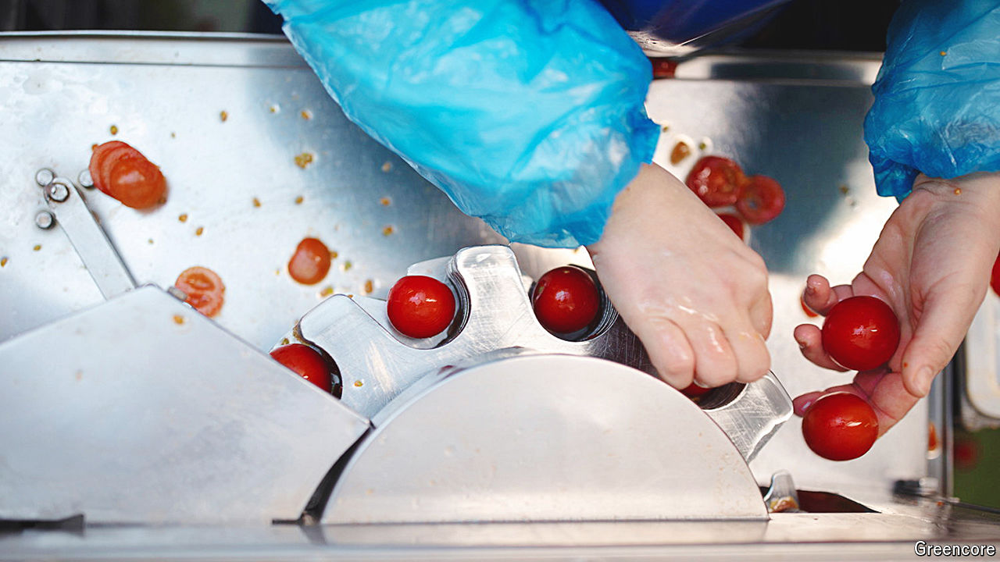
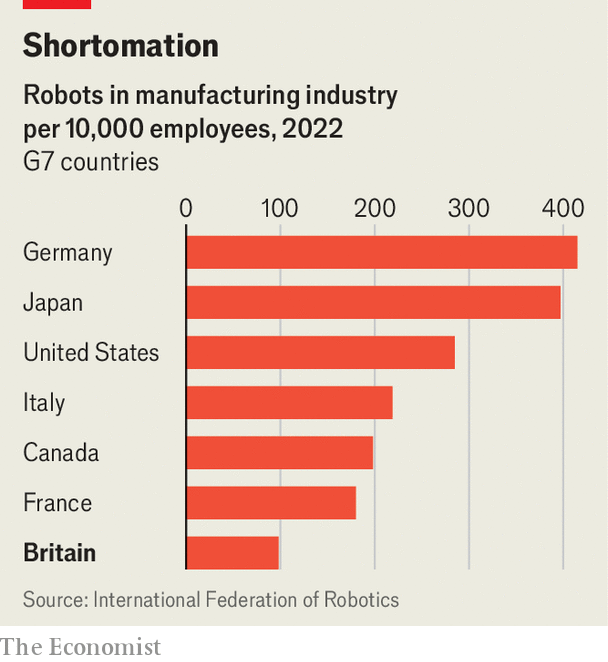

###### Machines

# Where are all the British robots? 

##### Firms’ small size is the biggest barrier to automation 

 

> Apr 16th 2024 

Sarnies and precision engineering may seem to be worlds apart. But Greencore, Britain’s largest sandwich-maker, spends £20m ($25m) on industrial robots annually. They peel, slice and stone avocados. They cut wraps and baguettes in half using ultrasonic knives. They place slices of bread above fillings. They also help make sushi.

Machines have not solved all of Greencore’s problems. They’re unable to make a classic BLT (bacon, lettuce and tomato) sandwich, whose fillings are hypersensitive to bruising from heavy machinery. “The software exists but the dexterity of the robot is not where it needs to be,” says Dalton Philips, Greencore’s CEO. Robots struggle with other tasks, too. The company’s workers wrap millions of sandwiches by hand each week. But where they can help, machines make a huge difference, saving 350 hours of manual labour each week on sushi-making alone. 

In a country where  for 15 years, such gains are not to be sniffed at. Yet Britain has the lowest adoption rate for robots in the G7 (see chart). The country deploys around 98 robots for every 10,000 workers in manufacturing, compared with more than ten times that amount in South Korea and around four times that number in Germany, Japan and China, according to the International Federation of Robots (IFR), a trade body. A study by Copenhagen Business School has estimated that Japan-like levels of automation would boost Britain’s productivity by over a fifth. 

 


You might expect economies that are more dependent on manufacturing to be further ahead when it comes to investing in robots. Manufacturing today accounts for only 8% of the British economy, down from 27% in 1970; in South Korea and Japan, manufacturing accounts for 26% and 19% of GDP respectively. But even compared with other services-oriented economies, Britain is a laggard. For every 10,000 workers in manufacturing, America has 285 robots and France 180. 

Bright spots exist. The automotive industry in Britain has 734 robots for every 10,000 employees; Jaguar Land Rover’s Solihull plant boasts more than 615 high-tech robots, with a Jaguar XE rolling off the assembly line every 78 seconds. Automation is also prevalent in logistics, where robots lift and sort items in warehouses. But other industries trail behind. London Economics, a consultancy, estimates that robots will perform just 1% of tasks in construction and agriculture by 2035, despite up to 38% and 30% of functions in these industries being suited to machines. 

There are several causes of the slow overall pace of automation, some more easily fixed than others. Uncertainty has almost certainly played a role in dampening investment, from the upheaval of Brexit to the inconstancy of policymakers—Britain’s capital-allowance regime has gone through as many as 24 changes in four decades. A generous full-expensing regime for capital investment is now in place; the Labour Party has promised to keep it if it wins the next election. 

The availability of cheap foreign labour in the past is thought by many to have  to invest in machines. High levels of economic inactivity since the pandemic and stricter immigration rules are exerting more pressure on employers to automate. So is an ageing workforce, which is . A fifth of Britain’s engineers are due to retire or be close to retirement by 2026, according to the Engineering Construction Industry Training Board, an industry body. Robot installations across Britain for food and drinks companies like Greencore were up by 76% in 2022, according to the IFR. ABB, a big Swiss-Swedish industrial-technology firm, says that Britain was one of its best countries for revenue growth last year. 

But the obstacles to large-scale adoption remain formidable. Britain lacks enough workers with the right skills to install and operate modern tools. A dearth of apprenticeships means that skilled technicians below degree level are in short supply. Half of German school-leavers take up vocational training, with a third opting for apprenticeships, compared with just 7% of those in Britain. 

Britain is also an economy of small (and often ) companies, which sits uncomfortably with the high fixed costs of machinery. Firms with fewer than ten workers employ a third of the country’s labour force; around a fifth of German workers and a tenth of American ones work for firms of that size. 

A poll of 500 smaller businesses in 2023, by Charles &amp; Dean, a finance broker, found that less than half of firms took advantage of a now-defunct “super deduction” scheme, which cut £1.30 from companies’ tax bills for every £1 invested in new machinery. Even with a generous tax break, one in five firms said they could not afford to invest. The average dairy farm in Britain is expected to earn a profit of £50,000 this year, for instance. Yet for a herd of 200 cows, milking robots can cost as much as £400,000 to buy. 

The good news is that the costs of automation are falling. Doubling the cumulative number of industrial robots produced leads to their prices falling by half, according to ARK Invest, an investment-management firm. That should help accelerate the slow spread of robots in Britain. Even if they cannot yet make a BLT. ■


