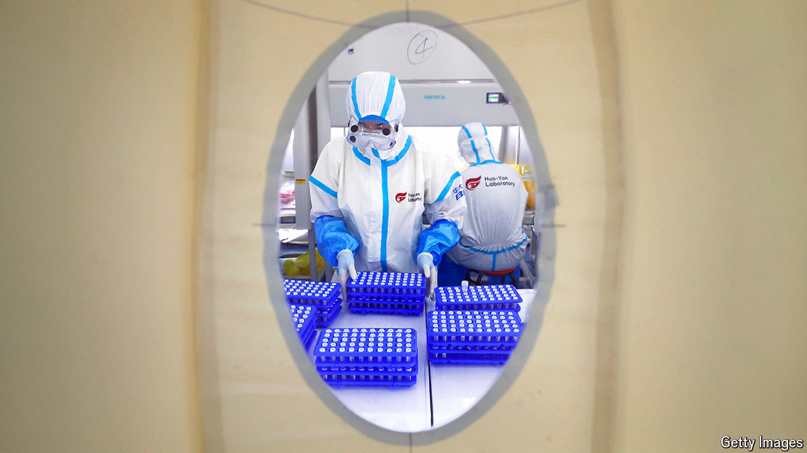
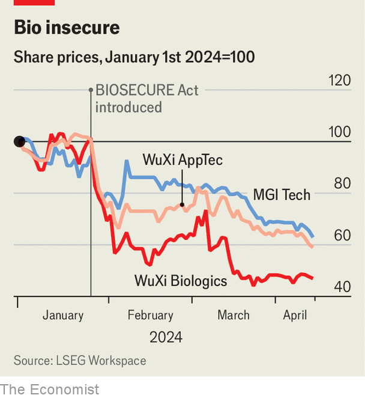

###### The health-care horserace

# America hits Chinese biotech—and its own drugmakers 

##### A sweeping bill in Congress could cost patients at home 

 

> Apr 15th 2024 

AMERICAN HEALTH-CARE costs are sky-high; as treatments get pricier and the number of patients swells owing to an ageing population, they are getting higher. Chinese biotechnology is increasingly sophisticated and, as its companies gain scale, getting cheaper. A growing number of American drugmakers, from startups to big pharma, rely on firms like WuXi AppTec and WuXi Biologics, which conduct drug research on behalf of clients and manufacture compounds used in drugmaking. MGI Tech, a maker of gene-sequencing machines, is offering American hospitals kit that is cheaper to buy and half as expensive to run as American-made alternatives. A match made in heaven?

Not to America’s Congress. A bill currently before the Senate would forbid the federal government from buying health-care products from companies that do business with partners like the WuXi sister firms and MGI Tech. A bipartisan group of lawmakers in the House of Representatives is pushing for the BIOSECURE act, which would do much the same. 

The politicians worry about American health data falling into the hands of the Chinese authorities. They also fret about American intellectual property (IP), for example in the form of drug recipes that big pharma shares with contract manufacturers, flowing to Chinese rivals. And they are concerned about American money going to Chinese firms that collaborate with the People’s Liberation Army (PLA) and with the Chinese government’s repression of Uyghurs, an ethnic minority. Should the bills’ sponsors succeed, America’s patients may be left bearing some of the costs. 

 


Despite irreconcilable differences on most other subjects, Democrats and Republicans are united in their dislike of China. Last month the Senate version of the legislation cleared the relevant committee by 11 votes to one. Investors seem to believe it has a good chance of becoming law. The share price of WuXi AppTec, which generates two-thirds of its revenues in America, has fallen by 40% since the BIOSECURE bill was introduced in the House in late January (see chart). WuXi Biologics, half of whose sales come from American customers, has lost more than 50% of its value. MGI Tech has lost more than a third. The three companies, which the House bill name-checks, have shed a combined $22bn in market capitalisation in the past two and a half months. 

The knock-on effects for the Chinese firms’ American customers are also likely to be profound. Start with the contract manufacturer-researchers. WuXi is to big pharma what Foxconn, the Taiwanese assembler of iPhones, is to Apple—a high-quality supplier entrusted with sensitive IP. It says its clients include the world’s 20 biggest drugmakers. Dozens of American pharma firms have notified investors that, should the BIOSECURE bill pass, they may be unable to meet demand for their products or to complete clinical trials on schedule. WuXi AppTec says that the proposed legislation “relies on misleading allegations and inaccurate assertions”. WuXi Biologics says it “has not, does not and will not pose any national-security risk to the US or any other country”.

Western customers have not yet severed ties with the WuXi companies, says Lila Hope, a lawyer specialising in biotech partnerships at Cooley. Some drugmakers are reportedly sounding out alternative suppliers from India, a big provider of similar services. But that would require a thumbs-up from American regulators, who have longstanding concerns about Indian companies’ lax quality standards. 

Jefferies, an investment bank, reckons that replacing Chinese capacity would take big Western drug firms at least five years and almost certainly end up costing more. For biotech startups, which tend to rely on Chinese partners with proven records to save time and money on research and manufacturing, the BIOSECURE bill could be an existential threat. According to a survey conducted in March by BioCentury, a consultancy, biotech bosses and their investors expect a slowdown in drug development in the event of its passage. 

Cutting ties with the lawmakers’ second target—China’s genomics industry—would have a less immediate impact on American firms. MGI Tech is only just entering the American market for gene-sequencers, having settled a patent dispute with its bigger American rival, Illumina, in 2022. BGI Genomics, which sequences more human genomes than any other company (and is also named in the BIOSECURE bill), makes just 3% of its profits in America. But both Chinese firms bring welcome competition to a highly concentrated industry. Despite being blocked by trustbusters from acquiring a rival in 2019, Illumina has 80% of the global market for high-end gene-sequencers.

MGI Tech’s American subsidiary, Complete Genomics, says it “is not a sequencing-service provider and does not have access to, collect, or maintain genetic data”. Independent investigators it brought in to inspect its sequencers have confirmed that the company cannot access patient data through the devices. BGI Group says that the allegations made in the BIOSECURE bill that it collects, stores and analyses personal genetic information for the purpose of infringing human rights, that it supports the surveillance of minorities and that it is controlled by the Chinese government or the PLA are all “false”.

The law, if passed, would almost certainly face legal challenges from the Chinese firms and, maybe, their American clients. It may be watered down, especially once big pharma’s lobbyists on Capitol Hill get to work on it. But the anti-Chinese sentiment guiding its congressional sponsors is not going away—even if that spells trouble for American health care. ■


