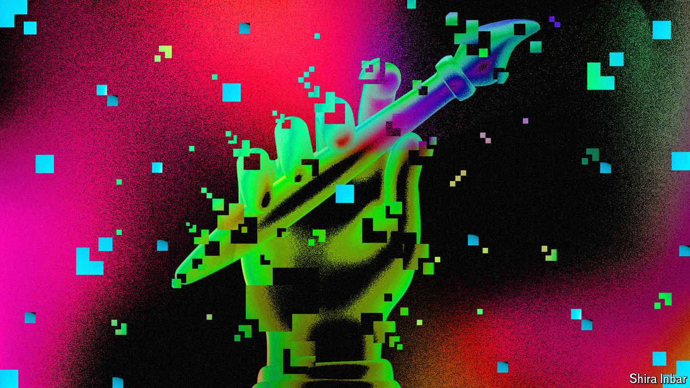

###### The imitation game

# Generative AI is a marvel. Is it also built on theft? 

##### The wonder-technology faces accusations of copyright infringement 

 

> Apr 14th 2024 

THE FOOTBALLERS look realistic at first sight but, on closer inspection, something is wrong. Their faces are contorted, their limbs are bending in alarming directions, the ball is slightly egg-shaped. Strangest of all, running across one footballer’s left leg is the ghostly trace of a watermark: Getty Images.

Generative artificial intelligence (AI) has caused a creative explosion of new writing, music, images and video. The internet is alive with AI-made content, while markets fizz with AI-inspired investment. OpenAI, which makes perhaps the most advanced generative-AI models, is valued at nearly $90bn; Microsoft, its partner, has become the world’s most valuable company, with a market capitalisation of $3.1trn. 

But some wonder how creative the AIs really are—and whether those cashing in have fairly compensated those on whose work the models were trained. ChatGPT, made by OpenAI, can be coaxed into regurgitating newspaper articles that it appears to have memorised. Claude, a chatbot made by Anthropic, can be made to repeat lyrics from hit songs. Stable Diffusion, from Stability AI, reproduces features of images, including the watermark of Getty, on whose archive it was trained.

To those who hold the rights to these creative works, generative AI is an outrage—and perhaps an opportunity. A frenzy of  and dealmaking is under way, as rights-holders angle for compensation for providing the fuel that powers the creation of AIs. For the model-makers it is an anxious period, notes Dan Hunter, a professor of law at King’s College London. “They have created an amazing edifice that’s built on a foundation of sand.”

AIs are  on vast quantities of human-made work, from novels to photos and songs. These training data are broken down into “tokens”—numerical representations of bits of text, image or sound—and the model learns by trial and error how tokens are normally combined. Following a prompt from a user, a trained model can then make creations of its own. More and better training data means better outputs.

Many AI companies have become cagey about what data their models are trained on, citing competitive confidentiality (and, their detractors suspect, fear of legal action). But it is widely acknowledged that, at least in their early stages, many hoovered up data that was subject to copyright. OpenAI’s past disclosures show that its GPT-3 model was trained on sources including the Common Crawl, a scraping of the open internet which includes masses of copyrighted data. Most of its rivals are thought to have taken a similar approach.

The tech firms argue there is nothing wrong with using others’ data simply to train their models. Absorbing copyrighted works and then creating original ones is, after all, what humans do. Those who own the rights see a difference. “I’ve ingested all this incredible music and then I create from it,” says Harvey Mason Jr, a songwriter and chief executive of the Recording Academy, which represents musicians. “But the difference is, I’m a human, and as a human, I want to protect humans…I have no problem with a little bit of a double standard.” Roger Lynch, chief executive of Condé Nast, which owns titles such as and the , told a Senate hearing in January that today’s generative-AI tools were “built with stolen goods”. AI companies “are spending literally billions of dollars on computer chips and energy, but they’re unwilling to put a similar investment into content”, complains Craig Peters, chief executive of Getty. 

Media companies were badly burned by an earlier era of the internet. Publishers’ advertising revenue drained away to search engines and social networks. Record labels’ music was illegally shared using applications like Napster. Content-makers are determined not to be caught out again. Publishers (including ) are blocking AI companies’ automated “crawlers” from scraping words from their websites: nearly half of the most popular news websites block OpenAI’s bots, according to a ten-country survey by Oxford University’s Reuters Institute in February. Record companies have told music-streaming services to stop AI companies from scraping their tunes. There is widespread irritation that tech firms are again seeking forgiveness rather than permission. “A $90bn valuation pays for a lot of lawyering,” says Mr Hunter. “That’s the business plan.”

The sincerest form of flattery

The lawyering is now happening. The biggest rights-holders are leading the charge. The , the world’s largest newspaper by number of subscribers, is suing OpenAI and Microsoft for infringing the copyright of 3m of its articles. Universal Music Group, the largest record company, is suing Anthropic for using its song lyrics without permission. Getty, one of the biggest image libraries, is suing Stability AI for copying its images (as well as misusing its trademark). All four tech firms deny wrongdoing.

In America the model-makers are relying on the legal concept of fair use, which provides broad exemptions from the country’s otherwise ferocious copyright laws. An encouraging precedent comes courtesy of a ruling on Google Books in 2015. The Authors Guild sued the search giant for scanning copyrighted books without permission. But a court found that Google’s use of the material—making books searchable, but showing only small extracts—was sufficiently “transformative” to be deemed fair use. Generative-AI firms argue that their use of copyrighted material is similarly transformative. Rights-holders, meanwhile, are pinning their hopes on a Supreme Court judgment last year that a series of artworks by Andy Warhol, which had altered a copyrighted photograph of Prince, a pop star, were insufficiently transformative to constitute fair use.

 


Not all media types enjoy equal protection. Copyright law covers creative expression, not ideas or information. Computer code, for example, is only thinly protected, since it is mostly functional rather than expressive, says Matthew Sag of Emory University in Atlanta. (A group of programmers aim to test this in court, claiming that Microsoft’s GitHub Copilot and OpenAI’s CodexComputer infringed their copyright by training on their work.) News can likewise be tricky to protect: the information within a scoop cannot itself be copyrighted. Newspapers in America were not covered by copyright at all until 1909, notes Jeff Jarvis, a journalist and author. Before then, many employed a “scissors editor” to literally cut and paste from rival titles.

Image-rights holders are better protected. AI models struggle to avoid learning how to draw copyrightable characters—the “Snoopy problem”, as Mr Sag calls it, referring to the cartoon beagle. Model-makers can try to stop their AIs drawing infringing images by blocking certain prompts, but they often fail. At ’s prompting, Microsoft’s image creator, based on OpenAI’s Dall-E, happily drew images of “Captain America smoking a Marlboro” and “The Little Mermaid drinking Guinness”, despite lacking express permission from the brands in question. (Artists and organisations can report any concerns via an online form, says a Microsoft spokesman.) Musicians are also on relatively strong ground: music copyright in America is strictly enforced, with artists requiring licences even for short samples. Perhaps for this reason, many AI companies have been cautious in releasing their music-making models.

Outside America, the legal climate is mostly harsher for tech firms. The European Union, home to Mistral, a , has a limited copyright exception for data-mining, but no broad fair-use defence. Much the same is true in Britain, where Getty has brought its case against Stability AI, which is based in London (and had hoped to fight the lawsuit in America). Some jurisdictions offer safer havens. Israel and Japan, for instance, have copyright laws that are friendly for AI training. 

Tech companies hint at the potential threat to American business, should the country’s courts take a tough line. OpenAI says of its dispute with the  that its use of copyrighted training data is “critical for US competitiveness”.

Rights-holders bridle at the notion that America should reduce its protections to the level of other jurisdictions just to keep the tech business around; one describes it as unAmerican. But it is a reason why the big cases may end up being decided in favour of the AI firms. Courts may rule that models should not have trained on certain data, or that they committed too much to memory, says Mr Sag. “But I don’t believe any US court is going to reject the big fair-use argument. Partly because I think it’s a good argument. And partly because, if they do, we’re just sending a great American industry to Israel or Japan or the EU.”

Copyrights, copywrongs

While the lawyers sharpen their arguments, deals are being done. In some cases, suing is being used as leverage. “Lawsuits are negotiation by other means,” admits a party to one case. Even once trained, AIs need ongoing access to human-made content to stay up-to-date, and some rights-holders have done deals to keep them supplied with fresh material. OpenAI says it has sealed about a dozen licensing deals, with “many more” in the works. Partners so far include the Associated Press, Axel Springer (owner of and ),  and Spain’s Prisa Media. 

News Corp, which owns the  and among other titles, said in February it was in “advanced negotiations” with unnamed tech firms. “Courtship is preferable to courtrooms—we are wooing, not suing,” said its chief executive, Robert Thompson, who praised Sam Altman, OpenAI’s boss. Shutterstock, a photo library, has licensed its archive to both OpenAI and Meta, the social-media empire that is pouring resources into AI. Reddit and Tumblr, two online forums, are reportedly licensing their content to AI firms as well. (The Economist Group, our parent company, has not taken a public position on whether it will license our work.)

Most rights-holders are privately pessimistic. A survey of media executives in 56 countries by the Reuters Institute found that 48% expected there to be “very little” money from AI licensing deals. Even the biggest publishers have not made a fortune. Axel Springer, which had revenue of €3.9bn ($4.1bn) in 2022, will reportedly earn “tens of millions of euros” from its three-year deal with OpenAI. 

“There is not a big licensing opportunity. I don’t think the aim of [the AI models] is to provide alternatives to news,” says Alice Enders of Enders Analysis, a media-research firm. The licensing deals on offer are “anaemic”, says Mr Peters of Getty. “When companies are…saying, ‘We don’t need to license this content, we have full rights to scrape it,’ I think it definitely diminishes their motivations to come together and negotiate fair economics.”

Some owners of copyrighted material are therefore going it alone. Last year Getty launched its own generative AI, in partnership with Nvidia, a chipmaker. Getty’s image-maker has been trained only on Getty’s own library, making it “commercially safe” and “worry-free”, the company promises. It plans to launch a video-maker this year, powered by Nvidia and Runway, another AI firm. As well as removing copyright risk, Getty has weeded out anything else that could get its customers in trouble with IP lawyers: brands, personalities and less obvious things, from tattoo designs to firework displays. Only a small percentage of Getty’s subscribers have tried out the tools so far, the firm admits. But Mr Peters hopes that recurring revenue from the service will eventually exceed the “one-time royalty windfall” of a licensing deal.

A number of news publishers have reached a similar conclusion. Bloomberg said last year that it had trained an AI on its proprietary data and text. Schibsted, a big Norwegian publisher, is leading an effort to create a Norwegian-language model, using its content and that of other media companies. Others have set up chatbots. Last month the  unveiled Ask FT, which lets readers interrogate the paper’s archive. The ’s Chowbot, launched in February, lets readers seek out the city’s best tacos or clam chowder, based on the paper’s restaurant reviews. The BBC said last month that it was exploring developing AI tools around its 100-year archive “in partnership or unilaterally”. Most big publications, including , are experimenting behind the scenes.

It is too early to say if audiences will take to such formats. Specialised AI tools may also find it difficult to compete with the best generalist models. OpenAI’s ChatGPT outperforms Bloomberg’s AI even on finance-specific tasks, according to a paper last year by researchers at Queen’s University, in Canada, and JPMorgan Chase, a bank. But licensing content to tech firms has its own risks, points out James Grimmelmann of Cornell University. Rights-holders “have to be thinking very hard about the degree to which this is being used to train their replacements”.

Fake it till you make it

The new questions raised by AI may lead to new laws. “We’re stretching current laws about as far as they can go to adapt to this,” says Mr Grimmelmann. Last month Tennessee passed the Ensuring Likeness Voice and Image Security (ELVIS) Act, banning unauthorised deepfakes in the state. But Congress seems more likely to let the courts sort it out. Some European politicians want to tighten up the law in favour of rights-holders; the eu’s directive on digital copyright was passed in 2019, when generative AI was not a thing. “There is no way the Europeans would pass [such a directive] today,” says Mr Sag.

Another question is whether copyright will extend to AI-made content. So far judges have been of the view that works created by AI are not copyrightable. In August an American federal court ruled that “human authorship is a bedrock requirement of copyright”, dismissing a request by a computer scientist to copyright a work of art he had created using AI. This may change as AIs create a growing share of the world’s content. It took several decades of photography for courts to recognise that the person who took a picture could claim copyright over the image. 

The current moment recalls a different legal case earlier this century. A wildlife photographer tried to claim copyright over photographs that macaque monkeys had taken of themselves, using a camera he had set up in an Indonesian jungle. A judge ruled that because the claimant had not taken the photos himself, no one owned the copyright. (A petition by an animal-rights group to grant the right to the monkeys was dismissed.) Generative AI promises to fill the world with content that lacks a human author, and therefore has no copyright protection, says Mr Hunter of King’s College. “We’re about to move into the infinite-monkey-selfie era.” ■


