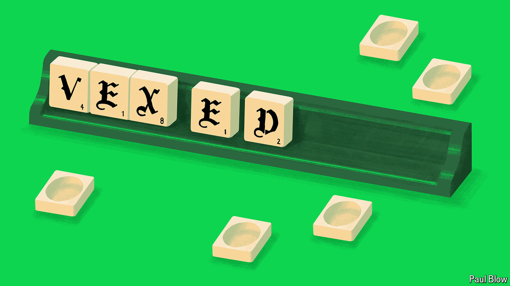

###### Bartleby

# The lessons of woke Scrabble 

##### When heritage meets innovation 

 

> Apr 18th 2024 

“THICK”, scoffed the headline on the  website on April 9th, in response to the news that Scrabble has had an overhaul. In some parts of the world the word-play game has been relaunched with a double-sided board; one side now shows a new, simpler design that is meant to be less intimidating and more inclusive than the original. 

The idea that Scrabble needs to be made less competitive in order to be attractive to Gen Z was always going to make some people rather vexed (16 points). “Next, they’ll turn to chess, but with only one piece each and only two squares on the board,” ran one typically balanced reader comment. Rants about snowflakes and wokeness aside, the new version of the game, which Mattel is introducing outside North America, looks like a perfectly good solution to a common strategic problem: how to make changes to much-loved products. 

Reams of innovation research focus on the need for managers to draw on diverse sources of thinking. The more you rely on a group of the same old faces for new ideas, the more you constrain the chances of breakthroughs. To take one example among many, a recent paper by Paul Vicinanza of Stanford University and his co-authors analysed the emergence of prescient ideas in court rulings, earnings calls and speeches by American politicians. It found that such ideas tended to come from the periphery. But the perils of entrenched thinking can also apply to customers. If the people who buy your products and services view them as traditional, they are more likely to resist changes. 

Such resistance is most obvious for brands with a long heritage and a loyal following. Consumers like the notion of longevity. In a study by Fabien Pecot of TBS Business School Barcelona and fellow researchers, the authors showed people two logos for an unfamiliar chocolate company, one with an old-school font and a black-and-white photo of a building, the other with a more modern font and a picture of a contemporary office. Participants were willing to pay more for the brand that had apparently been around for aeons (five points but really handy if you have a lot of vowels). 

But a rich history—even an entirely fictional one—also makes it harder to make changes. In another study, by Minju Han of Singapore Management University and her co-authors, people were told about a made-up cosmetics company. Some heard it had been founded in 1917, others that it had been established 100 years later. Each group then tested two hand creams, one ostensibly made to the original formula and the other a newly developed product. Even though the cream was the same in every instance, people who thought the firm had been founded in the early 20th century rated the new product as inferior to the original; those who thought it had been established recently gave them the same ratings. Heritage can command a premium but it can also be a prison.

These trade-offs are also visible in a paper by Giulia Cancellieri of Ca’ Foscari University of Venice, Gino Cattani of New York University and Simone Ferriani of the University of Bologna, which looks at the programming decisions made by Italian opera houses. Directors of such cultural institutions have to balance respect for the traditional canon with a desire to put on original productions; in management terms, they have to innovate while being true to their qi (which is not the right word but does give you 11 points and gets rid of that stranded “q”). 

The researchers examined in particular how attendance was affected by reinterpretations of classic operas. They categorise these changes depending on whether they are more cosmetic (the plot of “La Bohème” remains unchanged, for example, but takes place in a Dunkin’ Donuts) or more radical (Mimi has incredibly warm hands, say). They find that opera-goers liked novelty but that they reacted differently depending on its extent: season-ticket holders, who were more familiar with the classics, were less tolerant of radical changes whereas single-ticket visitors were keener on them. Freedom to innovate depends in part on how much you depend on loyal, repeat customers. 

Given all these pitfalls, Mattel’s innovation works well. It allows traditionalists to play the game they grew up with while also permitting an experiment that might bring in new players. Despite the sound and fury, it is all rather elegant (which gives you a bingo, 58 points and total, annihilating victory). ■


