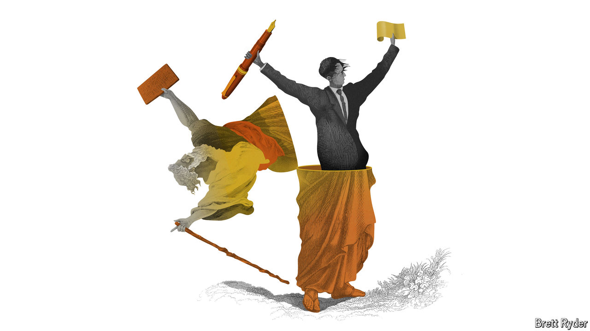

###### Schumpeter

# What is weighing on CEOs’ minds this earnings season? 

##### Shareholder letters are proving to be bleakly prophetic 

 

> Apr 18th 2024 

Schumpeter likes to write—and receive—handwritten letters. When he got out his pen last year and wrote to Larry Fink, boss of BlackRock, he explained to the passive-investing billionaire that he was doing so because he believed they shared a mutual interest: letter-writing. Your columnist went so far as to use a John Donne quote, “letters mingle souls”, to elicit a response. Evidently soul-mingling, whatever its merits in Elizabethan England, is not the done thing in Hudson Yards. Mr Fink  but not, sadly, to an exchange of correspondence. 

The personal touch is not quite dead, though. You can see that in Mr Fink’s latest letter to shareholders, as well as those of Warren Buffett, America’s most celebrated investor, and Jamie Dimon, Wall Street’s top banker. Mr Fink, to explain the importance of retirement savings, tells an uplifting story about his late mum and dad. Mr Buffett writes of his sensible (and now very rich) sister, Bertie. Mr Dimon, though hardly heart-on-sleeve, sounds like he carries the cares of the world on his shoulders. The least personal is Amazon’s Andy Jassy, who in a shareholder letter on April 11th came across as an Amazonian to the marrow of his bones. No matter. The day the letter was published his firm’s stockmarket value soared by $30bn to a record high of almost $2trn. That is an ROI—return on ink—of $6m a word. For shareholders, pure poetry.

There is more to these letters than self-publicity. They give a sense of how America’s corporate bigwigs see the world. Two letters, from Messrs Dimon and Jassy, are particularly relevant as the country enters the spring earnings season. After three Goldilocks months from January to March, when the stockmarket rallied on hopes of lower inflation, falling interest rates and a soft landing, they are less upbeat than you might expect. 

The main pressure on companies in this round of results will be to prove their worth. Buoyed by expectations of lower interest rates, the recent rally has lifted the share prices of the big companies that make up the S&amp;P 500 index. The index’s ratio of price to earnings looks high compared with the average of the past five years. Yet inflation has not fallen as fast as hoped—and therefore nor have rates. For the lofty valuations to be justified, in other words, earnings must rise. That should be easy enough for beneficiaries of the artificial-intelligence (AI) boom—Amazon and Microsoft, which provide the computing power; Nvidia, which supplies them with AI chips; and Meta, whose advertising business has been strengthened by AI. It will be harder for less techie firms. Unless they, too, show strong earnings growth, the market’s mood may sour.

When it comes to AI, the big question on earnings calls will be to what extent big tech’s investments in AI infrastructure and services are in fact generating higher revenues. In his letter, Mr Dimon indulges in the hype. AI, he writes, may be as transformational as “the printing press, the steam engine, electricity, computing and the internet”. But he also makes clear it is still early days. His bank, JPMorgan Chase, appears to be experimenting with “generative” AI, the type that has grabbed attention in the past 17 months, rather than deploying it at scale. Mr Jassy describes a three-layer system of building blocks that Amazon’s cloud-computing arm, AWS, is creating to help customers train generative-AI models, feed their data into existing ones and develop AI-related applications. For such services to make real money, however, big firms like JPMorgan Chase must move from experiments to deployment. 

Look beyond big tech, propelled by the tailwinds of AI, and bosses’ main concern is the business cycle. In recent weeks expectations of a soft landing have given way to those of a “no landing”: growth and inflation staying higher for longer, keeping long-term interest rates elevated. If those forecasts come true, investors will be asking whether revenues and profits can grow fast enough to offset the drag of higher rates. If not, fears of stagflation, seemingly put to rest last year, may resurface. On this score, Mr Dimon sounds almost prophetic. Consumer spending, and thus the American economy, have remained resilient, he writes, partly thanks to government largesse. But sloshing buckets of public money into clean-energy investments, military spending and so on risks making inflation stickier—and keeping rates higher—than markets expect. Adding to the uncertainty is “one of the most treacherous geopolitical eras” since the second world war.

Days after Mr Dimon’s letter was published, his words came back to haunt him. Fears of a long spell of higher interest rates contributed to a rare slump in JPMorgan Chase’s share price on April 12th, decent first-quarter results notwithstanding. Meanwhile, tensions in the Middle East put upward pressure on oil prices, further stoking fears of inflation. Mr Jassy also alluded to economic uncertainty in inflationary times. Though consumers continue to spend, he warns shareholders, they are doing so carefully. To save money, people are trading down whenever they can.

The write stuff 

Mr Dimon and Mr Jassy lead giant companies. The bigger a business, the more it tends to benefit from faster economic growth. The richer it is, the less it fears an interest-rate crunch that could curtail its access to capital. Other large, deep-pocketed firms, such as oil producers and obesity-drug sellers, may reinforce big tech’s and big banks’ hopeful earnings narrative. Smaller, more indebted ones will struggle if their interest costs do not fall. 

In business, the worse your balance-sheet, the higher the interest-rate risk. That is true in society at large. As Mr Dimon points out, nearly 40% of Americans do not have $400 in savings to deal with emergency payments such as medical bills or car repairs. His was not a cheerful letter. It was a bleakly powerful one. ■


