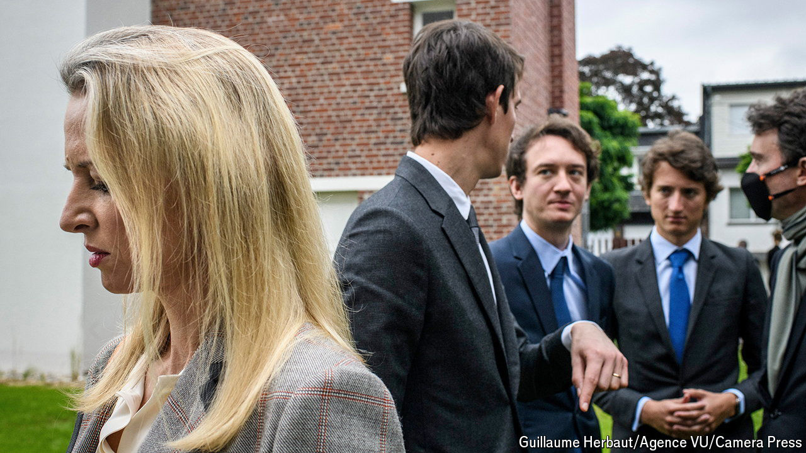
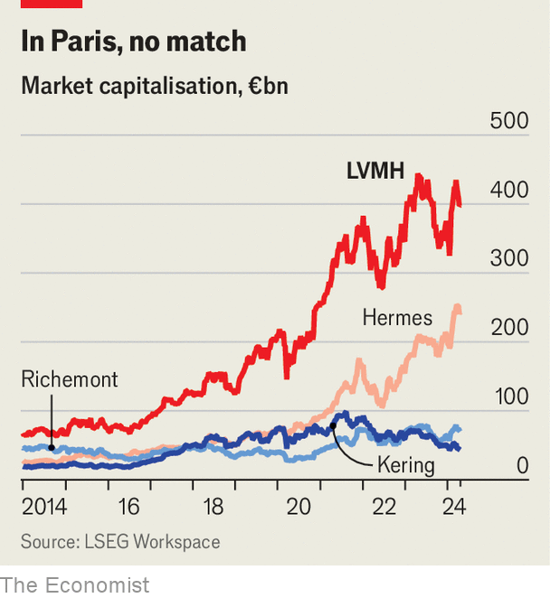

###### Pups in cashmere

# Who will lead the LVMH luxury empire? 

##### Bernard Arnault sizes up his heirs apparent 

 

> Apr 18th 2024 

BERNARD ARNAULT likes to describe LVMH as . The world’s richest man calling the €400bn ($425bn) luxury empire, of which he is chief executive, chairman and controlling shareholder, “a family business” is both a humblebrag and true. All five of his children work for him. And at LVMH’s annual general meeting on April 18th, after we published this, two of his sons (Alexandre and Frédéric) are poised to join Delphine and Antoine, his eldest offspring from his first marriage, on its board. Only 26-year-old Jean, the youngest, does not have a board seat (yet).

Arnault  can head LVMH for another five years. In 2022 shareholders, who credited the then-73-year-old with minting their fortunes as well as his own (see chart), happily amended the company’s by-laws to raise the mandatory retirement age for the CEO from 75 to 80. The wolf in cashmere, as the billionaire is known thanks to his killer dealmaking instincts, is showing no signs of letting up. But the boardroom reshuffle and other recent job moves suggest the succession plans for his lupine litter are well under way.

 


Last year Delphine took over as head of Christian Dior, the iconic fashion house which is LVMH’s second-largest brand (and which had a sparkling run under Pietro Beccari, who quadrupled sales in five years and was recently put in charge of Louis Vuitton, the group’s crown jewel). Antoine is now chief executive of the family holding company which controls LVMH. Alexandre is the de facto number-two at Tiffany &amp; Co, a jeweller. Frédéric and Jean have senior roles in the group’s watch business. 

Erwan Rambourg of hSBC, a bank, sees three possible succession scenarios. One is for the 49-year-old Delphine, who since 2000 has worked her way up through Dior and Vuitton, to inherit the top job from her father. Another is the enthronement of 31-year-old Alexandre, who did well as boss of Rimowa, a German luggage-maker that he persuaded his father to buy. He is now jazzing up Tiffany’s old-fashioned image through collaborations with superstars such as Beyoncé, an American pop icon, and Jay-Z, a rapper. The third is a collegial approach in which the five scions run five divisions of the group. 

If Mr Arnault has made up his mind, he is keeping his decision to himself. Either way, he will hand over an enviable business. True, after a stellar 2023, when sales rose by 9%, revenues in the first quarter of 2024 did dip by 2% year on year, to €21bn, chiefly owing to softening demand from Chinese shoppers worried about their country’s economy. In January Mr Arnault foreshadowed the slowdown by talking of “normalisation” following a period of post-pandemic revenge shopping for bling. 

This first-quarter disappointment may, though, prove to be a blip. And Mr Arnault’s new normal could still mean rude health. Fabbio Cereda of gAM, an asset manager, expects global luxury sales to expand by 6-7% annually in the next few years—and LVMH to keep gaining market share. A tidy inheritance, for whichever Arnault  or  prevails. ■


