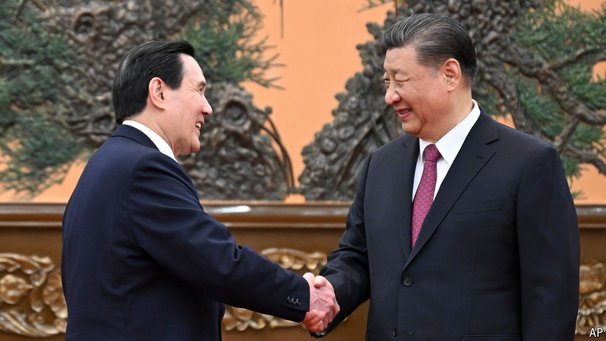

###### A meeting and a message

# China is talking to Taiwan’s next leader, just not directly 

##### Officials in Beijing want the island’s new president to be more like one from the past 

 

> Apr 18th 2024 

AFTER 11 days in China, during which time he was granted an audience with Xi Jinping, its supreme leader, Ma Ying-jeou came back to Taiwan this month with a message. The island’s former president, posting on Facebook, wrote that Mr Xi had “extended an olive branch to us”. Mr Ma hoped that Lai Ching-te, Taiwan’s next president, would “put the people first and respond pragmatically”.

Much has changed since Mr Ma left office in 2016, having pursued closer relations with China. His successor, Tsai Ing-wen, has asserted Taiwan’s status as a sovereign, democratic country. Mr Lai has called himself a “pragmatic worker for Taiwan independence”. China froze high-level contacts with Taiwan years ago. During Mr Lai’s successful campaign for president, Chinese officials denounced his party as separatists and called the election a choice between “war and peace”.

