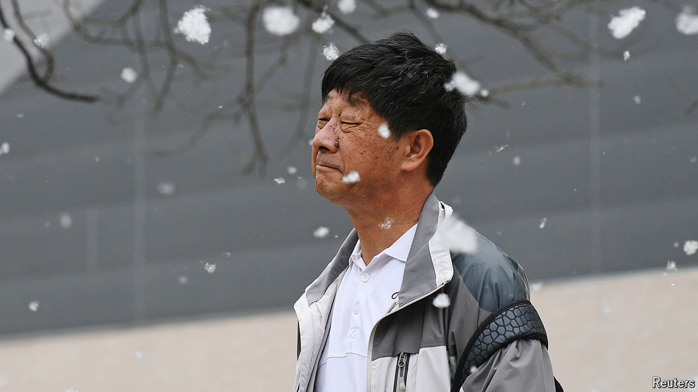

###### A puff piece

# Examining the fluff that frustrates northern China 

##### An effort to improve the environment has had unintended consequences 

 

> Apr 18th 2024 

LIKE MOST blizzards, it begins with just a few white wisps swirling about. Gradually the volume increases and the stuff starts to accumulate on the ground. During the heaviest downfalls the air is so thick with it as to impair visibility. But this is no winter scene. It is what happens every April across much of northern China, when poplar trees start giving off their cotton-like seed-pods.

The phenomenon has already begun in Beijing. On April 8th an eddy of fluff balls wafted around the American treasury secretary, Janet Yellen, as she held a press conference in an embassy garden.

