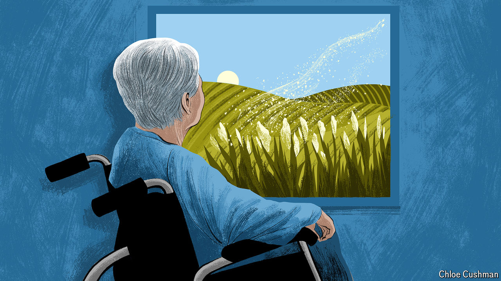

###### Chaguan

# The dark side of growing old 

##### A coming wave of Alzheimer’s and other forms of dementia will test China to its limits 

 

> Apr 18th 2024 

Mr ZHANG HAS stared down death during his 90 years on Earth. He has been diagnosed with cancer twice. During his latest bout doctors gave him 18 months to live. “That was 16 years ago,” he recalls wryly. Trim, snowy-haired and energetic—the key is “no exercise” and “no smoking”, he says—the retired manager cuts a dash in a blue shirt, green trousers and black cotton slippers. Yet on this spring afternoon in the city of Hangzhou, Mr Zhang is afraid. Not of death, but of dementia. In his youth, the old who lost their faculties were called “crazy”. Later the Chinese learned about a disease named by foreigners: Alzheimer’s. He has feared it for years. Advanced sufferers cannot recognise their families and so always feel alone or numb, he sighs: “That is the most terrible thing.” Quietly he adds that he has begun to forget things.

Mr Zhang is luckier than many. He lives in his own apartment with his wife (88). Hangzhou is one of China’s richest cities. His home district of Gongshu is a pioneer, used to test government plans for tackling dementia, a disease on the rise as China ages.

