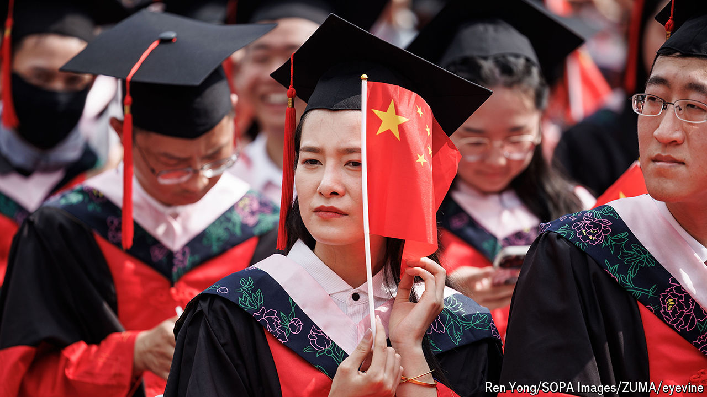

###### Degrees and difficulty

# Why so many Chinese graduates cannot find work 

##### Our number-crunching suggests that their plight could be much worse than previously thought 

 

> Apr 18th 2024 

AROUND THIS time each year companies visit university campuses in China looking for potential employees. This year the mood is grim. At a job fair in Wuhan a firm was looking to hire management trainees—but it wanted only elite graduates and offered just 1,000 yuan ($140) per month, claimed a post that went viral on social media. At a fair in Jilin most of the advertised positions required advanced degrees, said a soon-to-be graduate online. “Next time don’t bother inviting us.” Another griped that firms are not hiring. The recruitment process is “a lie”, she wrote.

The data paint a similarly bleak picture. The unemployment rate for people aged 16 to 24 in cities reached a record high of 21.3% last June. That was perhaps too embarrassing for the government, so it stopped publishing the data series while it rejigged its calculation to exclude young people seeking jobs while studying. (America, Britain and many other countries include such students when calculating their rates.) The new numbers are lower, but still depressing: in March 15.3% of young people in cities were unemployed. That’s nearly three times the overall jobless rate.

