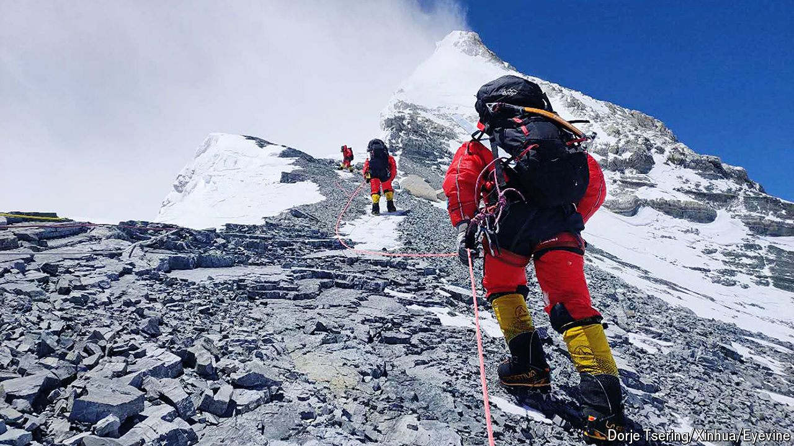

###### Mountaineering

# Climbing Everest is the extreme sport du jour 

##### More people are reaching the summit, but more people are dying on the way, too 

 

> Apr 18th 2024 

 By Will Cockrell. 

Climbing Mount Everest used to be a feat of staggering bravery, endurance and skill. In the 40 years after  first reached the summit in 1953, an average of 12 people a year followed in their footsteps. In 2023 more than 1,200 people attempted the climb, with 655 making it to the top. 

What was once an “almost certainly fatal” endeavour is “the new Ironman triathlon”, argues Will Cockrell, a journalist, in “Everest, Inc”, a fascinating new book. High-tech equipment and better understanding of the physiological impact of high altitudes have brought new hopefuls to Everest. But the biggest reason for the is the establishment of a professional guiding industry. For a hefty fee—between $35,000 and $110,000—experienced climbers will put novices on top of the world.

As with many extreme sports, Everest offers a test. Amateurs want to know if they can achieve something physically and mentally demanding. According to some psychologists, people undertake Herculean endeavours to deny their own mortality. Mr Cockrell believes this helps explain why interest in climbing Everest increases after deaths are reported: people are more attracted to the adventure if they are reminded of its dangers. 

The guiding industry exists in large part because of a foolhardy but irresistible character called Dick Bass. The heir to an oil fortune, Bass had the lunatic idea of climbing the highest mountains on all seven continents. He bought his way onto three different Everest expeditions and, in 1985, aged 55, he became both the oldest and least experienced climber to reach the summit. The sight of an average Joe on top of the world generated a media frenzy—and the establishment of companies that could cater to the new demand for tours. 

The early years of guided expeditions in the 1990s were mostly successful. In 1992-95, around 150 people paid to be led up the mountain, and a third succeeded. But in 1996, Jon Krakauer, an American writer, joined one of two simultaneous expeditions that went wrong. A storm “dropped down on the climbers like a piano on a cartoon character”. The guides, eager for their clients to reach the top, delayed turning them around. Three guides and two climbers died. In a bestselling book, , Mr Krakauer argued that Everest had become a high-end tourist trap. He decried the judgment of the guides and the selfishness of inexperienced climbers. Many businesses assumed that the book would crush them. Instead, fascination with Everest soared. 

The industry has . Large numbers of Nepalis were hired by companies in the West to install ropes and carry equipment for clients. The guiding firms made efforts to build lasting relationships with their teams on the ground. But, Mr Cockrell notes, “The reasons Westerners and Sherpas were climbing mountains remained .” 

Two accidents in the 2010s brought change. In 2014, 16 Sherpas were buried by falling ice while transporting clients’ gear. Their colleagues went on strike and forced the cancellation of the season. Then, in 2015, an avalanche killed ten Sherpas and nine foreign clients. In the aftermath, many Western operators lost their enthusiasm for Everest; today all the biggest guiding firms are Nepali-owned. 

“Everest, Inc” ends on a confounding note. More people are reaching the summit, but more are dying en route, too: 18 people perished in 2023, the highest-ever number. Nepalese authorities say climate change has caused more extreme weather. Mr Cockrell argues that there was no negligence on the part of the firms. He suggests that Nepali guides consider themselves in the logistics business and generally leave decisions of safety to clients. 

But amateur climbers make bad choices. The disaster in 1996 showed that even guides get these decisions wrong. Experts know more than ever about how to navigate Everest safely. But that does not make it a safe place. ■


