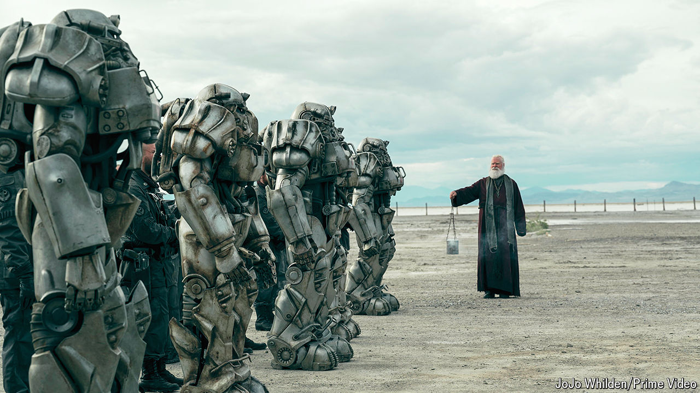

###### Press play

# How Hollywood fell in love with video games 

##### “Fallout” is the latest in a successful run of adaptations 

 

> Apr 18th 2024 

A new instalment of “Fallout”, a long-running series of video games, was released recently to rave reviews. Critics called the post-apocalyptic adventure a “rare gem” and an “absolute blast”. In its look and feel, the new “Fallout” is much like previous releases. The difference is that the latest iteration is not a game at all, but a television series.

Converting pixelated adventures to live-action narratives long defeated scriptwriters in Hollywood, resulting in turkeys like “Street Fighter” (1994) and “Doom” (2005). The developer of one celebrated game confides that its silver-screen adaptation around a decade ago was the worst movie he had ever seen.

But now studios are reworking games and finding commercial and critical success. Last year “The Super Mario Bros” was the second-highest-grossing film at the worldwide box office.  a TV show based on a PlayStation game, won a haul of Emmy awards in January. More game adaptations are on the way: IGN, an entertainment website, counts more than 70 games in development for film or TV, including shows based on “Tomb Raider” and “League of Legends” and films based on and “Minecraft”.

What explains the enthusiasm for these game-shows? One reason is that Hollywood’s favourite source of creative material, comic books, is getting boring. For two decades the box office has been ruled by superheroes. But more recently each Marvel film has seemed to be less successful and lauded than the last. , released in November, was the lowest-grossing so far. Games offer an alternative: “A deep well of franchises, a built-in audience, years of storylines and endless spin-off franchise possibilities,” says Fred Black of Ampere Analysis, a research firm. 

The pioneers of the new wave of adaptations have been Amazon Prime Video (which commissioned “Fallout”) and Netflix. These streaming companies, relative newcomers to Hollywood, have been on a commissioning binge to attract subscribers. Unlike older rivals such as Disney, which owns Marvel, they have a limited archive of intellectual property. “Most of the comic franchises were already owned, so they needed to find something else,” says Mr Black. Games were that something. Their success with titles like “Castlevania” (2017) and  (2019) got the attention of Hollywood studios.

Changes in the gaming world have also helped. The game-playing public has ballooned, thanks to smartphones (which put a miniature console in everyone’s pocket) and the covid-19 pandemic (which created millions of new gamers through sheer boredom). Big titles like “Minecraft” are played by more than 100m people each month, guaranteeing a large potential audience for film spin-offs. The broader and ageing pool of gamers makes it easier to get video-game projects greenlit in Hollywood. Previous generations of producers were befuddled by youngsters’ games; today’s moguls grew up playing them.

Most significant, modern games are better fodder for adaptation than their precursors. Amazon’s “Fallout” has a sharp script and a strong cast. But its epic, post-apocalyptic setting, twisting plot and rich back story all come from the game. The PlayStation version of “The Last of Us” was so cinematic that the opening scenes of Warner’s TV adaptation were barely changed. Its central characters, Joel and Ellie, were already vividly drawn; the TV series borrowed plenty of dialogue from the game. 

For all the recent hits, game adaptations are not yet such reliable performers as superheroes. Paramount’s “Halo” and Netflix’s “Resident Evil” did not live up to expectations. The biggest hits, says Mr Black, tend to be either so well known that even non-gamers recognise the brand (think “Mario”, “Sonic” or “Angry Birds”), or so engaging that their digital origin ceases to matter (“The Last of Us” or “Fallout”). The explosive first episode of “Fallout” is entitled, “The End”. For games on screen, it is just the beginning. ■


