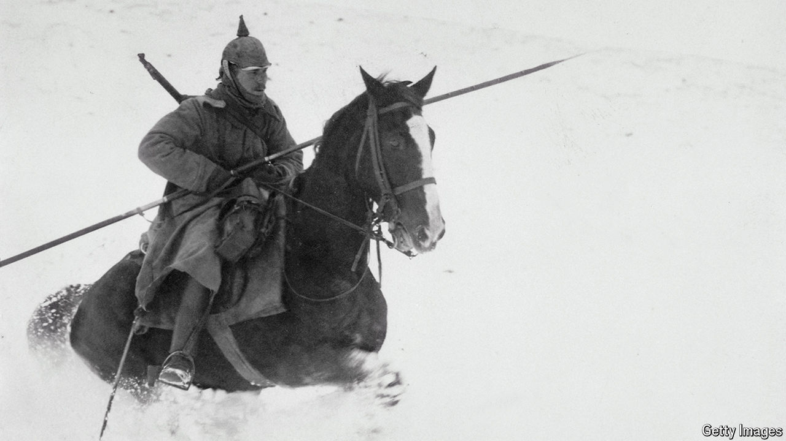

###### All quiet about the Eastern Front

# Much of the Great War was decided in the east 

##### A new history argues the Eastern Front gets less attention but was hugely consequential 

 

> Apr 18th 2024 

 By Nick Lloyd. 

Just 29 years old, Karl I was desperate to lead Austria-Hungary out of the first world war. He was crowned as  emperor in November 1916 after the death of his great uncle, who had ruled for 68 years. Though the empire had been instrumental in starting the conflict following the assassination of its archduke, , in June 1914 by a militant Serb nationalist, now Karl could see only the nightmarish cost. Austria-Hungary’s increasingly ramshackle, polyglot army had suffered devastating losses at the hands of Aleksei Brusilov, a Russian general, five months earlier. To function it depended on its ally, Germany. Vienna was starving. But secret peace talks went nowhere, and Austria-Hungary was dragged limpingly along in Germany’s wake to disaster.

Karl, ultimately exiled in Madeira, died from pneumonia in 1922. Though unsuccessful, Karl was beatified by the pope 82 years later for his peacemaking efforts. He is one of a small number of sympathetic figures in Nick Lloyd’s superb history of the Eastern Front in the first world war and one of even fewer who had some inkling of how it might end. But apart from the heroism and resilience of the ordinary soldiers, this is a story of vainglory, cynicism, incompetence and callousness.

Fascination with the  endures. The name has stuck despite the even larger conflict—and death toll—that came later. Though the books devoted to the first world war’s Western Front are extensive, the story of the Eastern Front has been mostly neglected. Mr Lloyd, a professor of modern warfare at King’s College London, has produced the first major history of the Eastern Front in English in nearly 50 years.

The first world war drew in 32 countries; its Eastern Front stretched over 900 miles “from the Baltic to the Alps, from the peaks of the Carpathians to the shores of the Aegean”. Some of the fiercest fighting was in Galicia, a region that includes what is today western Ukraine. It was very different from the war on the Western Front where, other than in its opening and closing stages, the armies of both sides were locked into a highly concentrated, trench-bound stalemate. In the east, there was often the space and terrain for manoeuvre warfare and pitched battles—and even the potential for dramatic, cavalry-led breakthroughs. 

Although more fluid, the Eastern Front was as lethal as its Western counterpart, due to the destructive power of modern artillery and the machine gun. Mr Lloyd estimates that the two doomed empires, Russia and Austria-Hungary, lost upwards of 2.3m and 1.2m men respectively. Some 450,000 Germans were probably killed on the Eastern Front. Because the fighting was less static but also because of simmering ethnic hatreds, many more civilians died or were displaced than in the west. 

When Winston Churchill wrote about the Eastern Front in his sixth and final volume on the Great War, published in 1931, he described it as both the “greatest war in history” and the “most frightful misfortune” to fall upon mankind since the destruction of the Roman Empire. Yet the book was called “The Unknown War”. 

Some individual episodes are still remembered, such as the Russian loss at Tannenberg early in the war and Brusilov’s offensive, which was Russia’s greatest and bloodiest feat of arms, resulting in nearly 2.5m casualties on both sides in three months. But so much has been forgotten, including the course of the war in the east across multiple theatres of operation and the strategies pursued by both sides. It is all this and more that Mr Lloyd has resurrected in compelling detail. 

Unusually for such a vast confrontation of forces, all three major belligerents ended up as losers. Russia collapsed into chaotic  in 1917; Austria-Hungary’s stricken empire was formally dissolved in 1919; Germany met with humiliating defeat on the Western Front.

The first world war redrew the world map. With conflict raging in the Middle East and Ukraine today, some might find the prospect of turning to a story of gruesome conflict from the past unattractive. But it was such a  that it continues to demand attention. As the German-American historian, Fritz Stern, ruefully observed, the conflict was “the first calamity of the 20th century, the calamity from which all other calamities sprang”. The calamity of the “unknown” Eastern Front is inseparable from everything that occurred afterwards. ■


