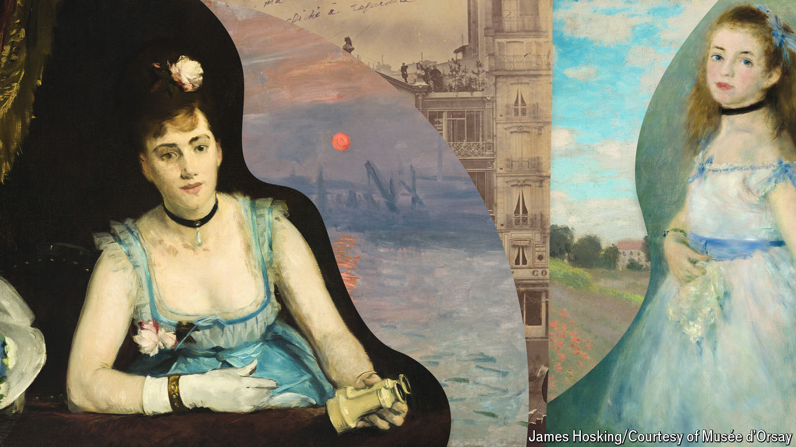

###### Show me the Monet

# On its 150th anniversary, Impressionism is surprisingly relevant 

##### What the once-derided movement reveals about art today 

 

> Apr 18th 2024 

THE WORLD was not always an arena of  superfans. “Wallpaper in its embryonic state is more finished than that seascape,” sneered Louis Leroy, an art critic, when describing Monet’s “Impression, Sunrise”. The painting of a hazy port in Normandy was hung in a show put on by the Anonymous Society of Painters, Sculptors and Engravers Etc that opened on April 15th 1874. Some of the comments about the sketchy style adopted by Monet and some of his fellow “rebels” were so acerbic that they sound more like put-downs from social-media trolls than professional art commentary. An “appalling spectacle of human vanity losing its way to the point of dementia” was how another critic in the 1870s described the new style.

The Anonymous Society’s show 150 years ago is remembered as the Impressionist movement’s birth; it was then that the painters were called “Impressionist” by Leroy, though the artists would not claim the label themselves for another couple of years. (An was a sketch, in the lingo of painters in 1874.) That show is now the subject of another exhibition, “Paris 1874: Inventing Impressionism”, which recently opened at the Musée d’Orsay. In September it will travel from Paris to the National Gallery in Washington, DC.

Today Impressionist paintings are among the most recognisable, beloved and valuable, so it is easy to forget the shock many people felt when first confronted by them. The startled reaction was as much a result of the subject matter as it was the rough brushwork depicting the fleeting quality of natural light. The artists rejected the focus of traditional painting—classical myths, history and idealised portraits—in favour of scenes of contemporary life, including the theatre and Paris’s boulevards.

Theirs was a democratic and capitalist undertaking: the 31 artists who took part in the Anonymous Society’s show wanted to select which of their works to exhibit and to sell them directly. This was in response to a government-sponsored  put on by the Académie des Beaux-Arts, which screened paintings with a jury and had conservative taste. Only four paintings sold during the Anonymous Society’s exhibition; the company formed to put on the show dissolved within months. 

Viewers regarding these paintings from the past can see some parallels with the present. The Impressionists evoked the destruction of the natural world, with a pure environment altered by railroads and smokestacks. They also painted in the shadows of violence and political uncertainty: only a few years after France’s defeat in a war with Prussia and a subsequent insurrection against the government, known as  The way the artists “deliberately or maybe unconsciously erased anything having to do with war from the paintings”, focusing instead on “happy scenes of modern life”, is “in itself fascinating and intriguing”, says Anne Robbins, co-curator of the show at the Musée d’Orsay. She posits that this is not unlike how people are anxious to move on from dislocations wrought by .

The Impressionists were also reacting to new technology, which influenced the creation of art, as it does today. They worked outdoors, rather than in studios, thanks to the invention of portable paint in tubes. Their pictures were influenced by another innovation: photography. Some other artists tried to emulate photography’s clarity. But with the Impressionists’ thick, visible brushstrokes, it is “almost as if they were saying, ‘Look, this is paint. This is not photography,’” says Philip Hook, author of “The Ultimate Trophy”, a history of Impressionism.

Déjà vu

Fittingly, the Musée d’Orsay makes good use of innovative tech to present these works, harnessing virtual reality to imagine what the exhibition in 1874 might have looked like. Visitors can don a headset and go on a startlingly realistic guided tour. You can almost touch the paintings you could have bought back then for 1,000 francs (if only you had!). Many museums have tried to use tech to complement their old-fashioned shows and lure in younger audiences; this is one of the most successful attempts to date. 

This exhibition is about the art world in 1874, but it makes you ponder art’s current state. It raises the question of what has happened to the avant-garde today. In going from shocking audiences to gaining broad acceptance, the Impressionists set a “template that has been repeated regularly with every new modernist art movement”, says Mr Hook. In subsequent decades artists played with style, subject matter and form, challenging viewers to consider what exactly art is, from  to Tracey Emin’s unmade bed. 

Today there is much less revolutionary experimentation. “Artists challenge much less today,” says one art dealer, who finds contemporary architecture more willing to break with norms. “In a moment when I thought more artists would be reaching out more politically, they seem to be reaching in more conservatively,” agrees Josh Baer, an art adviser and gallerist. Depicting beauty and personal identity are today’s popular artistic preoccupations. “I thought we’d be seeing something a little bit more aggressive,” Mr Baer adds. 

This year’s Whitney Biennial in New York is a collection of sleek works that take little risk. The Venice Biennale, which opens on April 20th, will be another pulse-taking. With prizes and pavilions, it is often described as the Olympics of the art world, and it usually captures the zeitgeist. This year’s theme is “foreigners everywhere” and focuses on artists whose identity and sexuality make them outsiders. 

Many feel the political correctness that has strangled dissent on college campuses has infected the art world, with artists becoming afraid to ruffle feathers and go against consensus. In today’s political climate museums are “terrified” to push the envelope, says Leslie Ramos of the Twentieth, a firm that advises on art and philanthropy: they have to be “woke but not too woke, interesting but not too scholarly, not too expensive but not too cheap”. Others blame the internet: a premium is now put on creating large, vibrant canvases that look good on social media. 

Those paintings by young artists (called “ultra-contemporary” in today’s parlance, according to Clare McAndrew of Arts Economics, a research firm) can sell for six- and seven-figure sums. Here the Impressionists also offer a humbling reminder. Of the 31 artists who presented at the Anonymous Society’s show in 1874, fewer than ten are remembered today. A handful are so obscure that the curators could find virtually nothing about them, says Ms Robbins of the Musée d’Orsay. 

The odds are that an even smaller proportion of artists working now will be celebrated in 150 years. As Helena Newman of Sotheby’s, an auction house, puts it: “Look at what we see today, and we know in our bones that only a small amount will stand the test of time.” ■


