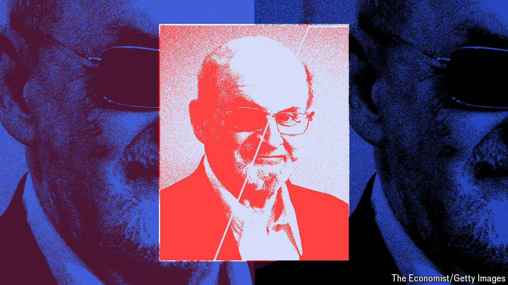

###### Back Story

# Salman Rushdie’s gripping take on being stabbed 

##### “Knife” is a memoir about the attack in 2022 but also a love story 

 

> Apr 16th 2024 

There are, writes Sir Salman Rushdie, “three important characters” in “Knife”, a new memoir of his  and his arduous recovery. The first two are predictable: the author and his blade-wielding assailant. The third character turns this chronicle of violence into a surprisingly tender and redemptive story.

Sir Salman was about to speak at a festival in upstate New York when a black-clad man charged the stage. His first thought was: “So it’s you. Here you are.” It was 33 years since Ayatollah Ruhollah Khomeini of Iran had called for his death because of the alleged blasphemy of his novel, “The Satanic Verses”. It was more than 20 since he moved to America after years of police protection in Britain. Now the half-expected, still-astonishing assassin was upon him. “I raise my left hand in self-defence. He plunges the knife into it.”

And into his neck, face, abdomen and eye—15 wounds in a 27-second frenzy. Violence, he notes, is confounding to its victims: “Reality dissolves and is replaced by the incomprehensible.” But he was alert enough to think this was the end. In a book that is both passionate and illusionless, he is clear there was no out-of-body experience: “My body was dying and it was taking me with it.” He seemed unlikely to survive but was stitched and stapled together. His blinded eye bulged from its socket “like a large soft-boiled egg”.

Only after a few weeks did Sir Salman see his disfigured face in the mirror. When he left hospital there were more scares and treatments and nightmares. He dreamed of the blinding of Gloucester in ; he thought of the knife that kills’s protagonist in “The Trial”. Among the supporting cast in “Knife” is the knife itself—at once a cold, sharp object and a metaphor for hatred, fanaticism and life’s ruptures.

Intermittently he thinks of the second character, the young Lebanese-American who has pleaded not guilty to attempted murder and assault, and who, typically, had barely opened “The Satanic Verses”. Omitting his name—he is “My Assailant”, then “the A”—Sir Salman wavers over whether he wants to confront him. Instead he makes up a jokey-serious dialogue between them, probing the imaginary suspect about faith, failure and loneliness. “You aren’t capable of understanding me,” the suspect insists. Standing outside the jail where the real man was awaiting trial, Sir Salman had an urge to dance.

All he wanted was to be a novelist, but the ayatollah and the knife have made him a global . He reaffirms its value here. “Without art,” he writes, “our ability to think, to see freshly, and to renew our world would wither and die.” He decries the “false narratives” of bigots and autocrats and extols openness and debate. “Language was my knife,” he avers, “the tool I would use to remake and reclaim my world.”

Yet the principal riposte to the brutality in “Knife” comes from its third main character: Rachel Eliza Griffiths, an American writer and photographer and Sir Salman’s fifth wife. In forensic detail, he recounts the “coin-toss moments” that led them to meet and fall in love, his giddy infatuation and eventual proposal. All this is more than a gushy ode: it is essential to his underlying themes.

One of those is time. His next thought, up on that stage, was: “Why now?” The knifeman was “a murderous ghost” seeking “to drag me back in time”. The past, he sees, is both inescapable and fixed. He poses lots of questions and what-ifs about the assault, including why he “just stood there like a piñata”. He nearly pulled out of the talk but needed the fee for an air-conditioning bill. He knows, though, that time allows no do-overs. Nor, because of Eliza, does he ultimately want it to: “We would not be who we are today without the calamities of our yesterdays.”

His other deep theme is the challenge of living in a bleak world; or, to put it another way, the riddle of human nature. He “experienced both the worst and best” when onlookers tackled his attacker and saved his life. Above all, however, the counterbalance to evil is the love and devotion of Eliza, with whom Sir Salman salvaged “a wounded happiness”. 

“Knife” is a love story about being stabbed, a paradox captured in the skewed symmetry between the attack and another central scene. On the night he met Eliza, Sir Salman walked klutzily into a glass door; he lay on the floor, blood streaming down his face, until she ministered to him. He got up then, and, triumphantly, he has risen again now. ■


