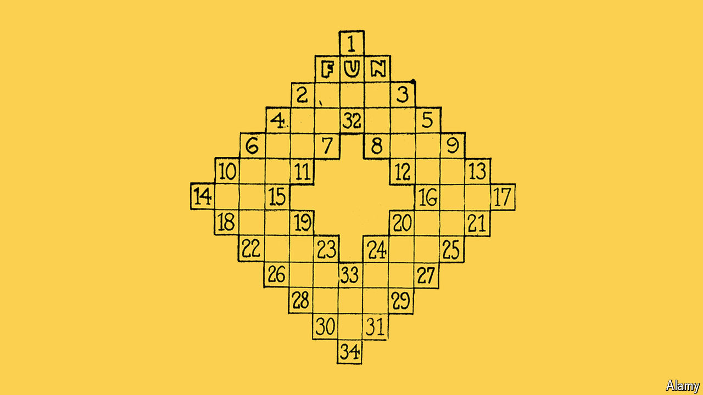

###### Get a clue

# What is a 14-letter word for a constructor of crossword puzzles? 

##### A new book looks at the history of the crossword through the women who designed it 

 

> Apr 18th 2024 

By Anna Shechtman. 

What is a three-letter word for “preppy, party-loving, egotistical male, in modern lingo”? Answer: “Bro”. When Anna Shechtman, a cruciverbalist (crossword constructor), introduced this clue to the crossword puzzle in 2014, readers took notice. “Bro” was traditionally clued as “sibling for sis”. Ms Shechtman was modernising the puzzle and capturing the zeitgeist. 

What makes a word puzzle-worthy? Since its appearance in the Sunday edition of the in 1913 (pictured)the crossword has helped define the canon of common knowledge. Though it was invented by Arthur Wynne, an editor, in its early days, women—especially —were the primary constructors and solvers. In “The Riddles of the Sphinx”, Ms Shechtman, who now creates crosswords for the  traces the history of the crossword in America through the women who helped create it. 

In the 1920s and 30s, newspapers warned of “crossword puzzleitis”, an “epidemic” they claimed was draining America’s  and distracting women from their household duties. But by the 1940s, the which had resisted the crossword craze, introduced the puzzle, partly to offer readers relief from unrelenting news about the second world war. “You can’t think of your troubles while solving a crossword,” wrote Margaret Farrar, its founding editor. Farrar, who edited the crossword until 1969, insisted on decorum. Words and clues too unsavoury for a morning breakfast on Sundays were stricken from the grid. The clue offered for “LSD”, for example, was “British currency” instead of “

As more women entered the workforce, the number of them producing puzzles declined. In 1989 Eric Albert, a computer scientist, developed constructing software, which helped designers fill a grid by enabling them to create and manage word lists. The world of crossword creation began to look more like the heavily male tech industry. Ms Shechtman interweaves this history with a memoir of her puzzle-making and eating disorder (reflecting a need for control that she sees in the rigid format of the grid). In constructing, she thinks about cultural representation. Should crosswords push solvers to expand their knowledge or keep them comfortable? 

Since the covid-19 pandemic, the popularity of the crossword and  like Wordle has only increased. The acquired Wordle in 2021, and in 2023 subscriptions to the ’s Games app climbed to over a million, around a tenth of the newspaper’s total subscriber base. Games, now a big driver of revenue, are a five-letter strategy. ■


