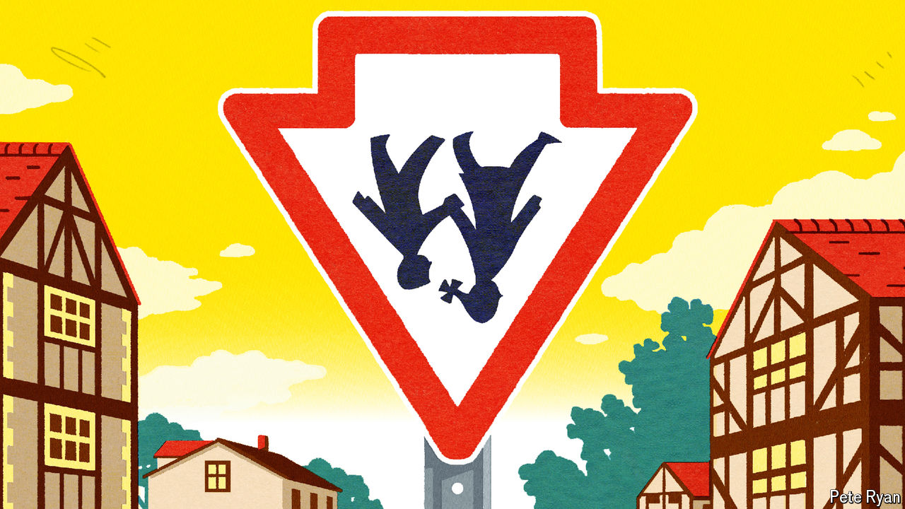
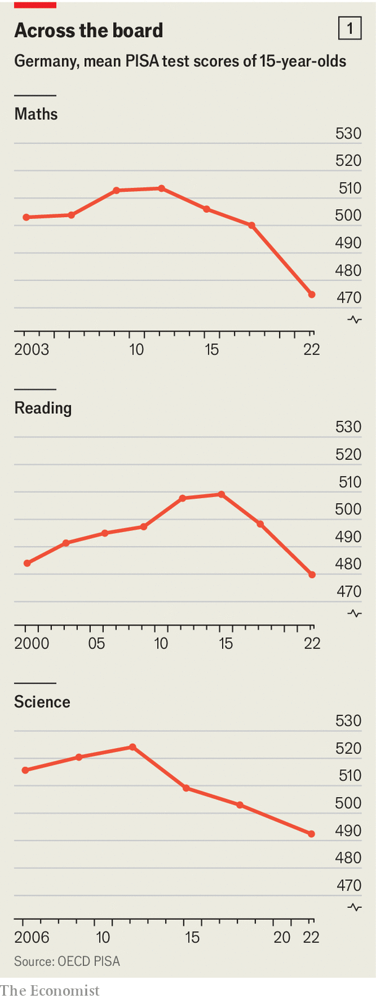
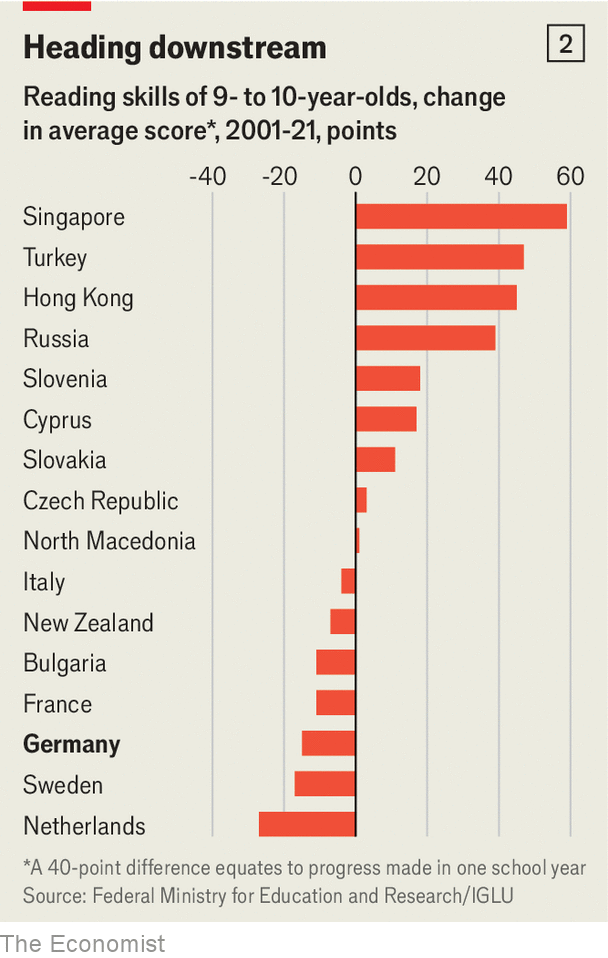

###### Schuling around

# Germany is flunking the education test 

##### Its scores are heading down, as its schools fail to adapt 

 

> Apr 16th 2024 

FROM MAY 1st, the proud holders of doctorates will no longer be allowed to put the title Dr in front of their name in German passports. For a country obsessed with qualifications—Prof Drs are fairly common and even Dr Drs not so rare—this decline in standing may be hard. But it is not so hard as the decline in German educational standards.

 


The most recent results from three very different testing regimes, comparing pupils of varied ages, point in a single direction: downwards. The best-known, the Programme for International Student Assessment (PISA) tests performance in maths, reading and science among 15-year-olds across some 80 countries every three years. Its most recent scores, in December, confirm steep plunges in all three subjects over the past decade in Germany (see chart). 

A separate study that measures reading competence among fourth-graders across 65 countries, known by the acronym IGLU, found that 25.4% of the German cohort lacked adequate skills in 2021, up from 18.9% five years earlier and just 17% in 2001. Meanwhile the latest survey of German-language competence among nineth-graders by IQB, an educational-research institute that compares outcomes between German states, found that the proportion nationwide that fail to reach minimum standards in reading, listening and spelling had risen respectively by 9, 16 and 9 percentage points since 2015.

 


The failure is far from catastrophic. Germany’s leading universities are still among the world’s best, as are its opportunities for vocational training. Even in decline, its schools perform in the middle rank of European standards; but that still means that they do worse than Austria, Poland, the Czechs and the Swiss—Germany’s neighbours and peers. Nor is the alarm new. When their schools first underwent comparative tests, in 2000, the underwhelming results so surprised Germans that the ensuing “PISA-” prompted a wave of reform. 

What is new is that Germany is achieving mediocre and diminishing results despite having tried varied reforms since the , and despite spending a similar proportion of its GDP on schooling as do better-performing neighbours. Nor can the poor showing be ascribed simply to either the covid-19 pandemic or to immigration, though the failure of the system to respond well to the influx of 1m refugees in 2015-16 is certainly part of it.

The causes lie deeper. “[Germany] is failing to adjust to the learning needs of the 21st century, as in Asia and the Nordic countries,” says Andreas Schleicher, the director for education at the OECD, which runs the PISA tests, in Paris. Axel Plünnecke, head of education research at the German Economic Institute in Cologne, concurs. The education system has fallen behind changes in social structure, he says, with the fact that almost a quarter of pupils now speak no German at home being just one such shift.

The system’s rigidities start with cultural attitudes that are often not helpful. In the country that invented the kindergarten, many parents actually shun pre-school education in the belief that it encourages competition. German children start school at six, but early schooling is often lax and playful, because children “should not be overstressed”. Fourth-graders, for instance, spend almost 30% less time reading in class than the OECD average. Teachers, in Germany traditionally unquestioned masters of their classrooms, often resist evidence-based new methods, or standardised tests that might “stigmatise” poor performers. Many see education not in terms of building core competences, but as a mission to create cultured citizens. In most German states primary school lasts just four years, at which point pupils are divided between those destined for academic studies or for technical/vocational careers. 

All these traits mean that children from less educated, poorer or non-German-speaking families reach this juncture at a stark disadvantage. They are far less likely to be chosen for the academic secondary schooling that leads to better-paying careers. Of children with at least one parent holding a higher degree, 79% will go on to university; of those with only professional qualifications, just 27%; of those who speak a foreign language at home, 23% and of those whose parents hold no professional qualification, a mere 12%. 

Such things are slow indeed to change. On the day Nele McElvany’s son was born 19 years ago in the Berlin district of Kreuzberg, another mother in the same building also gave birth. Ms McElvany—now Prof Dr McElvany—was dismayed at the time to think that while her own child would almost certainly end school holding an , the certificate for university entrance, her neighbour’s would not, simply because of their contrasting backgrounds. 

“At age ten they decide OK, we make you a knowledge worker, and you not,” says Mr Schleicher. “That was very well suited to the industrial age, but now it’s just a waste of a good part of human talent.” The problem is compounded, he says, by the fact that nearly everyone in a position of power is a product of the academic track. They simply cannot see the shortcomings of a system that they themselves benefited from. 

Even so, would-be reformers have repeatedly tried to shake up a system unique to a clutch of German-speaking countries. One result is that across Germany, high-school students relegated to the non-academic track can now more easily cross over, or simply study to take the . Since education falls under state, rather than federal control, German states have also tinkered by introducing longer school days, by extending primary school (as in Berlin) or by altering the length of high school (as in the southern state of Baden-Württemberg). 

But as Ms McElvany, an education expert and vice-president for research at TU Dortmund University, notes, all too many such efforts have stalled or gone into reverse. The obstacles are many. Education is a heated subject, involving stakeholders from anxious parents to powerful teachers’ unions. Election cycles are short. Politicians have a lot to lose from meddling in schooling, notes Ms McElvany, and little to win from projects that are often expensive and long-term.

This is a shame, because ideally Germany’s 16 states should experiment and learn from each other—as, say, in America. Schools in Hamburg, for instance, used to be near the bottom of the league among the states. In 2010 an effort at sweeping reforms that would have added a year to primary schooling, in part to accommodate surging numbers of immigrants, was quashed by insurgent conservative parents. But some changes were made, among them the introduction of language tests for pre-school children, with those doing poorly sent for a mandatory year of German lessons. The result: the city-state’s schools are now among the country’s top performers.

That no other states have adopted similar reforms testifies to systemic inertia. This often extends down to district level and to individual schools. A 2017 survey, for instance, discovered that whereas schools in the Netherlands exercised direct control over 92% of decision-making, including hiring of teachers, the level of independence in Germany trailed at a meagre 17%. “When I had to replace some simple parts that a kid broke in a science lab I found that our school doesn’t even have a bank account,” says a teacher at a Berlin high school. “Every spending decision has to go through the district council.”

Asked how she would ideally tackle school reform, Ms McElvany unhesitatingly ticks off a dozen measures. Luckily for Germany, none of them sounds very hard, from following Hamburg’s example of language pre-schooling, to emphasising core competences such as reading, to loosening budget strings to let underperforming schools fix their own problems. Unluckily for Germany, the political will to do much of this is absent.■


