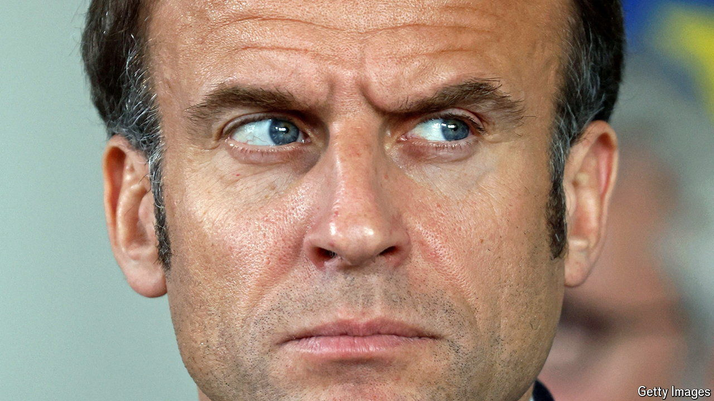

###### Le nouveau faucon

# How Russia targeted France and radicalised Emmanuel Macron 

##### He is now one of Europe’s leading Russia hawks 

 

> Apr 18th 2024 

ON JANUARY 16th the French president, Emmanuel Macron, announced that he would send another 40 long-range Scalp cruise missiles to Ukraine. Later that day Russia bombed Kharkiv, in north-eastern Ukraine, claiming French mercenaries were based there and supplying a list of names that the French army says is fake. Shortly afterwards the French  193 websites set up to undermine public support for Ukraine in France (as well as in Germany and Poland), run by a Russian firm based in Crimea. Days later Sébastien Lecornu, the French defence minister, said Russian air-traffic controllers had threatened that a French aircraft patrolling over the Black Sea would be shot down. 

In recent months France has catalogued an intensified Russian campaign to sow division, discredit the country and test its army. Russian security services, say French sources, commissioned the stars of David stencilled on walls in Paris last October, to stir up inter-religious tensions. In March cyber-attacks briefly took down some of the French government’s websites, and hackers stole data from its jobs agency. With the added help of Russia apologists in France, Russian bot farms turbo-charged scare stories about  in Paris, used a deepfake French news report to fabricate a supposed attempt on Mr Macron’s life, and spread vile false rumours about his wife, Brigitte.

This systematic targeting, say those close to the president, underlies a shift that continues to puzzle many observers: Mr Macron’s conversion from a leader who sought to engage with Russia’s Vladimir Putin to one of Europe’s most hawkish voices. The president who once urged allies not to “humiliate” Russia has now called for Russia’s defeat, urged allies not to be “cowardly”, and warned that a Russian victory would spell “the end of European security”. Mr Macron has not spoken to Mr Putin since September 2022. On February 26th he refused to rule out sending ground forces to help Ukraine.

What explains this shift? At a basic level, says Bruno Tertrais of the Institut Montaigne, a think-tank, Mr Macron was “mugged by reality”. Mr Putin lied to him and played him. The French president’s pre-war diplomatic outreach was a failure, even if he knew it was high-risk at the time. The assassination of Alexei Navalny in February served as a further jolt. As a former minister told , Mr Macron was “radicalised by disappointment”. 

Ukraine’s difficulties on the ground, as well as the prospect of another Donald Trump presidency, have made standing up to Russia more urgent. This comes at a time when Mr Macron has already concluded, in a speech in Bratislava last May, that bringing Ukraine into both the European Union and NATO would actually strengthen his ambition for European collective defence, not dilute it. 

“For decades France had believed that when it came to Europe, smaller was better,” writes Célia Belin of the European Council on Foreign Relations, in the American magazine . Russian aggression, she notes, has transformed the case for a wider EU. A French ten-year security commitment to Ukraine is now entrenched in a bilateral agreement, signed by Mr Macron and Volodymyr Zelensky in February. It is worth €3bn ($3.2bn) in 2024 and includes a French promise to support Ukraine’s entry into NATO.

Sceptics still query the sincerity of Mr Macron’s conversion, pointing to French efforts to cap Ukrainian farm exports. Fine words are one thing; concrete action another. Figures from Germany’s Kiel Institute suggest that French bilateral military aid is a fraction of Germany’s, though the latest numbers go up only to mid-January. With a budget deficit in 2023 of 5.5% of GDP, France is strapped for cash, its army has little kit to spare and its industry is struggling to produce stuff much faster. 

Others dismiss Mr Macron’s hardline stance as electioneering, intended to distinguish his geopolitics from Marine Le Pen’s, whose National Rally (RN) was once financed by a Russian bank. While this is indeed a campaign theme, its effectiveness is doubtful. The RN looks set to crush his party at polls for the European Parliament in June. The idea of sending ground forces to Ukraine is deeply unpopular in France.

It is noteworthy that Mr Macron’s  has won the loudest approval from Europe’s once sceptical eastern fringe. “I do think it’s genuine,” says Nicu Popescu, a former foreign minister of Moldova. “Macron has concluded that the EU’s security depends on the security of its neighbours.” Mr Macron backs Estonia’s idea of joint EU borrowing to pay for arms to Ukraine, an idea that is hated in frugal Germany. French diplomats recently drew up alarming scenarios about the implications of a Russian victory. Mr Macron, says a French military source, no longer harbours any doubts about Moscow’s expansionist ambitions. If Russia wins, the president said last month, Mr Putin will not stop at Ukraine. Now Mr Macron needs to act on his new understanding. ■


