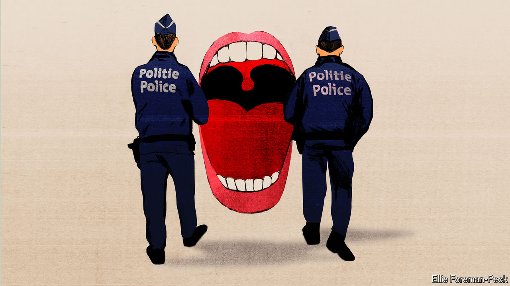

###### Charlemagne

# How a conservative conference morphed into a crisis of liberalism 

##### A Brussels hard-right confab descends into a mix of farce and petty tyranny 

 

> Apr 17th 2024 

One of the few benefits of Britain leaving the European Union, at least for denizens of Brussels, was that Nigel Farage all but disappeared from the city’s parliament, pubs and speaking circuit. The blowhard Brexiteer’s return to the Belgian capital on April 16th will have done little to rekindle his passion for the place. As the former MEP addressed several hundred fellow-travellers of the hard right at a conference, Belgian police swooped into the venue with orders to shut the event down. Outnumbered, the coppers ended up beating a discreet retreat, allowing Mr Farage to deliver a few more quips about gravy-train Eurocrats and fake-news media. After some to and fro, the police opted to seal the conference venue instead, leaving the afternoon’s speakers stuck outside and—worse, for attendees including Charlemagne—caterers unable to deliver food. Not to worry: lunch was replaced by a stern lecture from Suella Braverman, Britain’s former home secretary, about the dastardliness of human-rights lawyers.

The half-hearted police raid at a reactionary gabfest was the culmination of a discomfiting series of events around the “National Conservatism” conference on April 16th-17th. At the ninth such jamboree, organised by the Edmund Burke Foundation, an American outfit, the star attraction of this iteration was Viktor Orban, Hungary’s proudly illiberal prime minister. Unsurprisingly, some speakers held views outside the centrist consensus, albeit ones endorsed by plenty of voters. This  sent local Belgian authorities on a misguided mission to prove the “cancel culture” decried by conservatives is not just a conspiracy. A policy that aims to exclude hard-right parties from coalition governments, known as the , metastasised into an ugly variant whereby merely expressing such ideas is beyond the pale.

The first sign of trouble came a few days before the event, when its original venue, a posh set of heavily gilded rooms near the EU institutions used by political parties and diplomats for their own shindigs, decided to turf out the conservatives. One of Brussels’s 19 district mayors had ginned up fears of “anti-fascist” protests, arguing that security was impossible to arrange. This is clearly nonsense. Brussels hosts dozens of summits featuring grandees that run into no such problems. Nor had policing been an issue when the National Conservative bunch had held a similar event at the same venue in 2022. Discomfiting as that show of censorship was, more was to come. A backup Brussels venue was secured at a cavernous Sofitel near the European Parliament also well used to political confabs. As the conservative organisers were in the midst of setting up their stage on the day before the event, another Brussels district mayor worked to evict them, taking pride in foiling the conference of people whose views he disagrees with. 

And thus it was that the homeless nationalists ended up cramped inside the Claridge, a former nightclub turned into a concert venue and part-time conference hall (with no connection to the luxurious London hotel, nor anything remotely posh). If the site originally booked was the Ritz of political rallies, this was more akin to a roadside motel, jammed between a second-hand clothes shop and a kebab joint in Belgium’s poorest district; upcoming events include a Shrek-themed rave (“Bring out your inner ogre!”). Even then, yet another Brussels mayor sent in the cops. 

The offstage rigmarole spiced up what was otherwise predictable globalist-bashing fare. Those speakers who could attend—Eric Zemmour, a French firebrand, was among them though barred by police on the first day—delivered platitudes about family values and bent elites. Among the forces to be combated: the European Parliament, the European Commission, the mainstream media, polite society, the UN, immigrants, political correctness, NGOs, “Bolshewokism”, George Soros, and green regulation. Things liked by conference speakers included the freedom-loving owners of the Claridge, farmers, Donald Trump, national sovereignty, motherhood and “the will of the people”. Conspicuously absent, as well as lunch (which did arrive later, for there is only so much self-sacrifice even conservatives will put up with), was any kind of speech a liberal society should not be able to tolerate. 

Conservatives at the gates

Charlemagne holds little truck with the ideas featured at the conference. Many well-meaning speakers, notably from America, do not seem to realise their Hungarian patrons (who helped fund the event) are abusers of their conservative ideology, using it as cover to build a patronage system benefiting cronyish insiders. Some, like Mr Zemmour, hold truly reprehensible views. But to be misguided is their business, not that of either the thought police or the Brussels variant. Happily, the ham-fisted censorship proved surmountable. As the first day of the conference closed, Alexander De Croo, the Belgian prime minister, decried attempts to shut it down as “unacceptable”. An overnight court ruling quashed the original order to ban the event. Boosted by the furore around the efforts of his liberal enemies to silence him, Mr Orban got to address his fans, railing against the EU and the very liberal norms that (belatedly) ensured his right to speak.

Stuck between the hubbub of police blockading the venue and persecuted conservatives within, your columnist got to chat for a few minutes with the owner of the Claridge. A first-generation migrant from Tunisia, Lassaad Ben Yaghlane has run the place with his family for a decade. When he got the call to host the event, he thought before agreeing, then decided there could be no harm in providing anyone a room to debate in. The conservative organisers were a polite lot, he said. Didn’t he mind that some speakers were spewing migrant-bashing rhetoric from a stage he was providing? The 59-year-old shrugged and asked: “What’s a democracy if you say, ‘You can listen to this guy but not that one’?”■


