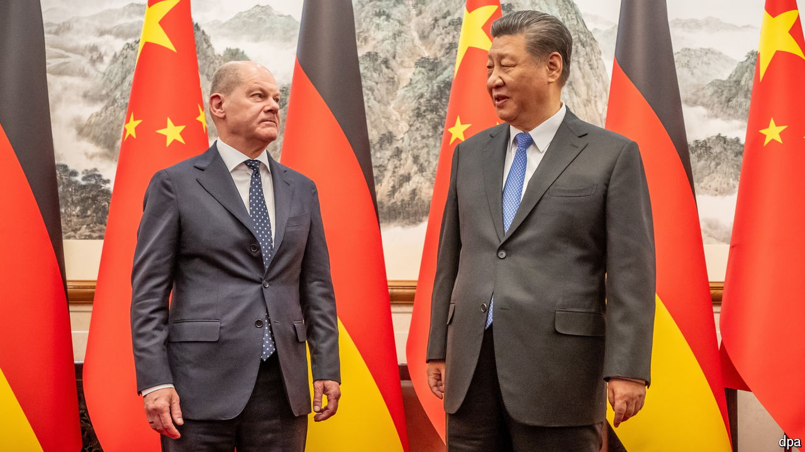

###### Not-so-bullish Germany in the China shop

# The German chancellor’s awkward meeting with China’s boss 

##### It is time for Xi Jinping to accept that Germany isn’t America’s puppet 

 

> Apr 18th 2024 

An official Chinese read-out said the summit meeting in Beijing that ended on April 16th reflected the strong ties that bind the world’s second- and third-largest economies. A morning of talks with Xi Jinping, China’s president, punctuated by a comradely stroll in the garden and ending in a cordial lunch, seemed to have marked a friendly climax to the three-day visit to China by Olaf Scholz, Germany’s chancellor. 

But not all is as rosy as spring. For a start, the German home audience was denied a live view of their chancellor’s frolic in Beijing because ZDF, a German public broadcaster, could not get Chinese press accreditation from the host country’s notoriously awkward bureaucrats. But behind that quibble lurked much bigger troubles. Just before the trip to China—his second since he became chancellor in 2021, and one for which he has attracted a fair amount of criticism from within Europe—Mr Scholz told an interviewer that although an American-style “decoupling” of the German economy from China is a bad idea, “de-risking” would be wise. “In Germany, the peacemaking effect of economic contacts was certainly overemphasised,” said the former mayor of Hamburg. “Nobody has that illusion today.” 

This may be true for Germany, which learned a lesson after wooing Russia for decades with fat energy contracts, only to see it invade Ukraine. Yet the statement from Mr Xi stressed a contrary message. It said that the intertwining of economies is not a risk but an opportunity, as well as “the guarantee of a stable relationship”. 

This difference means a lot to the bosses of 12 big German firms who accompanied Mr Scholz. Many are deeply exposed as investors in China, or face stiffening Chinese competition. A recent report by economists at Allianz, a German insurance giant, suggests that the two countries are moving “from complementarity to substitution”, as China begins to replace Germany even in high-value manufacturing. One example: since 2019 German machinery exports to ASEAN countries have fallen by 14%, and Chinese exports of the same goods have risen by 31%. China is pushing Germany aside even in Europe. In some sectors, such as solar panels and basic ingredients for essential pharmaceuticals, it already enjoys a near-monopoly. 

So when Mr Xi argued against protectionism, the response from Mr Scholz is likely to have been as stilted as the Chinese leader’s response to German nagging on such subjects as Ukraine or human rights. The fact is that although both countries would like to insulate their bilateral relationship from the more strident behaviour of their allies (for China that means Russia; for Germany it is America and some of the more hawkish European countries), they both sense that this is not sustainable. Soon enough, China will have to stop pretending that Germany, and indeed Europe, is acting tougher only because of American pressure, and accept that Europeans do indeed have their own reasons to be wary of China. And Germany will have to stop pretending there is much of a difference between “de-risking” and “decoupling”. ■


