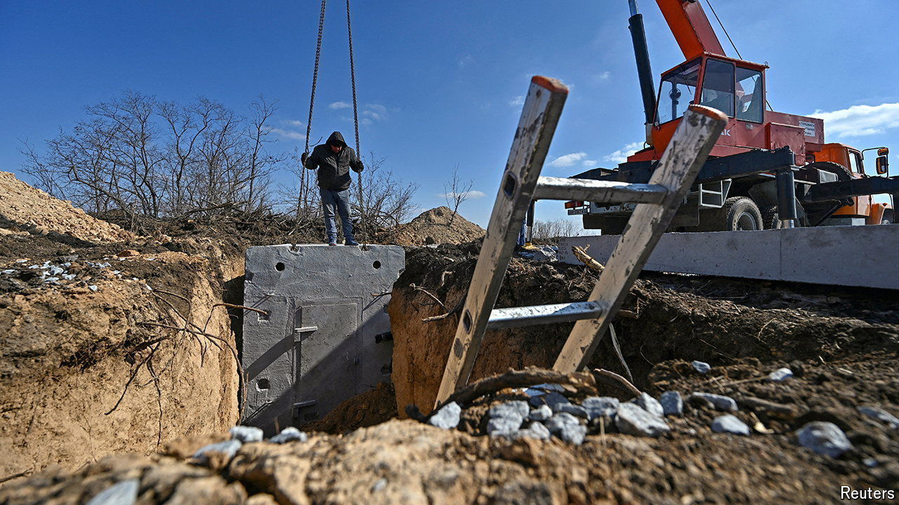

###### The Russians are coming

# Ukraine is digging in as the Kremlin steps up its offensive 

##### Will it be enough? 

 

> Apr 18th 2024 

The sunken faces that peer from behind battered fences are aged, whether or not the bodies that carry them are old. Russia, eight kilometres away, isn’t hiding. In the past 24 hours, three guided bombs landed in the village, with two of them exploding to devastating effect. Everyone here is in waiting mode. Oleh, the officer in charge of constructing a new network of fortifications on the outskirts of the village, shouts back a warning. “If you hear a whistle, you’ve got a few seconds to drop down on the floor. And hope for the best.” 

The construction of three new lines of fortifications in Sumy province is part of a billion-dollar Ukrainian scheme to shore up defences ahead of an expected Russian summer offensive. Diggers are working around the clock, as they are in Kharkiv, Zaporizhia and Donetsk provinces, where the main push is expected. Construction follows a master plan of interlocking trenches, underground command-points, observation posts, and sleeping quarters that double as field hospitals. The general rule is that army brigades build the first line. Engineering forces, local authorities and occasionally local businesses take care of the rest. The outer line, about 30km back, is the sturdiest, built in relative calm with diggers and reinforced concrete. After a long delayed start, the first part of the project is due to be completed by the end of the month. The question is whether that will be soon enough.


Things are already critical in part of the Donetsk area. On April 14th Ukraine’s commanding general, Oleksandr Syrsky, said he was particularly concerned by a deterioration around the small town of Chasyv Yar. Russian troops had been ordered to seize it by Victory Day on May 9th, he said, and were amassing a huge strike force. There is frankly little to seize. Anton, a drone-company commander, describes the once-quiet town in apocalyptic terms. The earth is ash-grey; the air heavy with the smell of gunpowder and burning. Most buildings have been destroyed by artillery and guided bombs, he says, “dozens” of which land every day. 

In Anton’s view, the Kremlin is repeating scorched-earth tactics it used with success to seize nearby Avdiivka in February. With Russian guns firing at least seven times more than Ukrainian ones, it was just “a matter of time” before the process would be completed once again. Ukraine has spent most of the war in serious artillery deficit, he says, but the shortages have been more pronounced since December. With Ukraine lacking the means to suppress infantry advances, the Russian army is now able to approach its positions with ease. “You’re always trying to preserve the ammunition you have, to defend against more serious advances. And so they keep creeping up, and you keep falling back.” 

The vulnerabilities have many people worried. Some media reports, quoting unnamed Western officials, have even suggested Ukraine may be on the verge of military collapse. Those fears are exaggerated. Mr Kostenko, who oversees groups in the south and east, assesses that there is only a “minimal” risk of a major Russian breakthrough in the near future. Ukraine is addressing its manpower shortages, he says. Things already look better than they did in December, when Ukraine’s draft system essentially “broke down”. But the critical factor remains ammunition. As long as a minimum keeps arriving, which so far it is, Russia will find it difficult to achieve anything other than limited tactical success in small places like Chasyv Yar. “The front lines aren’t pleasant, but the Russians have real problems too.” 

Not that any of that is calming nerves in Kharkiv, Odessa or even Kyiv, where rumours of imminent large-scale offensives have been stimulated by Russian influence operations and confused Ukrainian communications. A defence insider, who asked to remain anonymous to speak freely, insists that none of the supposed Russian operations looked particularly viable. He suggests “chaos” within Ukraine’s main staff had made the military picture seem worse than it was. “We are losing the information war to Russia,” he complains. Another source suggests that bureaucratic paralysis had resulted from the worsening military situation, with few people willing to take the initiative.

For some, the delays in starting the fortification programme are a case in point. Ukraine long denied the reality, they say, and waited far too long, until February, to begin digging. But knee-deep in the black soil, the upbeat Oleh counters the critics. “Try constructing a trench in snowy, frozen minefields,” he retorts. ■


