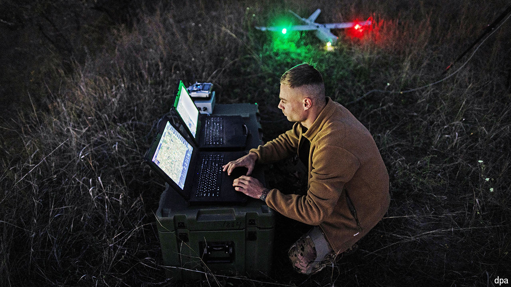

###### Droning on

# Ukraine is ignoring US warnings to end drone operations inside Russia 

##### Its superdrones can reach targets as far away as Siberia 

 

> Apr 18th 2024 

A guard looks on nervously. With every step, the air thickens with the smell of petrol. Around a corner is the workshop, and the buzz of manufacturing. Inside, lab-coated technicians are busy assembling grey birds under the glow of overhead lights. Young men in t-shirts scuttle about, before packing the drones in boxes for onward delivery. The destination for some of them will be 1,000km away and more—hunting for important targets inside Russia.

Since President Volodymyr Zelensky prioritised the technology, Ukraine has invested hundreds of millions of dollars into long-range drones, capable of searching out and striking distant targets. Half a dozen firms now make them.


The best of the new models has a range of 3,000km, able to reach Siberia. Born out of necessity—the West has been reluctant to provide Ukraine with long-range weapons—the programme has disrupted much of Russia’s oil and military infrastructure. But the White House is not happy. It is pushing the Ukrainians to stop the strikes.

America’s concerns have varied, from a rise in the oil price to the prospect of an uncontrollable tit-for-tat in which Ukraine could end up the loser. Fears of the latter rose in late March, when Russia inflicted millions of dollars of damage on Ukraine’s energy infrastructure. The attacks revealed gaps in air defences and vulnerabilities to Russia’s new Kh-69 low-altitude cruise missile. On April 11th such missiles destroyed Ukraine’s Trypilska power station, 40km from Kyiv, though it was in range of the capital’s Patriot air-defence systems. 

So far, Ukraine is ignoring American advice to call off the strikes. “Detective”, an intelligence officer responsible for part of the programme, says he has not received instructions to dial down operations. Yes, there has been a switch away from aiming at oil infrastructure in the past week, but it is probably temporary. “Our targets change day to day. We keep the Russians on their toes.” 

One long-range-drone producer claims that not every American representative agrees with its policy. His contacts “winked” while they delivered warnings. “They’re privately telling us to keep going.” The producer predicted an expansion of Ukraine’s drone programme in the months to come. “Russia is scorching Ukrainian earth. It’s time we did the same to European Russia.”■


