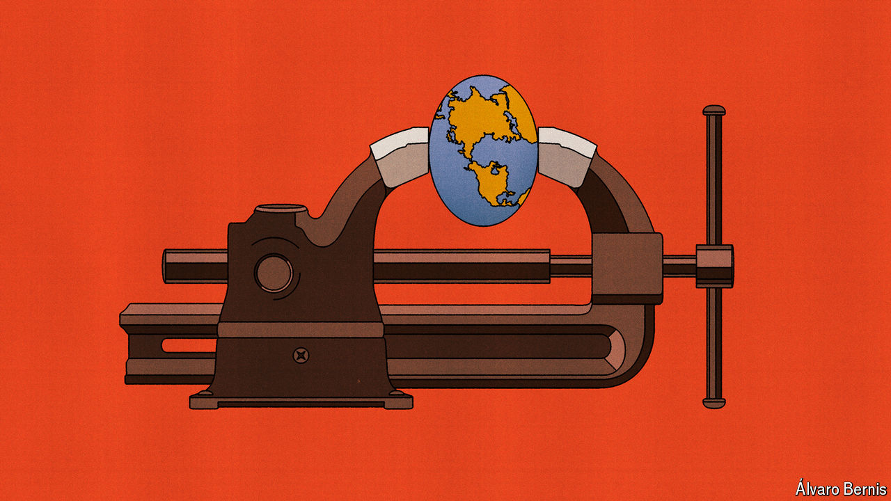

###### Free exchange

# Can the IMF solve the poor world’s debt crisis? 

##### The fund will freeze out China if that is what it takes to offer relief 

 

> Apr 18th 2024 

It is now four years since the first poor countries were plunged into default because of spiralling costs from covid-19 spending and investors pulling capital from risky markets. It is two years since higher interest rates in the rich world began to put even more pressure on cash-strapped governments. But at the spring meetings of the IMF and the World Bank, held in Washington, DC, this week, many of the world’s policymakers were acting as if the worst debt crisis since the 1980s, by portion of world population affected, had come to an end. After all, the poorest countries in the world grew at a respectable 4% last year. Some, such as Kenya, are even borrowing from international markets again.

In reality, the crisis rolls on. The governments that went bust still have not managed to restructure their debts and dig out of default. As such, they are stuck in limbo. Over time more—and bigger—countries could join them. So in between the spring meetings’ embassy dinners and think-tank soirées, the IMF’s board announced a radical new step to deal with the problem.

The core of the difficulty in resolving debt crises has been that there are more creditors, with less in common, than in the past. Over 70 years of debt restructurings, Western countries and banks came to do things a certain way. Now decisions require the assent of a new group of lenders, some of which see no reason to comply. Each part of the process, even if it was once a rubber stamp, can be subject to a protracted negotiation.

Chief among the new lenders is China. Even though the country is now the world’s biggest bilateral creditor, it has yet to write down a single loan. India has doubled its annual overseas lending from 2012 to 2022; it sent $3.3bn to Sri Lanka soon after the country was plunged into crisis. The United Arab Emirates and Saudi Arabia are in the group, too. They have together lent more than $30bn to Egypt. The Gulf creditors’ preferred method is to deposit dollars at the recipient’s central bank—a form of lending so novel that it has never been subject to a debt restructuring before.

As a result, the seven countries that have sought restructuring since the start of the pandemic have been unable to strike a deal to whittle down what they owe. Only two small countries have made progress: Chad, which rescheduled rather than reduced debts, and Suriname, which reached a deal with all its creditors but the biggest, China. Zambia has waited four years for a deal. Since no creditor wants a worse bargain than any other, there has been next to no principal debt relief during the worst debt crisis in four decades. Four years ago G20 countries signed up to the Common Framework, an agreement to take equal cuts in restructurings, but creditors have split over the degree of generosity needed.

The IMF, which usually cannot lend to countries with unsustainably high debts, has been unable to do much. Yet on April 16th it made a move. It said it would lend to countries that have defaulted on debts but have not negotiated a deal to restructure all their debts. The policy is known as “lending into arrears”.

In the past the fund, worried about getting its cash back, has lent into arrears sparingly and only with the permission of creditors still tussling over restructuring. Now all it is asking for is a promise from borrowing countries and co-operative creditors that its cash injections will not be used to pay off the holdouts. The imf’s economists have long feared that such a step would antagonise problem creditors, which are also countries with stakes in the fund itself. It seems the fund’s patience has run out: officials want to get debt restructuring moving.

The new policy has the potential to impose discipline on the holdouts. In theory, restructurings work because easing the burden on borrowers maximises creditors’ chances of getting some—perhaps most—of their money back. The fund lending into arrears sharpens the incentive to comply because lenders who hold up negotiations face the prospect of not getting anything. They would be the ones frozen in limbo, while everyone else strikes a deal and carries on. The policy also strengthens the hand of debtors. In the past they may have feared walking away from their debts to, say, China, which is an easy source of emergency cash even after a default. Now if they wish to do so, they will have an alternative lender in the form of the imf. 

Getting cash flowing would certainly be good for populations of the troubled countries. Doing so might also keep the fund honest. Its debt-sustainability analyses are used as a benchmark for restructurings, and it may have an incentive to be too optimistic about sustainability, to avoid pushing a borrower into restructuring limbo. In a process that does not depend on playing down poor countries’ problems so as to avoid impossible restructurings, the fund will probably become a better broker, distinguishing between countries that need debt write-downs and those that just need a little more liquidity to make their next payment. 

Arrears and tears

The question is whether the IMF can stomach the costs. Its threat will only bring creditors into line if it chooses to make use of its new powers. But in Washington officials still worry about aggravating the newer creditors, particularly China, with which the fund prizes its relationship. They might turn their back on co-operative restructurings altogether. Some borrowers could walk away from the IMF and take bail-outs from elsewhere. 

In the end, though, the fund may have little choice. Too many countries are in crisis. A clutch of big developing countries that have avoided default are teetering closer than ever to the edge. To avoid a catastrophe for hundreds of millions of people, international financiers need a way to get governments out of default before a country like Egypt or Pakistan goes under. Lending into arrears is the best available tool. ■


