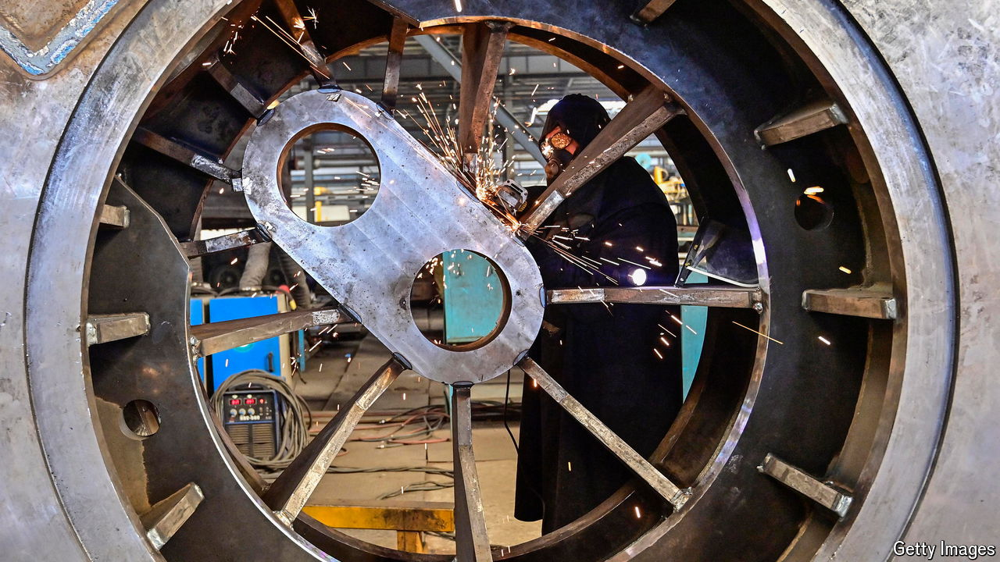
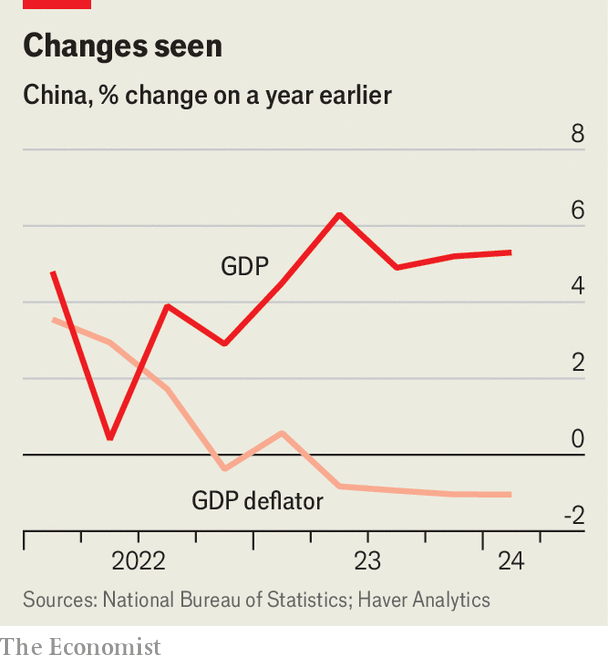

###### Manufacturing miracles

# China’s better economic growth hides reasons to worry 

##### The country’s leaders are too complacent about deflation 

 

> Apr 16th 2024 

When China’s leaders set an economic-growth target of “around” 5% for this year, the goal was widely agreed to be ambitious. Now the country looks increasingly likely to meet it. Several foreign banks have raised their forecasts. Data released on April 16th show the economy grew by 5.3% in the first quarter, compared with a year earlier—quicker than expected and faster than the target requires.

How is this happening? Countries at China’s stage of development often shift towards services. Yet China’s leaders have a soft spot for “hard” output. Xi Jinping, the country’s ruler, sees manufacturing as a source of both prosperity and security. He covets what officials call a “complete” industrial chain that would free China from reliance on foreign powers for vital technological inputs. His latest five-year plan aims to stop the steady decline in manufacturing’s share of GDP. 

The first quarter was consistent with that goal. Manufacturing output grew by 6.7% compared with a year ago, faster than the overall economy. High-tech manufacturing fared even better. China’s leaders have talked a lot about the need to cultivate “”, buzzwords that appeared in the monthly statistical press release for the first time. 

 


But even as China weans itself off foreign suppliers, it remains reliant on foreign buyers. The volume of exports grew by 14% in the first quarter compared with a year earlier, according to Zhiwei Zhang of Pinpoint Asset Management. Falling prices and a competitive currency have helped. America’s Bureau of Labour Statistics reckons the price of goods from China fell by 2.9% year-on-year in the first quarter. That is the third-steepest drop on record.

China cannot rely on strong exports for long without provoking a protectionist backlash from its trading partners. Olaf Scholz, chancellor of Germany, raised fears about Chinese overcapacity when he met Mr Xi in Beijing on April 16th. Germany used to benefit from China’s economic progress. It sold sophisticated industrial goods to China, even as China’s manufacturers conquered lower-end markets around the world. Now the two countries have become rivals in many industries Germany holds dear, including chemicals, machinery and, of course, cars. 

China’s reliance on markets abroad reflects some enduring weaknesses at home. Retail sales were surprisingly poor in March. Consumer confidence remains low. And the property market’s misery continues. The price of new flats in 70 of China’s biggest cities fell by 2.2% on average in March compared with a year earlier, the steepest drop since 2015, according to Reuters, a news agency. Sales of newly built residential housing fell by over a fifth. 

The slump in China’s property market has contributed to falling prices in many related parts of the economy, such as building materials and housing appliances. That has deepened deflation’s grip on the economy. Factory-gate prices have now fallen for 18 months in a row. Consumer price inflation, after a brief uptick during the lunar new year holiday in February, remained near zero in March. Declining prices are a double-edged sword, as Ting Lu of Nomura, a bank, has pointed out. They have increased China’s competitiveness abroad, which is one reason why the country’s exports have been surprisingly strong. But if deflation persists it could erode revenues, making debts harder to bear. It might also force companies to cut wages, which would do nothing to restore household morale or spending.

For all the paranoia of China’s leaders, they seem worryingly complacent about the danger of deflation. Perhaps they view it as a blip, which should not distract them from long-term aims to fortify China against shifts in the global balance of power—what Mr Xi calls “changes unseen in a century”. Falling prices can, though, turn a passing downturn into a protracted slump. This week’s figures showed that China’s GDP deflator, a broad measure of prices, has fallen for four quarters in a row. That has not happened since 1999. Or to put it in terms Mr Xi might appreciate, it is a change unseen this century. ■


