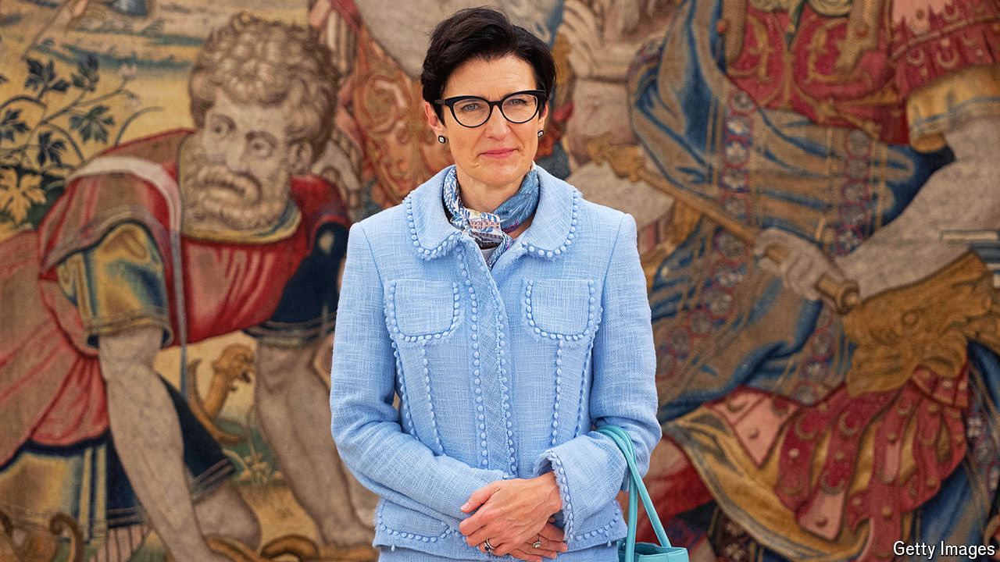
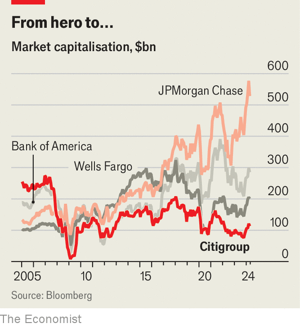

###### House of Fraser

# Citigroup, Wall Street’s biggest loser, is at last on the up 

##### Jane Fraser’s unexpected success 

 

> Apr 18th 2024 

Unmanageable and uninvestible. That is how investors have long considered Citigroup. For over a decade the bank, which was once the largest and most valuable in America, has been a basket case. It trades at half the value it did in 2006, making it the only big American bank to fetch a valuation lower than its peak before the global financial crisis. Pick any measure and Citi is invariably dead last compared with its rivals. The firm has more staff than Bank of America, yet makes only a third of the profit. 

Its prize for this miserable drubbing is not a participation trophy, but a consent order from regulators instructing it to improve internal oversight and change how it measures risk. The firm became the laughing-stock of Wall Street in 2020 when it accidentally wired $894m to creditors of Revlon, a failing company. That Jane Fraser became the first woman to run a Wall Street bank following the mess attached an asterisk to her appointment. “Glass cliff” is a term used to describe the phenomenon of women being appointed to top jobs at companies in deep crisis.

It seemed as if Ms Fraser was bound to fall from that cliff. Some Citi staff grumbled that she was a consultant, not a real banker, because she spent a decade at McKinsey before joining the firm in 2004. Those who bought shares on her first day in 2021 were choking down annualised returns of -15% by mid-September last year. But a remarkable turnaround now appears under way. On September 13th Ms Fraser announced a restructuring. She later laid out plans to sack 20,000 people by the end of 2026, some 7,000 of whom have already been shown the door. Investors seem to be rediscovering their faith in the firm. Citi’s share price rose by more than 50% between September and March, meaning that Ms Fraser now appears to be on the path to an accolade far more elusive than “first woman to do something”. She may become the banker who turned around Citi.

 


To understand what an achievement that would be, look to the bank’s creation in 1998. Citi was going to be “everything to everyone, everywhere”, recalls Ernesto Torres Cantú, who has worked at the bank for 22 years and runs its international business. That was its ambition under Sandy Weill, who was a legend on Wall Street. Mr Weill had bought and merged financial institutions to form a “financial supermarket”. In 2000 Citi was the largest bank in the world, as measured by its capital base.

Flaws are clear in hindsight. Harmonies between businesses never materialised. Instead, Citi became bloated. Layers of management obscured what was happening—which was, in the mid-2000s, a vast amount of bad mortgage lending. In 2008 Citi required more bail-out money than any other bank. It laid off 75,000 people, a quarter of its workforce. Its share price, which at over $500 in 2007 had valued the firm at $270bn, had fallen to less than a dollar by 2009. After the financial crisis, Citi’s bosses promised to simplify the firm. Assets were sold. But “all of the other restructurings we have made, until this one, wanted to preserve that idea [of being in all businesses in all markets] in some way or another,” says Mr Torres Cantú.

Ms Fraser has ditched the mission once and for all. Her first act was to outline plans to sell 13 consumer banks. Nine are gone; three are being wound down. Only one in Poland, where the process has stalled owing to war in Ukraine, remains. 

These cuts have paved the way for the next phase: restructuring. A tangled mess of reporting lines has been replaced by five businesses that report directly to Ms Fraser: markets, which includes debt and stock trading; banking, which houses investment banking; services, which is where Treasury management and securities services are located; wealth management; and the American consumer-bank and credit-card businesses. Citi now details the capital allocated to each of these and their returns, as well as their revenues and profits. 

The reorganisation has cut red tape. Before, “if you wanted to get something done with a client, you had to get the approval of the corporate-bank chain, and then you would move to the approval from the geography management and then you had to get the approval from the legal entity, from the CEO of the regional bank,” says Mr Torres Cantú. It has cut thousands of jobs. And it has also shed light on performance. “We want these business heads to compete with one another to achieve their return targets,” says Mark Mason, chief financial officer at the firm. “Everything is out in the open now.” What has become clear is that Citi has a crown jewel: its services arm, which uses a sixth of the firm’s capital and has returned 20-25% on that capital over the past year (excluding the fourth quarter of 2023, which included significant restructuring costs). Other business returns are poor or, at best, average.

Get the polish out

Ms Fraser wants a bigger crown jewel. Because Citi is a global bank, it has an advantage with corporate clients that operate across borders. The bank now hopes to gain smaller mid-market customers. Ms Fraser would also like to turn around the two laggards—banking and wealth management—for which she has brought in new blood. Andy Sieg, who ran wealth management at Bank of America, joined in September. Vis Raghavan, the head of JPMorgan Chase’s investment-banking business, will join in the summer.

Investors are delighted. Citi’s share price has risen by almost twice as much as those of America’s other large banks since September. But will the changes produce the goods? Citi is still under regulatory scrutiny. The firm’s results from the first quarter, released on April 12th, were mediocre; its share price slipped. Just because investors can now see how poorly wealth management and banking are performing does not mean those businesses will improve. And talent is expensive. As the firm sacked thousands, Mr Sieg was paid $11m for his first three months of work.

There is nevertheless a sense that Citi is at last changing. Reflecting on the firm’s decision to abandon its global consumer-banking businesses, Anand Selva, the firm’s chief operating officer, recalls how “years ago we were competing with all of these big regional and global banks”. But as regulations changed, many packed up, leaving just local banks as competitors. “You decide where you want to focus…and build scale,” he says. Citi will no longer be everything, to everyone, everywhere. ■


