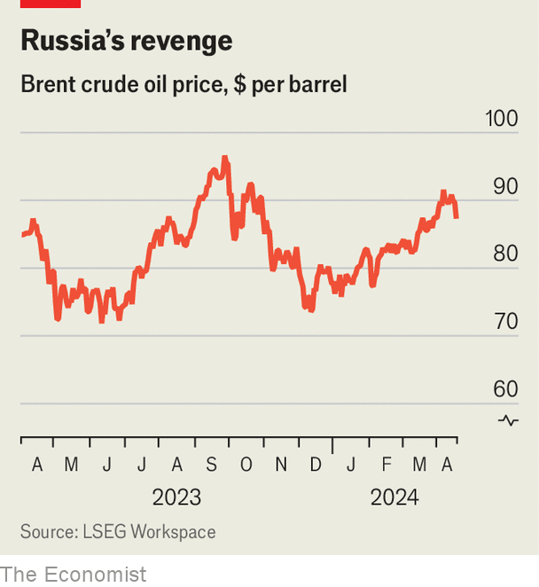
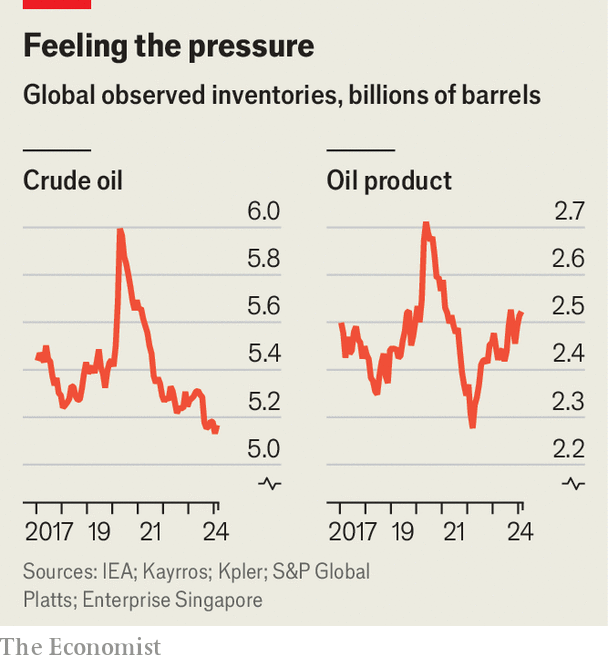

###### Explosive material

# Even without war in the Gulf, pricier petrol is here to stay 

##### Expensive oil could put Donald Trump in the White House 

 

> Apr 17th 2024 

When Iran’s missiles  on Saturday April 13th, oil markets were closed. When they opened on Monday, their reaction was a loud “meh”. Brent crude, the global benchmark, dipped below $90 a barrel. It has since hovered around that level (see chart).

Traders had expected an attack of precisely this variety: big enough to cause concern; obvious enough to be foiled. They are now betting that Israel will avoid anything too rash in response. Yet even if oil prices do not surge, they remain uncomfortably elevated and seem likely to rise higher still in the summer, when increasing demand amid tight supply will probably tip the market into deficit. A cast of decision-makers—from central bankers to President Joe Biden, who faces re-election in November—is watching anxiously. 

 


Geopolitical risk explains, in part, why oil prices have risen by a quarter since December. Brent passed $90 for the first time in nearly six months after Israel bombed Iran’s consulate in Damascus on April 1st. Supply disruptions are playing an even bigger role. Mexico is slashing shipments in order to produce more petrol at home. A leaky Scottish pipeline was forced to close. Turmoil in Libya is disrupting output; war in South Sudan could do the same.

Meanwhile, tougher sanctions on Russia are leaving more of its oil stranded. In March refiners in India—Russia’s second-biggest buyer since 2022—said they would no longer welcome tankers owned by Sovcomflot, Russia’s state-owned shipping firm, for fear of Western retribution. Most of the 40-odd tankers subject to sanctions by America since October have not gone on to load Russian oil. The  on Venezuela could further dent supply. America may also decide to better police its embargo on Iran’s oil sales.

The biggest supply disruption is deliberate. It is coming from the  (OPEC+). In November the group pledged to cut output by 2.2m barrels a day (b/d), or 2% of global production. Most observers had expected that, with prices likely to rise throughout 2024, members would take the chance to row back on the cuts. Instead, several announced in March that they would extend them until the end of June. Russia even said it would deepen its cuts by another 471,000 b/d, reducing output to 9m b/d, from 10.8m b/d pre-war.

Last year supply growth outside the cartel more than made up for the rise in demand. This year non-OPEC output will rise again—Brazil and Guyana are expected to pump record amounts—but growth will slow. Global oil stocks are already falling. They will shrink faster this summer, as holidaymakers in America take to the road.

 


All this is happening at the same time as demand becomes more pressing. Measures of manufacturing activity in America, China and Europe have surprised on the upside, leading the International Energy Agency, an official forecaster, to predict that global crude demand will rise by an average of 1.2m b/d this year, up from the 900,000 b/d it suggested in October. Others, including some big traders and OPEC itself, reckon demand growth may near or surpass 2m b/d.

Where will the oil price go next? If OPEC+ keeps its cuts unchanged, it could reach $100 within months. But that is not an outcome the cartel really wants. Many members, not least Saudi Arabia, worry that a rapid rise in the oil price could destroy demand. Dearer crude is pushing American petrol prices, already at $3.60 a gallon, closer to $4. A surge past that point could shave 200,000 b/d off petrol demand over the summer, estimates JPMorgan Chase, a bank. Thus OPEC+ may signal its intention to produce more at its next meeting. Jorge León, a former OPEC analyst now at Rystad Energy, a consultancy, expects crude to average $90 a barrel in the third quarter of the year and $89 in the final quarter. Futures markets are even more sanguine: buying crude for delivery in December costs around $85 a barrel.

Even if the tit-for-tat between Israel and Iran escalates, it is unlikely to change much. Any reduction in Iran’s exports—worth 1.6m b/d in March—might be balanced by more pumping from the rest of OPEC. In a worst-case scenario, Iran could decide to close the Strait of Hormuz, a waterway that connects the Gulf to the Indian Ocean, through which 30% of the world’s seaborne oil, and nearly all of the Gulf’s, must pass. Yet doing so would anger just about everyone in the region, and cut off Iran from its sole oil buyer: China. Although Iran could opt to cause trouble in less self-harming ways, such as harassing ships in the Gulf, this may not have a big impact. Even the tanker war of the 1980s—when hundreds of tankers were attacked—failed to durably boost prices.

The most likely scenario, therefore, is that oil prices remain tolerable to the world economy, at somewhere in the region of $85-90 a barrel, while allowing OPEC members to earn juicy margins. Prices are unlikely to fall soon, though. And whether such a level is tolerable to American voters, who see gasoline prices advertised in big red numbers by the highway every day, is another matter entirely. ■


