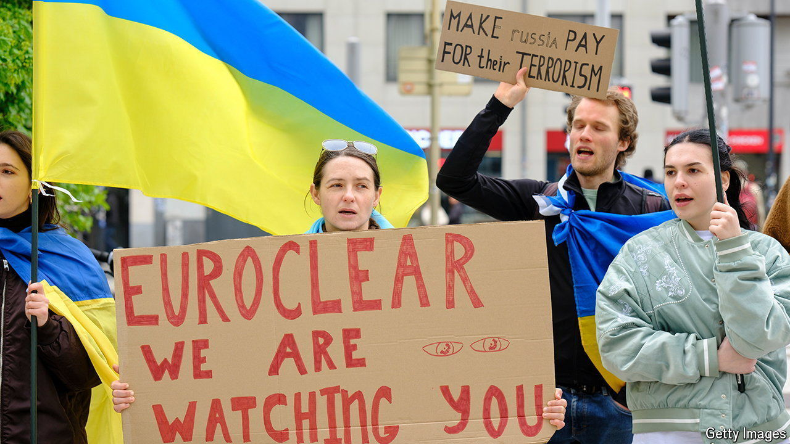

###### Conflict finance

# Frozen Russian assets will soon pay for Ukraine’s war 

##### And America now hopes to convince others to make better use of the stash 

 

> Apr 18th 2024 

After Russia destroyed the Trypilska power plant on April 11th, Ukraine blamed a lack of anti-missile ammunition. The country’s leaders are also desperate for more financial support. The two shortages—of ammunition and money—reflect different constraints among Ukraine’s allies. Whereas the lack of ammunition is mostly the product of limited industrial capacity, the lack of money is the product of limited political will. 

In one area, though, there are signs of progress: over what to do with Russia’s frozen assets. After Vladimir Putin invaded Ukraine, Western governments quickly locked down €260bn-worth ($282bn) of Russian assets, which have remained frozen ever since. Proposals about what to do with them have ranged from the radical (seize them and hand them over to Ukraine) to the creative (force them to be reinvested in Ukrainian war bonds). Until recently, none has found widespread favour with Western governments.


Could that soon change? On April 10th Daleep Singh, America’s deputy national security adviser for international economics, declared that the Biden administration now wanted to make use of interest income on frozen Russian assets in order to “maximise the impact of these revenues, both current and future, for the benefit of Ukraine today”. Six days later David Cameron, Britain’s foreign secretary, announced his support, too: “There is an emerging consensus that the interest on those assets can be used.”

The approach is an elegant one. Income earned on Russia’s foreign holdings can be seized in a manner that is both legal and practical. Many of the country’s bonds have already matured. Cash from redemption of bonds is held by the depository in which it currently sits until it is withdrawn, paying no interest to the owner as per the depository’s usual terms and conditions. Any interest earned thus belongs to the depository—unless, that is, the state decides to tax it at a rate close to 100%.

Next, as suggested by in February, would be to transfer the net present value of that income stream to Ukraine. Investing Russia’s cash holdings into five-year German bunds would yield €3.3bn a year, enough to service EU debt of about €116bn at the same maturity. The rest is financial plumbing: set up a G7-guaranteed fund that receives the depositories’ incomes on Russian cash, issue that fund’s debt to the markets and send the proceeds in bulk to Ukraine. 

Although the EU has agreed to seize profits from depositories, it has not agreed to the subsequent steps. Under the bloc’s current plans, the proceeds will be used to pay for Ukrainian ammunition by July if all goes well, with a small portion set aside to compensate depositories for any Russian legal action or retaliation. But many in Europe remain suspicious about America’s desire to unlock more money through financial engineering. On April 17th Christine Lagarde, president of the European Central Bank, suggested that such proposals face a “very serious legal obstacle”.

A drip of funds would be welcomed by Ukraine, but a big wodge of cash, as promised by America’s proposal, would be better still. European politicians would therefore be wise to sign up to it before there is a new occupant of the White House. ■


