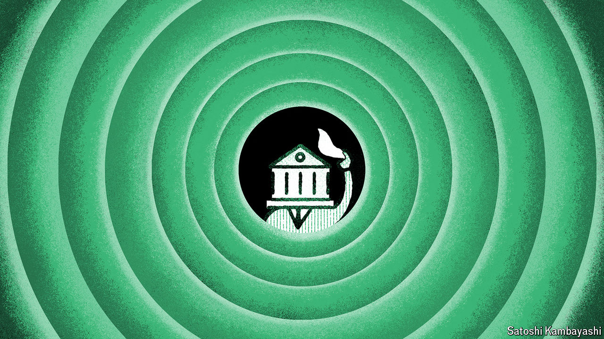

###### Buttonwood

# Why the stockmarket is disappearing 

##### Large companies such as ByteDance, OpenAI and Stripe are staying private 

 

> Apr 18th 2024 

The law of supply and demand is one of the first things that students of economics learn. When the price of something goes up, producers bring more to market. What, then, is going on in global stockmarkets? 

Global share prices have never been higher, having risen by 14% over the past year. At the same time, the supply of stocks is shrinking. As analysts at JPMorgan Chase, a bank, note, the pace of company listings is slower this year than last, and last year was already a slow one. This means that equity issuance net of stock buy-backs so far this year is already negative, at minus $120bn—the lowest such figure since at least 1999. Companies including ByteDance, OpenAI, Stripe and SpaceX have valuations in the tens or even hundreds of billions of dollars, and remain private.

Jamie Dimon, JPMorgan’s boss, is among those to have voiced concern. He identifies demand for environmental, social and governance reporting and the pressure of quarterly earnings reports as part of the trend’s explanation. But for the most part, the disappearing stockmarket is a side-effect of something more positive for company founders: they simply have more options. Private-equity funds managed $8.2trn by the middle of 2023, according to McKinsey, a consultancy—more than twice the amount in 2018. If founders do not want to go public, they now face less pressure to do so. There are plenty of funds that are willing to invest in them regardless.

Founders have many reasons to stay private. The rise of intangible assets is a big one. Such assets range from copyrights, software and other intellectual property to brand recognition. René Stulz of Ohio State University notes that requirements for disclosure of financial information and strategy favour companies with tangible assets, such as machinery and real estate. When a firm announces it owns a building, competitors can hardly steal the asset. When it comes to ideas, research and other intangibles, the less rival firms know, the better. If a company tries to withhold information when listing, it may be undervalued. Worse still, it may be breaking the law. 

People other than company founders may be worried by the trend, however. Public markets are more transparent than private ones. Thus their reduced importance matters not just for investors, but for regulators monitoring financial stability and analysts assessing the market. Stocks also still tend to be the cornerstone of portfolios for less sophisticated retail investors. Alexander Ljungqvist, Lars Persson and Joacim Tag, three economists, suggest that the disappearance of markets may reduce public support for business-friendly government policies, as voters benefit less from corporate profits.

Might anything be done to revive stockmarkets? The changing behaviour of institutional investors may blunt some of the trend’s more damaging consequences. Allocations from such investors to private equity have grown in recent years, rising to 10% of their assets in 2023 from 6% five years earlier, at the same time as allocations to listed equities have dropped by a similar amount. This will provide households with exposure to privately held investments through their pension and mutual funds.

But institutional investors will do little to improve transparency in private markets. One option that might appeal to regulators is to impose tighter requirements on large companies that choose not to list, in order to close the gap between the rules faced by public and private firms. A less coercive option would be to reduce the amount of information that companies are forced to share when they go public. 

Unfortunately, such efforts have produced mixed results in the past. The Jumpstart Our Business Startups (JOBS) Act, which was introduced in America in 2012, reduced disclosure requirements for public firms. Although an assessment in 2015 indicated that it had boosted initial public offerings by 25%, another in 2022 suggested that it had done so by encouraging low-quality offerings that ended up underperforming the market. 

As a result, the best hope for stockmarkets may lie with the greed of private-equity investors. Public markets still provide an unparalleled exit route for those who would like to turn corporate holdings into ready cash. Bain, another consultancy, notes that private-equity funds are currently sitting on $3.2trn in unsold assets. At some point, end-investors will want the money back. But until then, Mr Dimon is right: shrinking public markets are cause for concern. ■


