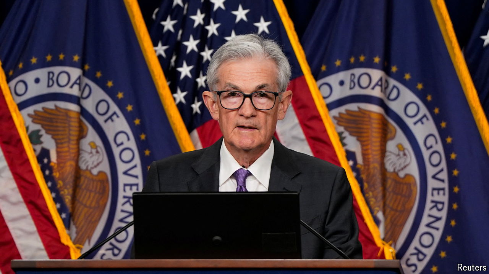
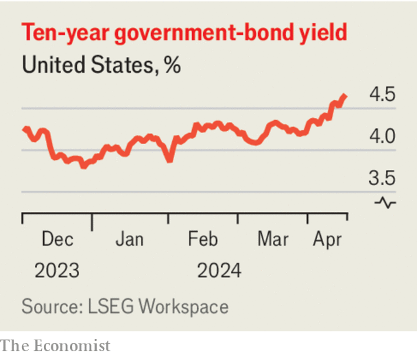

###### The second Powell pivot

# America’s interest rates are unlikely to fall this year 

##### That will squeeze financial markets and the world economy 

 

> Apr 17th 2024 

For most of the year everyone from stockpickers and homebuyers to President Joe Biden has banked on the Federal Reserve cutting interest rates soon. Over the past two weeks those hopes have been dashed. Annual consumer price inflation in March, at 3.5%, was higher than expected for the third month in a row; retail sales grew by a boomy 0.7% on the previous month. On April 16th Jerome Powell, the Fed’s chairman, warned that the battle against inflation was taking “longer than expected”. Investors had begun 2024 pricing in more than 1.5 percentage points of interest-rate cuts over the course of the year. Today they expect  by only 0.5 points.

Mr Powell has conducted a pivot upon a pivot. The euphoric expectations for rate cuts took on a life of their own after the Fed . That unduly stimulated the economy and will force the central bank to retrace its steps, and then some. The consequences of higher-for-longer interest rates will reverberate around America, financial markets and the world economy.

 


America’s economy has demonstrated that it can withstand at least a temporary period of higher rates. On April 16th the IMF forecast that it would grow by 2.7% in 2024, up from the 2.1% it expected in January. Yet its resilience to prolonged exposure to high rates is less certain. 

Many companies issued corporate debt during the pandemic when rates were much lower. That has helped them cope with high rates so far; but eventually they will have to refinance and pay up. Mortgage-interest rates of nearly 7% have frozen much of the housing market. America’s high and rapidly growing government debt is also becoming much more expensive to service: the yield on ten-year Treasury bonds has risen to about 4.6% from 4.2% at the end of March. Already the most recent forecasts, predicated on lower rates, saw net interest absorbing more of this year’s federal budget than defence.

Financial markets will also feel the effects of continued high rates. The Fed’s doveishness in December propelled a stockmarket boom; though that recently lost steam, the S&amp;P 500 index of stocks remains a fifth above its level at the end of October, when rates were last expected to stay higher for longer. Stocks now look vulnerable to a correction. 

Moreover, the problems that high rates exposed in America’s banking system in 2023 still lurk. At the last count there were $478bn of unrealised losses on banks’ balance-sheets, much of which result from higher rates reducing the value of government and mortgage-backed bonds. That figure will have risen now that bond yields have shot up again.

The consequences of higher rates in America will also ripple out to the rest of the world. Though there are signs of somewhat sticky inflation elsewhere—Britain’s consumer price inflation was also higher than expected in March—no major economy is as hot as America’s. The IMF’s forecast for euro-zone growth this year, for example, is just 0.8%. The result is a strengthening dollar, which is up about 5% against its biggest trading partners this year. Strikingly, the Japanese yen has slipped to nearly 155 against the greenback, despite a historic (though modest) monetary tightening in March, prompting speculation that the government may intervene to defend the currency directly.

In theory a stronger dollar should help the rest of the world by making its exports more competitive, and growth in America should spill across borders as it sucks in imports. But a surging greenback can also disrupt trade and borrowing that is denominated in dollars. Economies that rely on commodity imports, such as Japan’s, face a double squeeze from a stronger greenback and a , which is up by about 20% since early December and could rise a little further if strife in the Middle East worsens. 

If high interest rates in America end its enviable economic run, rate cuts will eventually follow. Until that time comes, America’s monetary policy will remain a problem for the rest of the world. ■

