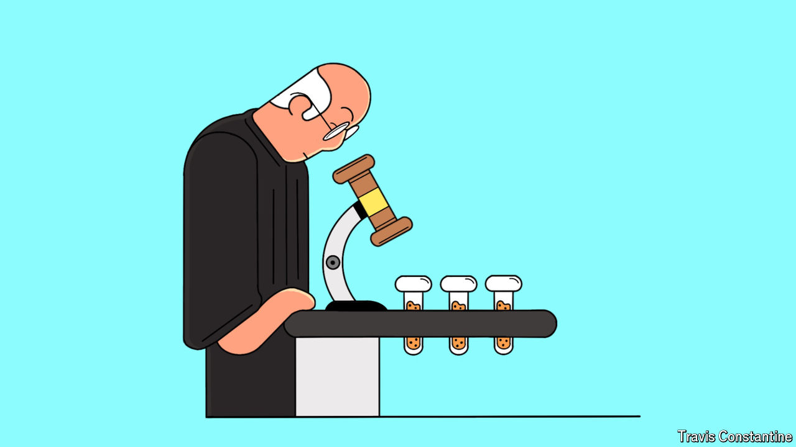

###### Poor prescription

# America’s moves against Chinese biotech will hurt patients at home 

##### The motives behind the BIOSECURE act are muddy 

 

> Apr 18th 2024 

America’s crackdown on Chinese trade is broadening. On the campaign trail on April 17th President Joe Biden proposed tripling tariffs on steel imports, citing . Having choked off China’s access to advanced semiconductors and moved to ban , a Chinese-owned social-media app, lawmakers are eyeing a new target: biotechnology. The biosecure act, which has bipartisan support in Congress, proposes to end government contracts for firms that count Chinese biotech companies as clients or suppliers. American officials have previously said they want to guard a “small yard” of sensitive technologies with a “high fence”. This bill illustrates that the yard is getting bigger, with sorry consequences for American consumers.

It uses the threat of ending lucrative federal contracts to sever American firms’ ties with , makers of sequencing machines and makers of large-molecule drugs such as weight-loss injectables. It extends the ban to any biotech firm with its headquarters in an adversary country, and mentions four Chinese companies by name. 

One target is a sequencing firm called BGI, formerly known as Beijing Genomics Institute. BGI is the largest sequencer of human DNA in the world and operates in over 100 countries. It supplies prenatal tests and diagnostic swabs for covid-19 and other diseases. The firm, like its rivals, provides health screenings on the cheap in return for keeping its patients’ anonymised data. The data in turn are used in cutting-edge drug development.

Lawmakers allege that the data hoovered up by BGI are stored within reach of nosy Communist Party officials. The firm says sensitive information is stored privately and that its American operations are limited. But lawmakers need not take BGI’s word for it. In February President Joe Biden banned exports of health data to adversaries, including China, mirroring China’s own controls. Lawmakers did not need to go further. 

Moreover, having begun with reasonable concerns about a specific firm’s handling of data, the authors of the bill have widened their scope much further, by bringing in the makers of medical equipment and drugs, such as Wuxi AppTec, which conducts research and manufactures compounds used to make drugs for clients including the world’s biggest pharma firms. WuXi AppTec and its sister firm, WuXi Biologics, are by revenue the world’s largest providers of contract drug discovery and manufacturing. While some diversification away from Chinese producers might have been justifiable, that is not the stated intention of the bill. In any case, the legislation would not merely enforce diversification, but wholesale decoupling. 

The lawmakers claim that Chinese biotech firms have stolen intellectual property (IP) and collaborated with the People’s Liberation Army (PLA) and the Chinese government’s repression of Uyghurs. (WuXi AppTec says it is not aware of unauthorised transfers of IP.) Yet here too the biosecure act is an overreaction. Western biopharma firms are notoriously protective of their IP and are surely best placed to decide whom to trust with their drug recipes. Chinese firms that are militarily or morally compromised should be targeted on an individual basis, not by dint of their nationality or industry. 

The muddier the motivation behind the legislation seems, the harder it is to escape the conclusion that old-fashioned protectionism is at play. And that is a problem, because it means the bill would unduly hurt American consumers, without delivering any of the supposed security benefits. 

Small gain, high price 

If the legislation passes, as seems likely, drug shortages and delayed clinical trials for medicines would probably follow. Every large Western pharma firm and many small ones would have to abandon supply chains and find new partners for trials. Biotech startups in particular rely on cheap Chinese manufacturers to bring their products to market. And that would go against another stated intention of the Biden administration: to lower drug prices. ■

