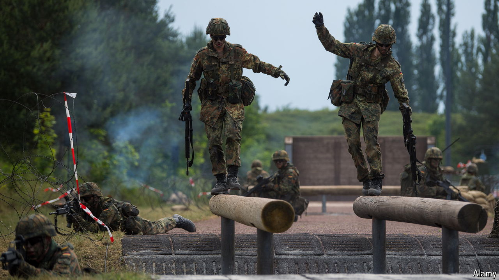

###### Your country needs (more of) you

# How to get more people into military uniforms 

##### Why mandatory military service makes sense for some countries but not others 

 

> Apr 18th 2024 

 is under discussion once more in Europe. The reasons? The possibility of Ukraine’s defeat looms large, as does the threat of a future president Donald Trump abandoning nato. Boris Pistorius, Germany’s defence minister, says that Europe must be ready for war before the decade’s end. He describes dropping a one-year period of service for school-leavers in 2011 as “a mistake”. Britain’s army chief, General Patrick Sanders, has called for a “citizen army”. 

Compulsory stints in the armed forces can take several forms, including the conscription of civilians of any age, call-ups using lotteries and a standard period of military service for young people after they leave school. Compulsion is being considered because many rich countries  enough people for their all-volunteer professional forces. Some countries look admiringly at NATO’s Nordic and Baltic members, all of which have some form of mandatory service which enjoys high levels of public support. Sweden ended it in 2011, only to resurrect it in 2018. 

Is this an approach that other countries should follow? The short answer is not yet. Armies should be designed to reflect both geography and how they expect to fight. In countries with relatively small populations that have borders close to Russia, such as Estonia and Finland, public acceptance of conscription is high and training prepares forces for a “porcupine” defence against an invader. There is a strong sense of a shared national endeavour. For similar reasons, military service in Israel, which faces constant security threats, is uncontroversial (aside from resentment that the ultra-Orthodox do not have to serve). Taiwan and South Korea have conscription because they, too, are close to bellicose powers. 

Citizens in most of the rest of the rich world do not yet feel an imminent threat. So for conscription to be workable, there would need to be a clear and shared understanding of why it was needed. That is lacking in countries such as Britain and France, where it is not obvious what conscripts could do in a modern, technologically sophisticated army. Besides, “in a crisis” each country must field a full division (30,000 troops with heavy equipment) within 30 days if needed by NATO. Dealing with lots of conscripts could be a distraction.

Because conscripting young people infringes harshly on their liberty, the policy would need public support. Even Ukraine, in existential peril, found lowering the call-up age from 27 to 25 this month politically tricky. Undoubtedly the difficulties faced by most of Europe’s armed forces in recruiting regular soldiers and building proficient reserves need redress. But they can mostly be resolved by means other than compulsion.

First, consider raising soldiers’ salaries. Older folk sometimes grumble about the supposed character flaws that make young people unwilling to serve. But poor pay and conditions are by far the biggest obstacles to recruitment when job-seekers have other choices. Defence budgets are rising but will need to do so faster. NATO members’ target of spending 2% of GDP on defence will not be enough to cover both higher wages and new kit. There should also be more experimentation, for instance with one-year trials of service that can be combined with university studies or other training. And despite much discussion, few armies have done enough to recruit women and combat sexual harassment.

Second, more civil-society support is needed to attract those with the specialist skills required in emergencies. In addition to wooing more volunteers to augment regular forces, armies could swell reserves by making soldiers who leave the forces agree to annual training days until they reach their mid-40s. In this way Britain could mobilise as many as 300,000 such people if needed. The numbers might be even higher in France and Germany, as they have larger armies.

In these tense times countries should still maintain plans for how, if the worst came to the worst, a much wider mobilisation might occur. To deter the most dangerous enemies, you must be ready for a war that you do not want to fight. Just ask the courageous Ukrainians. ■

