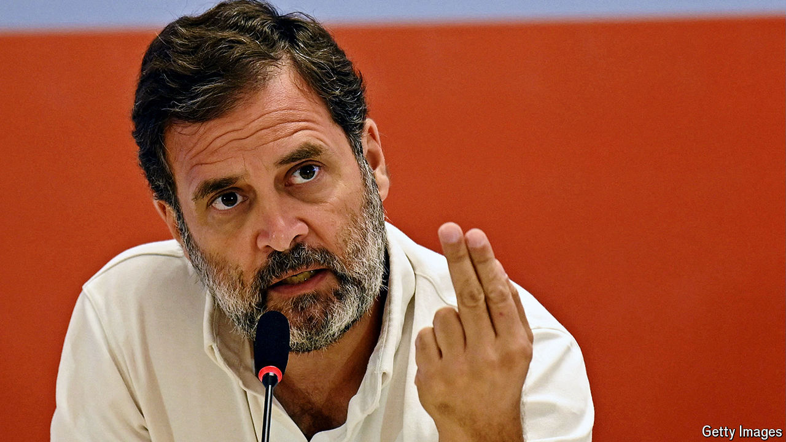

###### The Modi juggernaut

# India’s democracy needs a stronger opposition 

##### The Congress party is set for a drubbing in the world’s biggest election 

 

> Apr 18th 2024 

Over the next six weeks nearly a billion Indians will cast their votes. If the polls are right, the general election will be a triumph for Narendra Modi, the prime minister. His Bharatiya Janata Party (bjp) will secure another ; he will serve a third term. For the opposition, disaster beckons. The Congress party, which led the struggle for Indian independence and dominated politics for decades afterwards, is headed for a . With luck, this will be a Schumpeterian moment that forces it to reform: the health of India’s democracy depends on it.

It is hard to overstate the role Congress has played in . Under Mahatma Gandhi it marshalled (largely non-violent) resistance to British imperialism. Under Jawaharlal Nehru and his successors it ruled India for 54 years, positioning itself as a one-nation, multi-faith, left-of-centre movement. 


Yet it remains a family firm. Nehru and his descendants have led the party, or India, or both almost continuously since independence in 1947. Congress’s current de facto leader is Nehru’s great-grandson, Rahul Gandhi (who is not related to the Mahatma). Under him, Congress is not expected to improve much on the 20% of the vote it won in 2019, down from nearly 50% in the 1980s. That could translate into a paltry 10% or less of seats in parliament.

Congress complains that the contest is rigged. Mr Modi has stifled dissent, cowed the media and harassed his opponents. Arvind Kejriwal of the Aam Aadmi Party, another opposition group, recently became the first sitting chief minister to be arrested. Last year Mr Gandhi was suspended from parliament for four months after being convicted of defamation for mocking Mr Modi’s name (the Supreme Court suspended a two-year jail sentence). Congress has had its bank accounts frozen.

But a skewed playing field is only part of the problem. Mr Modi is an exceptionally gifted politician. His approval rating, in some polls, is over 75%. His strongman persona, combining Hindu chauvinism and Muslim-bashing with an emphasis on economic development and national renewal, appeals to many Indians. His powerful oratory and humble roots as the son of a tea-seller help him . By contrast, Rahul Gandhi is easy to dismiss as a privileged amateur leading an ossified party with neither the talent nor the ideas to govern the world’s most populous country.

A big electoral defeat should be a clarifying moment for India’s opposition. There is strong demand for an alternative to the bjp: more than half of voters support other parties. The trouble is, these are mostly a mosaic of regional movements that cannot plausibly aspire to national power. Congress is still the best bet to lead a national opposition, but to do so it must change. 

First, the Gandhi family, and the party elders around them, should make way for younger, more dynamic leaders. Second, Congress must transform how it communicates, not just grumble about media bias and censorship. Mr Modi has mastered technology to reach ordinary Indians, as our analysis of his monthly show, relayed on everything from YouTube to WhatsApp, illustrates. Congress must learn to compete. 

Finally, Congress needs better ideas, rather than a timid reheating of the welfarism of the past or griping that the BJP has stolen its more innovative policies, such as India’s digital identity scheme. Mr Modi’s economic management has been competent, but India faces giant problems, from improving its dismal schools to managing migration from farms to cities. 

To avoid sliding into autocracy, India needs a serious opposition, as capable as the BJP but less divisive. If Congress does not change, its young, would-be reformers should split and create a new movement. Mr Modi has remade Indian politics. Time for the opposition to remake itself.■


