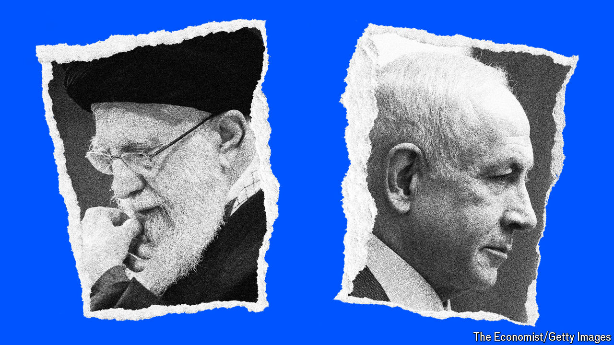

###### The Middle East on fire

# Israel should not rush to strike back at Iran 

##### Instead it should try a novel response to Iran’s missile attack: restraint 

 

> Apr 18th 2024 

The war cabinet in Israel is grappling with a perilous decision: how to respond to Iran’s  on April 13th. The barrage was, fortunately, blocked with help from friends and neighbours. Should Israel “take the win”, as President Joe Biden is urging, letting a blatant act of war go unanswered? Or should it retaliate and risk sparking a regional conflagration? 

A small country with many enemies, Israel has long prized massive—some would say disproportionate—deterrence. It has wrecked Gaza in the attempt to crush Hamas, which massacred Israeli civilians on October 7th. Israeli retribution against Iran now seems inevitable. But Israel’s government should stay its hand.


There is a precedent. In 1991 Saddam Hussein, Iraq’s despot, hit Israel with dozens of Scud missiles. His aim was to provoke Israeli retaliation, and thus divide an Arab coalition poised to help America evict his forces from Kuwait. At America’s urging, Israel did not retaliate. Today, too, Israeli restraint could make it easier to build a coalition against a regional threat: Iran. But only America can muster such a coalition.

Iran claims Israel invited the attack by killing seven members of its Islamic Revolutionary Guard Corps (irgc), including two generals, with an air strike on its diplomatic compound in Damascus. This is cant. Iran cared little for diplomatic premises when it took American diplomats hostage in 1979, and when its agents or allies blew up the American embassy in Beirut in 1983 and the Israeli one in Buenos Aires in 1992. Regardless, Iran’s recent strike is disproportionate.

It fired 170 drones, and about 120 ballistic and 30 cruise missiles. It made overt the long covert war with Israel, breaking the taboo against openly attacking each other’s territory. The strike is a challenge to America, too. Mr Biden has repeatedly warned Iran and its allies “Don’t”. They ignored him. First proxies started shooting at Israel; now Iran has joined in.

As the war in Ukraine shows, drones and missiles favour the attacker because they are hard and costly to shoot down. But they can be thwarted by technology and co-ordination. American, British and French forces—and more quietly Jordanian and perhaps Saudi ones—took out many of the Iranian warheads. The rest were almost all destroyed by Israel. The few that got through did little damage.

The attack proves the menace of Iran’s ever more zealous rulers. Its proxies in Lebanon, Yemen, Iraq and Syria hollow out states and destabilise the region. This “axis of resistance” has fired drones and missiles not only at Israel but at Saudi Arabia, the United Arab Emirates and Pakistan. Iran’s weapons are being used against Ukraine, too, as it aligns itself with Russia, China and North Korea. The danger is all the greater because Iran is alarmingly close to having nuclear arms. 

Even so, Israel should bide its time. Restraint would help to heal the rift with America over the conduct of the war in Gaza. It would allow the budding air-defence partnership to grow into a bigger and more lasting coalition. The more Israel can create a common front with like-minded countries, the better. Co-ordinated sanctions, diplomatic isolation, cyber-attacks and support for Iranian dissidents—and rapprochement between Israel and Arab states—may prove better at containing Iran than strikes. If Israel acts rashly, its neighbours will bear a heavy cost in a wider regional war; America and Europe will be sucked into hostilities; oil prices will soar; and global trade will be disrupted. Only Iran’s “axis of resistance” would welcome chaos. Iran itself could cross the nuclear threshold.

America would be vital to creating a coalition to contain Iran. America and European powers can start by co-ordinating sanctions on the irgc and allowing the “snapback” of un penalties suspended under a now-defunct nuclear deal from 2015. Diplomacy with Iran, direct or indirect, should continue but with no illusions. America and Israel—and ideally others—need to make a calibrated but credible threat of military action if Iran makes a dash to acquire nukes. 

To make all this possible, however, Israel needs to end the war in Gaza, starting with a temporary ceasefire and the exchange of prisoners and hostages. The more Hamas loses hope of fomenting a regional war, the likelier it is to agree to such a deal. Progress towards Palestinian statehood, under a reformed Palestinian Authority, would unlock the big prize—normalisation with Saudi Arabia.

None of this will be easy or without risks. But Iran’s attack highlights the dangers of escalation in a never-ending war. It also shows that Israel alone cannot defeat Iran and its network. To counter it, Israel needs its own network—with America, Europe and emerging Arab friends. A moderate coalition is the surest way to end the perpetual conflict with the Palestinians, which feeds Islamic radicalism, and to contain Iran. ■

