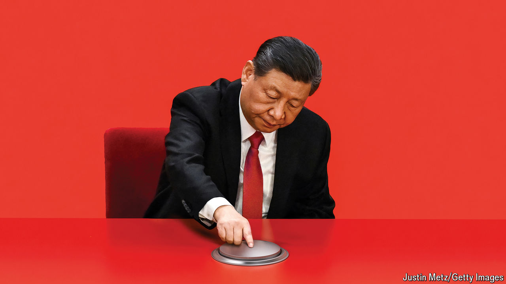
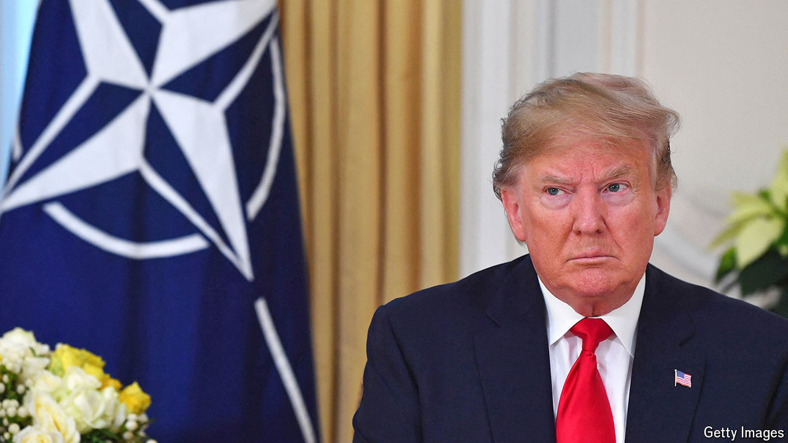
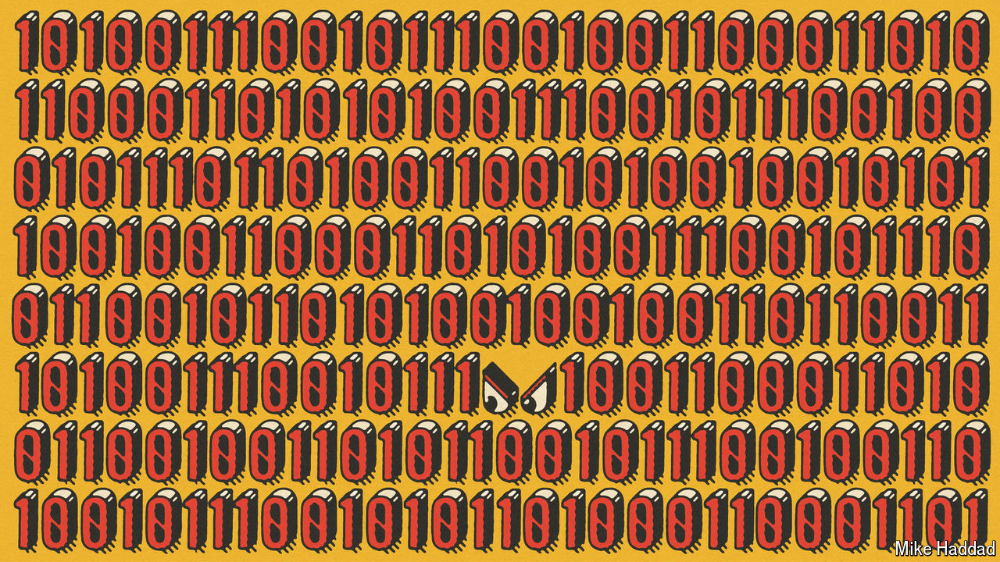
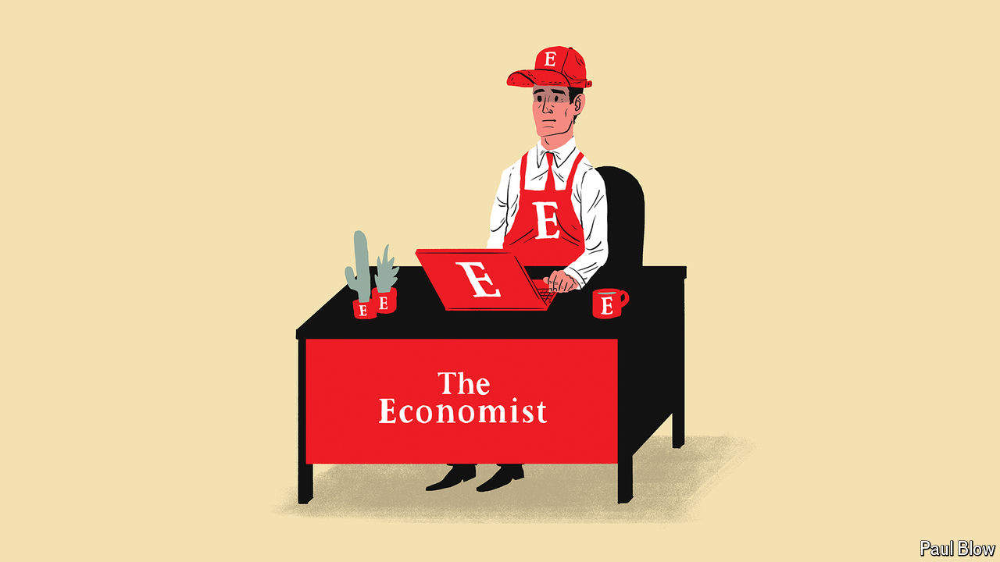

###### On China, WEIRD countries, nuclear weapons, software engineers, banlieues, uniforms

# Letters to the editor 

##### A selection of correspondence 

 

> Apr 18th 2024 


China’s economic quandary

You described the “new productive forces” strategy adopted by China’s leadership as the country’s gravest economic test since Deng Xiaoping relaunched reforms in the 1990s (“”, April 6th). The significance of this new approach goes beyond the economy, and could pose a threat to the regime that Xi Jinping has fashioned over the past dozen years, which is centred on buttressing the power of the Communist Party around its core chieftain.

Deng struck a simple bargain with China’s population after the repression of protests in 1989: leave politics and power to the Communist Party and, in return, the party will make you materially better off through high growth. The means used to generate the second element of that deal have now proved unsustainable, as was inevitable given the reliance on investment, overcapacity, weak domestic consumption, the build-up of debt and other interlocked factors. This presents the party with the puzzle of what to put in place of high growth to enable it to claim political legitimacy and enjoy popular appeal. 

Given the likely failure of Mr Xi’s programme to provide 

a convincing answer, the danger for the leadership is that a faltering economy may now have a severe knock-on effect. That will bring the first part of Deng’s equation into question in a manner for which even Xi Jinping Thought cannot provide a ready answer.

Jonathan Fenby


 


WEIRD countries

Two articles in the April 6th edition, “” and “” on Asia’s damaging dynasties, are similar in that they report on cultures that place an emphasis on looking after their own. But according to Joseph Henrich, neither the Italian mafia nor Asian nepotism is that peculiar. In “The WEIRDest People in the World”, Mr Henrich showed that it is the citizens of WEIRD (Western, educated, industrialised, rich, democratic) societies that seem weird to everyone else. 

WEIRDos keep riches for themselves, rather than sharing their gains with their clan, and snitch on friends for the sake of upholding the law. Mr Henrich ascribes the split between WEIRD and non-WEIRD countries to the policies of the Catholic church in the 5th century, which sought to undermine kinship. 

Johann Wirsing


 


The risk of nuclear weapons

Your claim that nuclear deterrence has worked up to now is questionable (“”, April 6th). There is no corroborative evidence for this, only the correlation of the possession of nuclear weapons by rival countries with the fact that they have not been used since 1945. Even in the case of Ukraine, which you cite as evidence of deterrence in operation, there is no way of knowing whether NATO really would have sent combat troops to join the fight against Russia if the Kremlin did not have nuclear weapons.

Deterrence doctrine is an unproved theory based on the naive assumption that political leaders will act rationally 100% of the time. It assumes each side always has accurate information about its opponent’s intentions. It fails to consider the possibility of accidents, miscalculations, terrorist groups, cyber-attacks or simple mistakes. We now know it was a matter of luck that a Soviet submarine did not fire a nuclear torpedo at blockading American navy vessels during the Cuban missile crisis.

Rather, it is the devastating humanitarian impact of nuclear weapons, as shown in Hiroshima and Nagasaki, and the threat they pose to the whole world, not just the states that possess them, that led to the adoption of the Treaty on the Prohibition of Nuclear Weapons in 2017. Almost half the world’s countries have signed or ratified the treaty.

The nations with nuclear weapons and their allies must learn from that. Instead of putting their faith in a flawed theory of deterrence, they should join the treaty and finally remove this existential threat. Eliminating nuclear weapons is simply good risk management.

Melissa Parke

Executive director

International Campaign to Abolish Nuclear Weapons


 


O.J. Simpson’s trials

Your analysis of the O.J. Simpson trials (“”, April 12th) misunderstood a crucial distinction between criminal and civil law, which exists in California and endures throughout the common-law world. You referred to the majority black jury acquitting Simpson in his criminal trial, and the majority white jury finding him liable in his civil trial. From this, you concluded that “presented with the same facts, white and black Americans saw a different reality”. However, this conclusion does not follow. The verdicts are neither inconsistent nor opposite.

In a criminal trial, the prosecution must prove the offence so that the jury is sure beyond reasonable doubt. In a civil trial, liability is established if it is more likely than not that the relevant events occurred. Analysed in this way, it is entirely possible that the black jury found it more likely than not that Simpson committed the crime (thus liable under the civil standard of proof), but they could not be sure of guilt, rendering them bound to acquit pursuant to the criminal standard. For the same reasons, the white jury in the civil trial might well have proceeded to acquit in the criminal trial.

Moreover, your criticism of Simpson’s criminal defence attorneys, and the likening of them to populists or demagogues, was unfair. Their professional duty was to cast doubt on behalf of their client. They did that with skill and effect. If criticism is to be levelled, it should be directed at the police officer responsible for racist slurs. Without this abhorrent behaviour, it would have been far more difficult for Simpson’s attorneys to develop the “nebulous conspiracy” that you suggest was responsible for his acquittal.

Rupert Wheeler

Barrister


 


Drafting software engineers

I was not surprised to learn that an engineer at Microsoft discovered the attack on XZ Utils, open-source software which is incorporated into Linux systems (“”, April 6th). Skilled developers typically work on important projects either as a hobby or because their employer needs a bug fix or new feature to support a business function. Policymakers should consider two initiatives.

First, offering tax credits to developers for time spent writing, fixing and reviewing code on open-source projects that are maintained by registered charities would give people with the required skills a reason to spend a few weekends each year contributing to these public goods. We already offer tax credits to volunteer firefighters or teachers. 

Second, the armed forces should consider open-source software development as a model for their cyber-reservist programmes. Since 2002 various government initiatives in America have been trying to find ways to put America’s professional programmers to work at the weekends. Asking them to help maintain code on open-source projects used by the government would be better suited to a weekend and night-time work regime than transitional full-time software engineering. Personally I would be interested in joining such a programme. What young techie wouldn’t love also to be a sergeant.

Jon Wiggins

Machine-learning engineer


 


Don’s ban XL Bullys

Your call to ban XL Bully dogs everywhere was a strange bit of finger-wagging paternalism from an ostensibly liberal newspaper (“”, March 25th). In the United States the breed abounds, and is increasingly popular as a rescue dog. In 2023 there were 21 fatalities attributed to bully breeds. It is hardly a statistically significant problem. The owners of dogs that exhibit aggressive behaviour should be held to account by the law. As should owners whose cruelty encourages and exacerbates aggressiveness. But outlawing the breed will only drive it further into the “shadows” where such cruelty is the norm. 

R. Zachary Thomson


 


On the edge of French cities

Karim Bouamrane, the mayor of Saint-Ouen, is quoted as saying that “etymologically the word  means the ‘place of the banished’. It’s the place where we don’t like you” (“”, April 6th). Although this interpretation certainly supports the gist of the article, the truth is less dramatic. Historically, the  was the area around a city (usually within one league, or ) where the authority of the city applied and its decisions were relayed via proclamations, or . 

Andrew Johnston


 


What to wear to work

Bartleby’s column on corporate uniforms missed an important point (). Uniforms help us realise when our own values are at odds with an organisation’s. As a new management consultant, I was told that I could wear a charcoal suit, a navy suit, a white shirt or a pale blue shirt. I looked down at the yellow tartan dress I was wearing and realised that this was not my place, and that these were not my people. 

I quit, and joined a company where I was complimented on my long-standing and deeply held belief that sequins are daywear. 

Siân Davies


Frank Zappa was interrupted from playing once by a member of the audience who heckled him about some concert-guards in uniform. Zappa’s reply was “Everybody in this room is wearing a uniform, and don’t kid yourself.” You can hear the live exchange on “Burnt Weeny Sandwich”, an album released in 1970. 

Denis Bonaccolta


