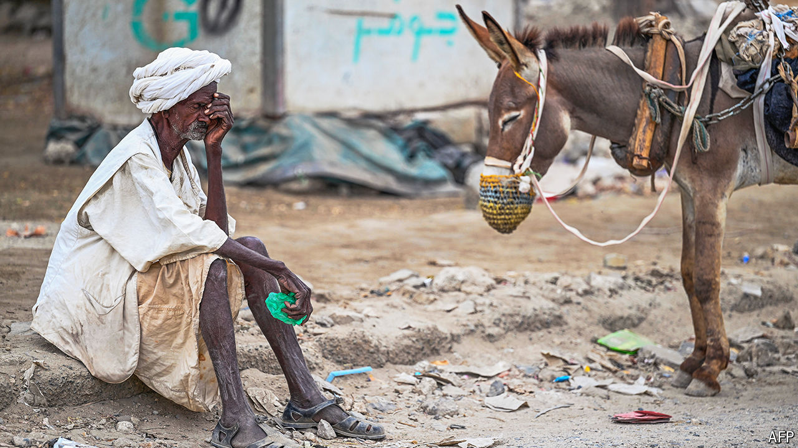
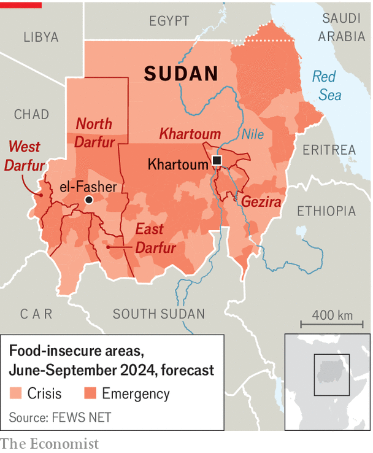

###### Deeper into hell

# After a year of war, Sudan is a failing state 

##### Half a million may starve without urgent help 

 

> Apr 15th 2024 

It has become a morbid sort of trivia game. Which country has the world’s largest population of internal refugees? The highest number of people facing famine? And where do aid agencies have the biggest humanitarian load, but until this week were short of 95% of the funding they need? The answer is not, as many might assume, Gaza or Ukraine. It is Sudan.

When the conflict in Africa’s third-largest country began a year ago it might have been mistaken for a clear-cut fight between two generals, each vying for control of the central state. On one side were the Sudanese Armed Forces (SAF), led by General Abdel Fattah al-Burhan; on the other the Rapid Support Forces (RSF), a paramilitary unit under the command of Muhammad Hamdan Dagalo (a Darfuri warlord universally known as Hemedti). Even after  in the capital, Khartoum, and quickly spread to Darfur, some observers still imagined it could be contained or that the two sides would grind themselves to a stalemate, and then strike a power-sharing deal. 

Instead the conflict has metastasised into a  so vast and anarchic it could yet destabilise several of Sudan’s neighbours. If there were, at first, two broadly coherent armed blocs under identifiable leadership, now there is a mosaic of competing militias and rebel movements, each with its own interests and agendas. Arms and mercenaries are pouring over the border from Chad, Libya and the Central African Republic, and across the Red Sea (see map). Even fighters from as far afield as Russia and Ukraine have reportedly joined the fray. With neither side having managed to land a decisive blow, both the SAF and the RSF have begun to splinter. “We are hurtling towards a failed state,” frets Tom Perriello, America’s recently appointed special envoy. “There is a real risk of a 20- to 25-year setback for the people of Sudan and the wider region.”

 


More immediate is the risk of mass starvation. “The situation is catastrophic,” says Michael Dunford, the head of the UN’s World Food Programme in east Africa. “When you look at the sheer size and scale, we’re desperately concerned about where this is headed.” 

On April 15th donors pledged around $2.1bn to fund humanitarian efforts. Yet this may already be too late to avert a famine, which is expected by June and may kill 500,000 people, according to the “most likely scenario” in a study by the Clingendael Institute, a Dutch think-tank. In its “extreme” scenario forecast, up to a million may perish. Because of the war, large parts of Sudan—in particular Darfur—collected almost no harvest in 2023. National cereal production collapsed by almost half; the price of basic food commodities shot up by as much as 83%. These trends are set to worsen with fighting having now reached the breadbasket state of Gezira. 

Though the UN has yet to declare a famine, few experts doubt that one is already under way in parts of Sudan. In the worst-affected areas, which include the capital, people are eating leaves to survive. Children are already beginning to die from malnutrition or related diseases. Some 70% of health facilities in war-stricken areas are no longer functional, according to Deepmala Mahla of CARE, an aid group. For most of last year refugees arriving in Chad, which borders Darfur, said they were escaping a fearsome campaign of ethnic cleansing unleashed by RSF troops and allied Arab militias against local black Africans. Now the new arrivals tell aid workers they are fleeing hunger. 

Both sides are obstructing humanitarian assistance. RSF fighters regularly attack aid lorries and loot warehouses belonging to NGOs. In February the SAF banned aid agencies from delivering supplies via Chad. Since then it has partially relented, but it continues to withhold visas and travel permits for aid workers. Crossing the lines between territory controlled by the SAF and RSF to deliver assistance is “cumbersome and deliberately time-consuming”, notes a UN official. As a result, whole regions have for months been cut off from emergency supplies. “Previous food crises in Sudan were localised,” argues Alex de Waal, an expert on famines at Tufts University. “Now we are witnessing something we haven’t seen since the 19th century: a nationwide food emergency.”

Consider el-Fasher, North Darfur’s capital and the SAF’s last major holdout in the west. Before the war the city was a sanctuary for those escaping violence and hunger elsewhere: tens, if not hundreds, of thousands of civilians had sheltered there since the previous round of ethnic cleansing in Darfur 20 years ago. Yet these days it is a microcosm of the chaos that prevails elsewhere in Sudan. In theory the national army remains in charge, with several thousand troops holed up in barracks in the city centre. But in reality rebels from the local Zaghawa ethnic group provide most of the security, while much of the outskirts is under the control of the RSF and affiliated militias. Crossing from one side of the city to the other means navigating multiple checkpoints, each manned by a different armed group. Though the SAF conducts frequent air strikes on RSF positions, they often end up hitting civilian areas, including those under the army’s control.

With movement in, out and around el-Fasher so costly and dangerous, life inside is growing desperate. “We are already too late,” says Justine Muzik of Solidarités International, a French humanitarian charity. Dengue fever and malaria are running rampant. Every two hours in Zamzam, a refugee camp on the south-western side, a child dies from lack of food or medical care, says Médecins Sans Frontières, another French charity. With new arrivals streaming into the city from other parts of Darfur, basic supplies are dwindling. Though food is still available in the market, a sack of rice can cost almost eight times what it did before the war. 

Across large parts of the country soldiers from both sides are raping women and girls, in some cases because of their ethnicity. In Khartoum state alone more than 1,000 rapes have taken place, according to lawyers and doctors. Ghada Abbas, a human-rights lawyer who recently fled Sudan, describes an incident in which soldiers violated three sisters aged 12, 16 and 18 in Omdurman, a city close to the capital. Although people heard their cries, “nobody dared to go out,” she says.

Elsewhere there are some hopeful signs. Discreet ceasefire talks are under way in the Egyptian capital, Cairo. A separate process backed by America is also to resume in Saudi Arabia soon. However, in recent weeks the regular army has reversed some of the RSF’s earlier gains in Khartoum, raising hopes among its supporters of a decisive victory. Just a few weeks before it had been the RSF that appeared triumphant. “What this looks like now is musical chairs,” not a genuine sea-change, argues Kholood Khair of Confluence Advisory, a Sudanese think-tank. With both sides still determined to gain the upper hand, the prospect of peace is slim. ■


