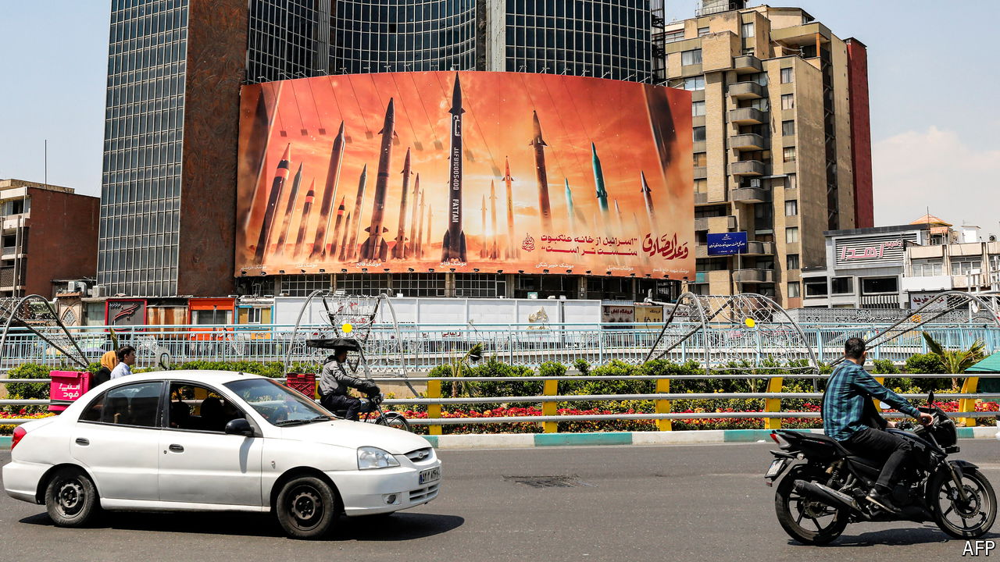

###### The Middle East on fire

# Iranians fear their brittle regime will drag them into war 

##### Ultra-religious hardliners are gaining power and yearn for confrontation 

 

> Apr 15th 2024 

DESPITE ITS 45-year-old hostility towards the “Little Satan”,  had never fired a shot at Israel from its own territory. Instead, the road to Jerusalem went through Karbala, an Iraqi city holy to Shias, said the Islamic Republic’s founder, Ayatollah Ruhollah Khomeini, so he went to war with Iraq. Ayatollah Ali Khamenei, Iran’s Supreme Leader since 1989, used its proxies—Hizbullah, the Shia militia in Lebanon, and the Palestinian militant groups, Hamas and Islamic Jihad—to  and avoid direct confrontation. When Israel attacked Iran’s nuclear programme and its scientists in Tehran, the capital, in recent years, Mr Khamenei’s advisers called for “strategic patience”.

That has all changed. Iran’s salvo of over 300 ,  and  launched at Israel on April 13th heralds “a paradigm shift”, according to Ahmad Dastmalchian, Iran’s former ambassador to Lebanon. The firepower stunned many Iranians, far exceeding the volley that Iran sent in response to America’s assassination of its top general, Qassim Soleimani, in 2020. The head of Iran’s Islamic Revolutionary Guard Corps (IRGC), Major General Hossein Salami, says the regime is now working with “a new equation.” “The era of strategic patience is over,” said an adviser to the Iranian president on X (formerly Twitter) on April 14th. 


Foreign pressure partly explains the policy change. Israel has racheted up its attacks on Iranian targets throughout the Middle East since the start of the war in Gaza in October. It has killed 18 IRGC commanders and about 250 Hizbullah fighters in attacks on Syria and Lebanon. The airstrike on April 1st on the Iranian diplomatic compound in Damascus, which Iran insists is sovereign territory under international law, proved that Iran’s proxies were no longer providing the deterrence on which it has relied for so long. 

But domestic forces are also shaping decision-making. For most of his career, Mr Khamenei relied on gruff conservative pragmatists like himself. Many were commanders in the IRGC, the regime’s most powerful fighting force, and ready to work with the West if they thought that doing so bolstered the regime. But more recently a group of ideological diehards have risen to prominence, who are to Iran what the religious hard right are to Israel. The Paydari Front, or Front of the Stability of the Islamic Revolution, are Shia supremacists who oppose any kind of compromise with anyone inside or outside Iran. They deride their critics as atheists and counter-revolutionaries and want to turn Tehran’s parks into mosques. They consider any kind of reconciliation with the West such anathema that some of their ilk burnt the text of the JCPOA, the deal Iran signed with seven world powers in 2015 limiting its nuclear programme, in parliament. They liken “strategic patience” in the face of Israeli attacks to appeasement.

Their opponents speak of state capture. Ebrahim Raisi, the hardline cleric who was elected president in 2021, has given them prominent positions in his government. His father-in-law is perhaps Iran’s most radical cleric; his sermons fire the Paydaris’ zeal. They tightened their grip on power in last month’s parliamentary elections after many people boycotted the vote. Paydari Front candidates trounced Mohammaed Bagher Qalibaf, a pragmatic former mayor of Tehran, IRGC commander and relative of Mr Khamenei’s. They are now seeking to oust him as speaker of parliament. They have passed new chastity laws. Against the advice of IRGC old-timers, they are seeking to reimpose the mandatory hijab after its de-facto suspension following widespread protests in 2022. On the same day that Iran struck Israel, they sent the morality police back on the streets after a year-long hiatus.

Realists in Iran’s armed forces know that their military hardware is no match for that of Israel. Its air force projected regional power under the shah, but has not been upgraded since then. Its 1960s F-4 American warplanes are no match for Israel’s s, the world’s most advanced fighter jet. Many of its tanks date back to the second world war. But the Paydari Front sees their earthly battle in divine terms. “When you shot arrows at the enemies, you did not shoot; rather God did,” said the zealots, quoting the Koran in a statement after Iran’s attack. Its members speak of the sacrifice made in the seventh century at Karbala when Imam Hussein, the grandson of the Prophet Muhammad, was killed by a Muslim tyrant. He has been venerated by Shias ever since. They pray for a conflagration that could trigger the coming of Imam Zaman, a messianic leader who will inaugurate the end of days. After Iran’s strike their followers celebrated in the streets and distributed sweets. They have plastered Tehran’s billboards with banners in Hebrew warning Israelis to stock up on supplies in anticipation of another attack.

The Paydari Front’s clerics have also infiltrated the ranks of the IRGC. The most recent generation of commanders spent their careers attending summer camps run by Paydari clerics, many of whom are also posted to their units. “The new generation is more ideological and abrasive, less experienced and less pragmatic,” says Saeid Golkar, an expert on the IRGC at the University of Tennessee at Chattanooga. Unlike earlier generations, they have no memory of the Iran-Iraq war in the 1980s. They use religious texts to devise strategy. “Those who don’t know war are more eager to fight,” he says, quoting an Iranian saying. 

Mr Khamenei still calls the shots. His senior commanders say they gave Israel and its allies three days’ notice of the attack. They signposted when it was over. But some Iranians question the 84-year-old’s strength to withstand the Paydari campaign. Under Mr Raisi, the religious right have purged the civil service of reformists and other naysayers. They have used Israel’s continued attacks to marginalise remaining pragmatists within the regime and their calls for restraint. Some claim to welcome the prospect of an Israeli strike on Iranian soil. They reckon it would unite Iranians, a proudly nationalist bunch.

But for all its power, the Paydari Front’s rise may be making the Islamic Republic more brittle. The gap between Iran’s rulers and their subjects grows ever wider. Their president, Mr Raisi, is almost as unpopular with his people as Binyamin Netanyahu is in Israel. Many Iranians blame his inexperienced ideologues for crippling Iran’s economy (the rial reached a new nadir against the dollar after the April 13th attack). And they fear that their zealotry could drag Iran into war. Such is the antipathy towards them that many view the regime’s enemies as friends. After the rocket salvo Iranians exchanged jokes mocking their inefficacy. “A lot of Israelis died…laughing,” quipped one. Graffiti has appeared on the streets calling for Israeli reprisals. “Hit them, Israel. Iranians are behind you,” read one in Tehran. As one Iran-watcher noted, Iranians’ reaction to an Israeli attack could prove a greater threat to the regime than any attack itself. ■


