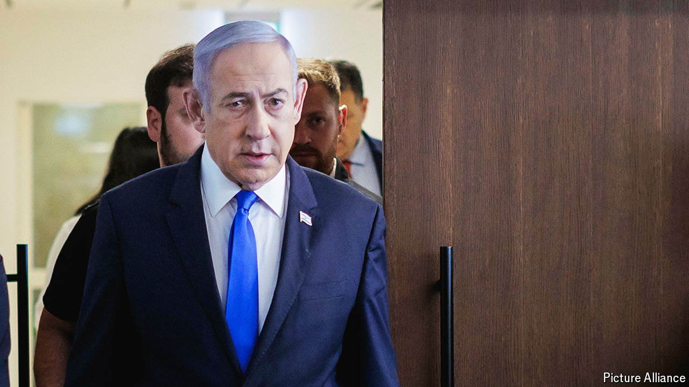

###### Israel’s dilemma

# Iran’s attack has left Israel in a difficult position 

##### How does it respond without squandering the coalition that supported it? 

 

> Apr 18th 2024 

In the space of two weeks Israel has been dealt two major strategic surprises. The first came in the aftermath of Israel’s air strike against Iran’s embassy compound in Damascus on April 1st. Intelligence indicated the Islamic Republic was about to abandon its decades-long strategy of confronting Israel through proxies and this time retaliate directly from its territory. 

The Iranian attack came on April 13th in the shape of hundreds of drones and missiles launched towards the Jewish state. With it came the second surprise. A coalition of Western and Arab nations deployed fighter jets in the skies over the Middle East and, along with Israel’s missile-defence systems, intercepted nearly all the incoming threats. Together they reduced the immediate impact of the attack to one wounded girl and some minor damage to an Israeli air base. But they also left Israeli decision-makers with a dilemma. 


For Israel, a small nation that has built its survival in a hostile region on military deterrence, failing to respond to a direct attack on such a scale on its territory is all but unthinkable. The missiles fired by Iran could have been devastating. Few in Israel doubt the need for a response. 

But Israel has a lot to lose if it fails to calibrate its response. The international coalition formed at the urging of President Joe Biden to foil Iran’s attack could continue to be a big strategic asset. “All the countries involved, both from the West and the Arabs, have already been working quietly together for years,” says an Israeli security official. “This is the first time they’ve been seen openly in action against Iran—and that’s a massive development.” 

Mr Biden, anxious to avoid a regional war, urged Binyamin Netanyahu, Israel’s prime minister, to “take the win” and avoid further escalation. The Arab regimes that were involved, particularly Jordan and Saudi Arabia, do not want to be seen as Israel’s protectors; most of the Middle East is still focused on the bloodshed in Gaza. Preserving the coalition will be no easy task. 

The Iranian attack has shifted some of the international focus away from Gaza. After months of condemnation of its actions in Gaza, Israel has unexpectedly found itself once again in the position it was in the wake of the Hamas massacres on October 7th—supported by its allies. “We’ve been given another moment of grace. Let’s see how quickly we waste it,” says one jaded Israeli general. 

The consensus among Israel’s war cabinet and generals is that Israel will retaliate. But the timing and nature have been hotly debated in a series of inconclusive cabinet meetings. Plans for an immediate counter-attack were already in the works in the early hours of April 14th, while Iran’s drones and missiles were on their way to Israel. The failure of the Iranian attack and the phone-call from Mr Biden stopped Israel in its tracks. But this may not last. 

As the ministers and generals argue, the biggest mystery has been the position of Mr Netanyahu. Since the 1980s he has been warning of the Iranian threat and the need for the West to co-operate with Israel and the Sunni Arab nations against it. But in the days since Iran’s strike he has fallen notably silent. He has appeared once in public, in front of new idf conscripts. All he had to say was that “Iran stands behind Hamas” and that Israel is determined “to defend ourselves in all sectors”. 

Mr Netanyahu’s dilemma is that even as he is being offered the coalition against Iran that he has demanded for so many years, his far-right allies in government are demanding he take action which would squander that opportunity. They are clamouring for “a crushing attack”, in the words of Itamar Ben-Gvir, the national-security minister. The far right is also worried that America will force Israel into agreeing to a ceasefire in Gaza and the return of the Palestinian Authority there. Mr Netanyahu’s silence is explained by his dependence on the support of such political allies. 

But Aryeh Deri, one of the prime minister’s closest allies in the government, hinted at Mr Netanyahu’s position in a radio interview. “We have to remember that there is still an unfinished campaign in Gaza,” said Mr Deri. “At a time like this, we shouldn’t open more fronts.” ■


