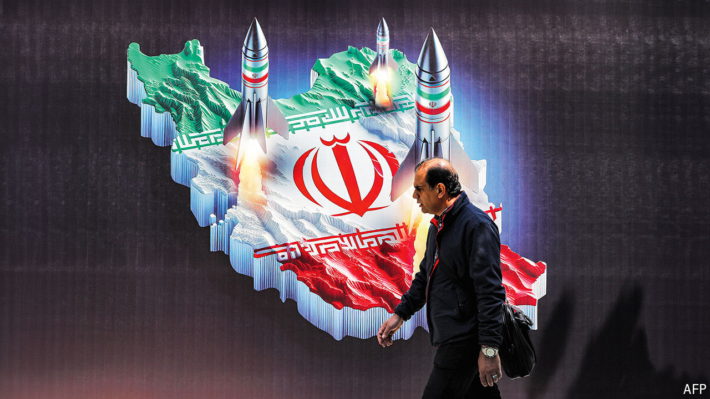

###### Striking out

# One of the Middle East’s oldest conflicts has entered a new era 

##### Iran’s attack on Israel throws out old rules and puts allies in a delicate position 

 

> Apr 18th 2024 

EVEN an ineffective act can be transformative. The Middle East spent the first half of this month waiting for Iran to retaliate for , on April 1st, which killed two generals at its embassy compound in Damascus. When it came, on the night of April 13th, it was bolder than expected, a barrage of more than 300 missiles and drones aimed at Israel. That it caused no death and little destruction did not diminish its import: this was the first time Iran has struck Israel directly.

Now the region waits nervously again, this time to see when and how Israel conducts its almost inevitable response. Its partners in the West, particularly America, must strike a delicate balance between defending their ally and restraining it. Friendly Arab states are in an awkward position, too. And the belligerents themselves, Iran and Israel, must now navigate a conflict in which the old rules of engagement have been abruptly shredded.


No one doubted that Iran would retaliate. Months of Israeli strikes had wiped out almost the entire leadership of its Islamic Revolutionary Guard Corps (IRGC) in Syria. The attack on a consular building was a , who demanded a muscular response. But most observers, including Israel, thought Iran would do so in a less direct way, pursuant to a long-standing policy of fighting Israel through proxies rather than head-on.

Iran’s strike was telegraphed for days. That gave ample time to prepare: not only for Israel, but also for an ad hoc coalition that included America, Britain, France, Jordan and other Arab states. They shot down all but a handful of the projectiles. Four missiles hit Nevatim air base, in southern Israel, but caused little damage.

Israel’s leaders have vowed to hit back. “Any enemy that fights against us, we will know how to strike him, no matter where he is,” Yoav Gallant, the defence minister, said on April 16th. Their options range from a response in kind against military bases in Iran to cyber-attacks on key infrastructure or strikes on the IRGC abroad.

Allies have spent days pushing for restraint. Joe Biden told Binyamin Netanyahu, the Israeli prime minister, that America would not support a direct counter-attack. The American president worries that it would lead to expanding tit-for-tat bombardment—the sort of regional war he has sought to avoid since October 7th. European leaders sent a similar message.

To dissuade Israel, they will need to convince it that they take the Iranian threat seriously. That is easier said than done. America promises new sanctions on Iran’s missile and drone programmes, but that alone will not reassure Israel. Some American officials suggest a loftier idea. They point to the unprecedented co-operation between Western and Arab states during the Iranian attack: Jordanian jets downed dozens of Iranian drones, while Qatar, Saudi Arabia and the United Arab Emirates (UAE) helped behind the scenes. Such co-ordination seems to fulfil a long-held American goal. For years it has urged Arab states and Israel to integrate their air defences, hoping to blunt Iran’s arsenal.

If Israel refrains from a spectacular counter-attack, these officials argue, there is an opportunity to reinforce a regional coalition. The idea appeals to Israeli officials as well. “This event is not over,” said Benny Gantz, a member of the war cabinet. “The regional co-operation which we built, and which withstood a significant test, needs to be strengthened.”

Don’t forget Gaza

Such talk makes Arab officials uncomfortable. They are still furious with Israel over Gaza and also worry about the threat from Iran, which has threatened to attack Jordan if it co-operates further with Israel.

Jordan says, rightly, that it shot down Iranian drones because they violated its airspace. It also probably saw a diplomatic benefit. The kingdom is among the world’s most aid-dependent countries. America, its largest single donor, provided $1.2bn, along with military aid worth around 20% of Jordan’s defence budget in 2022. Helping protect Israel gives King Abdullah a boost with lawmakers in Washington.

Gulf states had their own motives. Some officials were miffed to watch America rush to Israel’s defence. They saw a contrast with 2019, when , and 2022, when they hit Abu Dhabi, the capital of the UAE. America did little in response. The incidents are not quite analogous. There was no advance warning of the attacks on Saudi Arabia and the UAE. Saudi Arabia is  with America. By helping shoot down Iranian drones, Gulf leaders hoped to show that a formal arrangement would offer tangible benefits.

Like Israel, many Arab states see Iran as their main threat. But a sense of shared danger will not override their anger about Gaza or their fear of an Iranian attack. The prerequisites for deeper co-operation, they insist, are a ceasefire in Gaza and a commitment from America to defend them if attacked. Neither seems imminent.

Israeli leaders should not be overconfident. Their air defences were impressive, albeit they had days of advance warning and ample foreign help. A surprise attack might be more effective. Still, Iran can only repeat the trick so many times. America estimates it has around 3,000 ballistic missiles. So it used 4% of its arsenal—and a much larger share of those able to reach Israel—in a single night, to no great effect.

Iran had two goals: to appease hardliners and to deter Israel from future strikes. It almost certainly failed at the latter. Firing hundreds of missiles and drones and hitting nothing of value makes Iran look belligerent yet weak—a mix that invites, not deters, further attacks.

That suggests a longer-term worry. Mr Biden spent the first half of his presidency  with Iran, which imposed strict caps on enrichment work in exchange for relief from economic sanctions (and which Mr Trump abandoned in 2018). . Iran now has a stockpile of 122kg of uranium at 60% purity, enough to produce three nuclear bombs if refined further to weapons-grade.

The Iranians have been cautious. They have walked up to the “nuclear threshold” but refrained from crossing it, lest they trigger tougher multilateral sanctions or a military strike. The past few weeks may change their calculus. If drones and missiles are not enough to deter Israel, they may reckon they need a nuclear weapon to do so. That, in turn, would greatly increase the chances of an Israeli attack on their nuclear facilities. Iran chose to move its decades-long conflict with Israel into the open—but the consequences of that decision will be hard for anyone to predict. ■


