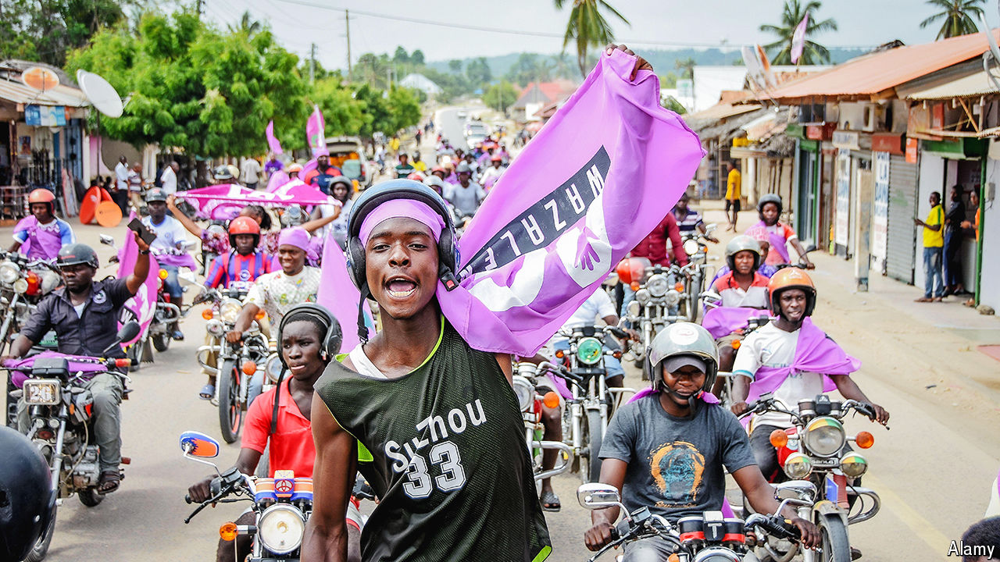

###### I get knocked down

# Tanzania’s opposition, once flat on its back, is now on its knees 

##### The next elections will be both uncompetitive and unfair 

 

> Apr 18th 2024 

The most recent Tanzanian general election, held in 2020, made a mockery of democracy. Agents of the ruling CCM party stuffed ballot boxes, pre-marked voting slips and erected fake polling stations. Police officers rounded up opposition candidates and their supporters. To hide the fraud, the authorities shut down the internet, gagged journalists and suppressed rights groups. The few opposition supporters brave enough to protest were shot at. At least 14 were killed. John Magufuli, then Tanzania’s president, duly won re-election with 84% of the vote. The CCM did even better, securing all but seven of the directly elected seats in the country’s parliament.

Overturning such a whacking majority in a single electoral cycle would be tough anywhere. Yet, when Tanzanians return to the polls next year, the opposition ought not despair. The execrable Mr Magufuli is dead. His successor, Samia Suluhu Hassan, is more tolerant of criticism. 

She is also more vulnerable electorally than her predecessor. The margin of Mr Magufuli’s victory may have been inflated, but he was undoubtedly popular. By demonising foreign investors, denouncing Western imperialism and championing the poor, he built a broad support base. Mrs Samia, by contrast, has rebuilt ties with the West, welcomed foreign investors and declined to engage in rabble-rousing. These may be sensible policies, but there are few votes in them. 

Tanzania’s GDP per person is among the 30 lowest in the world. Some 44% of people are poor. Given that the CCM has held power since independence from Britain in 1961, there must be a sizeable chunk of Tanzanians yearning for change.

Even so, diplomats and analysts think it may take 15 years before the opposition has a shot at winning power. “Politicians like to say ‘we will win, we will win’, but we have to be practical,” says Zitto Kabwe, who stepped down as the leader of Tanzania’s second-biggest opposition party, ACT-Wazalendo, in March. Mr Kabwe reckons the best the combined opposition can hope for next year is about 25% of the vote.

This is because Mr Magufuli eviscerated the opposition in a five-year reign of terror. The trigger was an election in 2015, when the opposition won 40% of the presidential vote and 45% of the parliamentary vote. In response, Mr Magufuli intimidated, bought off and silenced his critics. Defections from Chadema, the principal opposition party, were encouraged. The business interests of opposition members and donors were relentlessly targeted. 

Those who could not be induced to defect faced arrest, or worse. Tundu Lissu, Chadema’s presidential candidate in 2020, survived after being riddled with bullets by unknown assassins. Freeman Mbowe, its chairman, was assaulted and had his leg broken. Mr Magufuli may be dead, but the chilling effect of his presidency lingers.

Worse than the fear, though, was the systematic dismantling of the opposition at a local level. In 2016 Mr Magufuli banned the opposition from holding political rallies. These allow politicians to forge connections with potential voters, particularly in villages and the countryside. More people attend political rallies in Tanzania than anywhere else in the world, as far as available statistics show, according to Dan Paget of the University of Sussex, who is writing a book on the subject. Although Mrs Samia lifted the ban last year, it had silenced the opposition across swathes of Tanzania for six years.

Perhaps the most grievous blow Mr Magufuli struck against the opposition came not in the general elections of 2020 but in the local polls the year before. The electoral commission barred 94% of Chadema candidates from standing, prompting an opposition boycott. As a result, the CCM won 99% of local seats. 

It took two decades from the restoration of democracy in 1992 for the opposition to become competitive. Its emergence at national level was built on its successes in running local governments. Without a presence in parliament or local government, the opposition can hardly present itself as a government-in-waiting. “Under Magufuli our focus was on survival,” says Mr Kabwe. “Now we have to rebuild.”

Tanzania’s election process has long been laughably skewed. Every official involved in running previous polls, from returning officers to the electoral commission, was either directly appointed by the president or was a public servant whose livelihood depended on not upsetting the ruling party. Losing candidates were forbidden from mounting court challenges in a legal system where, in any case, judges are also appointed by the president. 

Negotiations between Chadema and the government for electoral and constitutional reforms have broken down. Mr Lissu, who opposed the talks, says that the CCM “flatly rejected” all proposals for meaningful change that Chadema put forward. “While uttering pretty phrases, she has actually been consolidating authoritarianism,” he says of Mrs Samia. Now, he fears, the CCM is intent on ensuring that local elections in December will be a repeat of those in 2019, with Chadema candidates again excluded on technicalities. 

In this gloomy view, any prospect of rebuilding and securing even 25% of the vote next year therefore looks remote. “Without electoral reform, there is no hope that we will get democracy peacefully,” says Mr Lissu. “We will have to advance our cause on the streets through demonstrations and mass action.” ■


