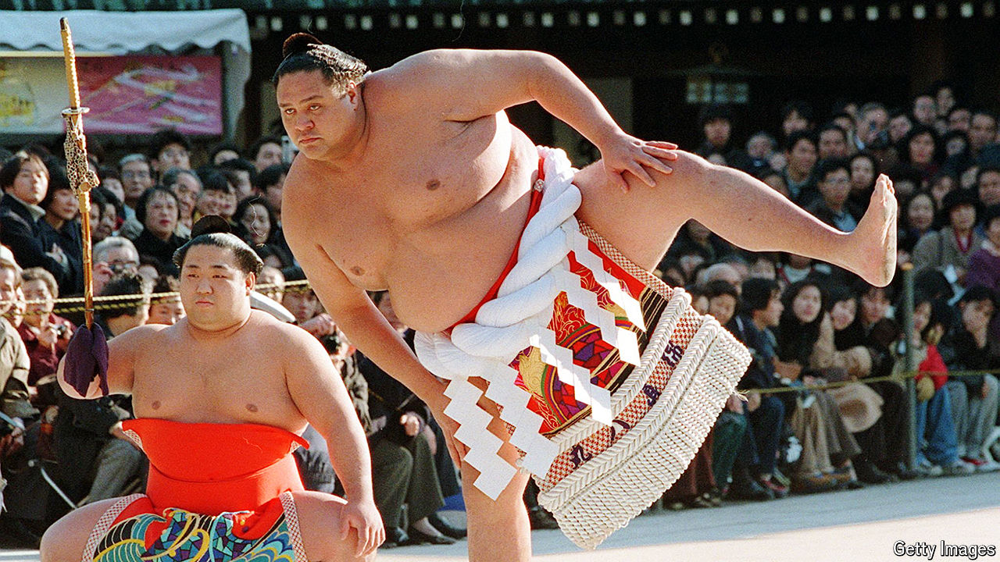

###### A gaijin makes good

# Akebono was the first foreign-born grand champion of sumo 

##### The wrestler who shocked and changed Japan died in early April, aged 54 

 

> Apr 18th 2024 

Lumberingly, he paced to the centre of the ring, then back to his corner again. Several times he did this, flexing his arms. Then he squatted, and fixed his opponent with his stare.  stare, of absolute focus, which he could keep for days. 

Except for his loincloth, he was naked. His mountainous torso glistened with sweat, oil, fat and muscle. Moments before he had rinsed his mouth with power-water, rubbed his body with power-paper and grabbed a handful of purifying salt to scatter in the ring. His long hair was caught up in a topknot styled like a leaf of the ginkgo tree. He had clapped his hands to alert the gods, stamped his feet to scare off evil spirits, and shown with a few deft postures that he had no weapons. He was more than ready.

Then it was over. In seconds he had charged forward, lunged for the throat, and pushed his opponent out of the ring. Job done.

So ended many of Akebono’s matches. At 2.03 metres, he towered above his rivals. (His name meant “dawn”, because when he stood up it was like the sun rising.) He also outweighed most of them, swelling from 154kg, when at 18 he started training, to 235kg five years later. His long arms could shove a rival off-balance in a heart-beat, making him touch the ground with something other than the soles of his feet, which doomed him. Brute force was all it took; no matter if they were on your belt, push them, and fast. 

Much of his size-advantage came from the fact that he was a  a foreigner. It had been enhanced for sure by sumo training, which involved huge meals of chicken-broth stew and litres of beer, followed by naps, to build bulk. But Akebono was also American, a Hawaiian, one of very few foreigners before the 1990s who endured the training regime. He was big when he arrived, a handy centre in high-school basketball games, and his first coach feared he might prove too lanky for sumo. He was wrong. His pupil romped through the regular 15-match tournaments, rose swiftly through the rankings and became, in 1993, the first-ever non-Japanese , or grand champion.

His ascent seemed quite improbable. He had been brought up poor on Oahu Island as Chad Rowan, the son of a half-Irish taxi-driver. His boyhood was spent learning street-smarts and watching wrestling on TV, and his future seemed to be as a beach bum. Then a Hawaiian sumo-recruiter spotted him, and that was that. 

The first months were tough, since he spoke almost no Japanese and pined for a decent American steak. But in the wrestlers’ training stable he suffered no more nor less than all the others in the lowest ranks, getting up at 4am to exercise before breakfast, slopping out for his superiors, cooking their rice and serving it before getting a mouthful himself. The only differences were his dumbness, but he was shy anyway, saying little either in Japanese or English; his Hawaiian horror of cold winters; and the need to forget all the codes of life he had learned over 18 years. 

But he stuck it out, and felt as he progressed that, when he wrestled, he was neither American nor Japanese: just a wrestler, whose body by the end did the thinking for him. It was never a matter of planting his flag in the middle of the ring and taking on a rival nation. He was learning a great, ancient skill. 

The more serious racial frictions emerged as he climbed higher. An essential virtue of the sumo wrestler was , dignity. He should be sober, uncomplaining, and modest, celebrating his triumphs with nothing more than a wave of the right hand. The sumo elders doubted that foreigners could ever possess that. In 1992 another hefty Hawaiian, Konishiki, “the Dump Truck”, had been turned down for the title of . In terms of tournaments won, he deserved it; but, said the elders, he did not have enough  Konishiki called this racism, pure and simple. Only eight months later, however, Akebono was promoted to that foremost rank and stayed there for eight years. 

His elevation calmed the controversy, for he had the sumo ethos in spades. Already, as a  or senior wrestler, he qualified for a car and driver, customised kimonos to wear in public and a host of assistants. But he was not a man for showing off. As a  his new monthly salary of $15,000, though huge for a sumo wrestler, was still tiny by American standards. And it was all he needed. Once the splendid belt was off he stayed dignified and humble, an ordinary Hawaiian who loved welcoming high-schoolers, plying them with snacks and teaching them how to wrestle. To American visitors, he was still “Chad”. 

His example brought many more foreign wrestlers to sumo. Some were Hawaiian; more were Mongolian. Eastern Europeans came. By 2000 many Japanese worried that their national sport did not have enough native recruits, let alone champions. In 2002 the elders reduced to one the number of foreigners allowed in each stable. But the truth was that, among the young, sumo was increasingly seen as hidebound and audience-unfriendly. Akebono himself wanted it to be more exciting and open to anyone. But when he asked to join the rule-imposing body that governed sumo—just for a year, perhaps—he was told, firmly, “No”. At that point he retired as a , feeling he had no future there. He had worried sometimes that Japan was becoming too Americanised; but clearly not as far as that. 

In 2001, at his retirement as a , he sat in the ring in his robes. He had no plans to abandon martial arts in general, and was to win several pro wrestling championships before both knees and heart gave out. But he was laying down his sumo career. Eleven thousand people watched as, one by one, 320 friends and colleagues came up to snip a few strands from his topknot with a pair of gold-plated scissors. He felt sad, much more than he thought he would. His head felt lighter, but not with the loss of his hair; more with the loss of a great honour, and the responsibility he had carried to bring two nations together. ■

