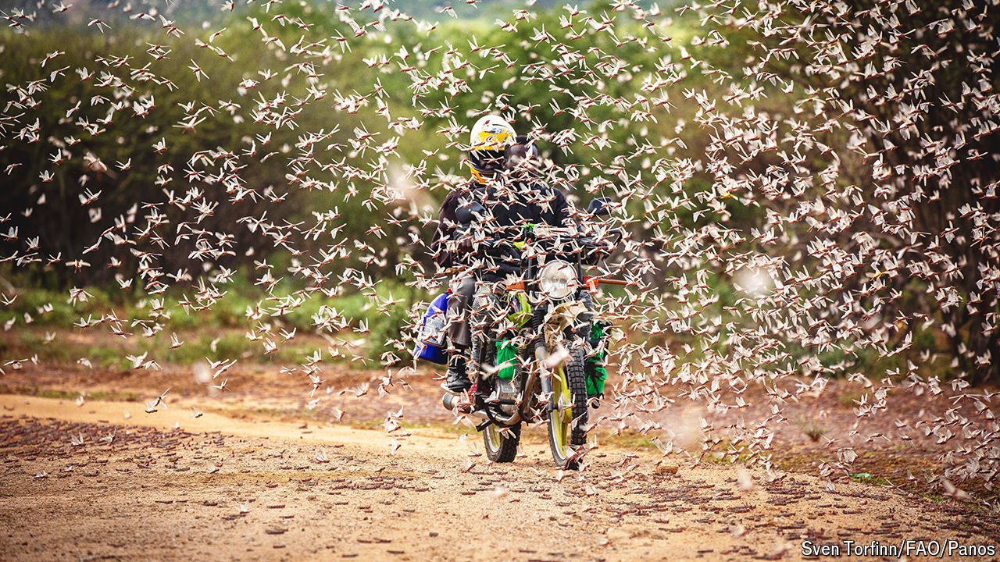

###### Who you gonna call?

# Locust-busting is getting a upgrade 

##### From pesticides to drones, new technologies are helping win an age-old battle 

 

> Apr 17th 2024 

IN THE LIST of plagues inflicted upon the people of Egypt in the Book of Exodus, only darkness and death get higher billing than locusts. That ranking is apt. Today, , also known as the desert locust, is considered the most dangerous migratory pest in the world. Measured by the volume of foliage consumed, a small swarm can devour as much food in a single day as 35,000 people. In places with fragile food security, the effect can be devastating. Outbreaks are regrettably common. As of April 2024 the Food and Agriculture Organisation (FAO), an agency, was monitoring five active outbreaks of  in countries near the Red Sea.

The problem is that swarms grow fast. In the right conditions, 1,000 locusts can become 20,000 within three months, and 160m within a year. The last big upsurge, which began in the Arabian peninsula in 2018, lasted three years and affected countries as far afield as Tanzania and Iran. Fortunately, this invasion also drove investment into new locust-hunting tools. Some of this is now beginning to pay off.

The desert locust lives in the belt of drylands that stretches from Mauritania, on the west coast of Africa, to India. The harsh conditions, low in water and vegetation, normally keep its numbers down. But human activity is starting to make their lives more comfortable. Climate change is bringing heavier storms to deserts, driving greenery in unexpected places. At the same time, forest environments that were once too damp for locusts to lay eggs in are being transformed through desertification into drier habitats where they can thrive. Add in hotter temperatures, says Arianne Cease of Arizona State University, and the future looks rosy for the desert locust.

Controlling this pest depends on locust hunters spotting dens in the desert and snuffing them out early. Patrolling known hotspots in the aftermath of rainstorms, these scouts spray pesticide on smaller dens by hand or truck, and douse larger ones by aeroplane. But this work burns up time and resources, and is rarely comprehensive—especially in countries with limited means or ongoing conflicts. In 2018, for example, a pair of cyclones lashed rain upon a remote Yemeni desert. As civil war had left the government powerless and distracted, three generations of desert locusts were left to breed unobserved. Their descendants invaded 12 countries.

A break in the clouds

The resulting disaster also bred innovation. Keith Cressman of the FAO estimates 16 significant developments have resulted from the upsurge. Among them are tools that use data to make expeditions more efficient. Desert locusts are creatures of habit: females like to lay eggs in soil that is moist, but not sodden, and juveniles are more likely to survive if they are surrounded by ample foliage to eat. Advances in remote sensing mean that some of these environmental features are getting easier to detect from space.

By comparing satellite readings with massive data sets from ground sensors, as well as the ample historical record, researchers are building statistical models to better predict which nests pose the greatest risk. One such model was rolled out in October 2023 by an FAO commission co-ordinating desert-locust work in ten north and west African countries. It provides field officers with an online map complete with probabilities of finding locusts at specific locations. This will help field scouts prioritise routes, saving money and time.

Drones can help them cover even more ground. The FAO and the Hemav Foundation, a Spanish non-profit, have jointly designed dLocust, a portable drone shaped like a Stealth bomber and launched by slingshot. It is designed to fly a loop up to 80km long, autonomously snapping high-resolution pictures of suspicious greenery. Field scouts review these by tablet or smartphone and choose which to visit. Twenty-three dLocust units are in field operation, mostly in Africa.

Attack drones are also in the works. Kenyan researchers have run experiments to determine the optimal height for a drone to unleash a pesticide over its hungry targets. (Spray it too high, and the wind dissipates the deadly mist; spray too low, and some may be wasted). The ideal height was found to be ten metres.

Pesticides, too, are overdue for an upgrade. In the panic following the latest upsurge, some governments carpet-sprayed organophosphate pesticides, chemicals that serve as locust nerve agents. The effect was as satisfying as it was swift. “You could more or less see the insects falling dead from the sky,” said Wim Mullié, an environmental toxicologist in Dakar. 

Any humans nearby would have felt poorly too: such compounds are banned in the EU, Dr Mullié says, because of their toxicity to other species. In Ethiopia, pesticides may have killed or scared off billions of honeybees. More targeted chemicals do exist, including Novacrid, a fungus-based biopesticide first developed in the 1990s. Somalia, which used Novacrid throughout the latest upsurge, got its locust problem under control. The problem, however, is that it costs more than its competitors and takes three weeks to kill the insect. This has left many governments hesitant to rely on it. Better chemicals are needed.

Such technological advances will not fix the problem on their own. Locusts thrive in conflict zones and under-resourced regions; field agents may well stay home if they risk being shot at, or if there is insufficient power to run their equipment. Where there is death and darkness, locusts remain close behind. ■


