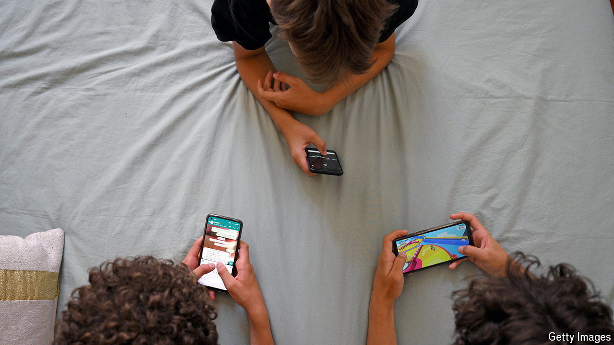
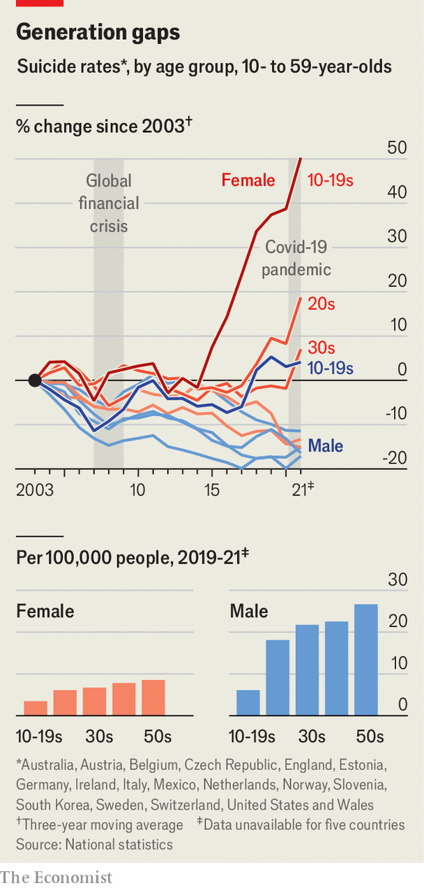

###### Digital detoxes

# What is screen time doing to children? 

##### Demands grow to restrict young people’s access to phones and social media 

 

> Apr 17th 2024 

Two months ago Daisy Greenwell and Clare Fernyhough set up a WhatsApp group to discuss how to stave off their young children’s demands for smartphones. After they posted about their plans on Instagram, other parents wanted in. Now their group, Smartphone-Free Childhood, has more than 60,000 followers debating how to keep their children away from the demon devices—a debate they are naturally conducting on smartphones of their own.

This group, based in Britain, is not the only one worried about children’s screen time. Last month the state of Florida passed a law banning social media for under-14s. Britain’s government is reportedly considering a ban on mobile-phone sales to under-16s. The concerns are summed up by a recent book by Jonathan Haidt, “The Anxious Generation”, which argues that smartphones, and especially the social networks accessed through them, are causing a malign “rewiring of childhood”.

In a contentious debate two things are fairly clear. First, smartphones and social media have become a big part of childhood. By the age of 12 nearly every child has a phone, according to research in Britain. Once they get one, social media is how they spend most of their screen time. American teens spend nearly five hours a day on social apps, according to polls by Gallup. YouTube, TikTok and Instagram are most popular (Facebook, the world’s largest social network, is a distant fourth).

 


Second, most agree that in much of the rich world there has been a decline in mental health among the young. The share of American teenagers reporting at least one “major depressive episode” in the past year has increased by more than 150% since 2010. Perhaps such terms have simply become less taboo, sceptics suggest. But it is more than talk. Across 17 mostly rich countries, there has been a sharp rise in suicide among teenage girls and young women, though their suicide rate remains the lowest of any cohort (see chart).

Are the phenomena linked? The timing is suggestive: mental health began to slide just as smartphones and social apps took off, in the 2010s. Some studies also suggest that children who spend more time on social media have poorer mental health than lighter users. But such correlations do not prove causation: it may be, for instance, that depressed, lonely children choose to spend more time doom-scrolling than happy ones do.

A small number of randomised experimental studies are chipping away at the causal question. In 2017 Roberto Mosquera of the Universidad de las Américas, and colleagues, got a group of Facebook users in America to stay off the platform for a week. The abstainers reported being less depressed than the control group and took part in more varied activities; they also consumed less news.

In 2018 researchers at Stanford and New York University did a similar experiment, again in America. After a month away from Facebook their detoxees felt happier than the control group, spent less time online, more time with family and friends and were less politically polarised. (Again, they knew less about the news, and spent more time watching television alone.) The effects on well-being in both studies were modest.

“The really convincing causal evidence we have is quite limited,” admits Matthew Gentzkow of Stanford University, one of the authors of the 2018 study. But, he argues, most points in the same direction as the circumstantial evidence around timing. “If you put all that together, I think it’s enough to say there is a substantial probability that these harms are large and real.”

Much remains uncertain. The best randomised experiments have been done on adults, who are not the main objects of concern. Most studies focus on Facebook, which these days is a small part of teens’ media diet. And they are mostly in America, which is unlike the countries where most of the world’s teenagers live. A 72-country study last year by the Oxford Internet Institute found that Facebook adoption correlated with a small improvement in well-being among the young.

People’s relationship with social media also defies categorisation. The Mosquera experiment found that, although people said they were happier when they didn’t use Facebook, they nonetheless valued its utility at $67 a week—and, after a week of abstinence, the detoxees valued it even more highly. Asking whether social media are good or bad for mental health is the wrong question, argues Pete Etchells of Bath Spa University, author of “Unlocked”, a somewhat more upbeat book about screen time. Perhaps a better question, he says, is: “Why is it that some [children] really thrive online? And why is it the case that others…really struggle?”

Unless that question is answered, banning phones or social media until a later age would simply delay the problem, he fears. It is also unclear what should be covered by such a ban. Social media include everything from Facebook to the chat function in games like “Fortnite”, points out Dr Etchells. Dr Gentzkow, who supports a higher minimum age for some social media, warns against limiting all of it. “Actual communication with your friends”—by phone, text or video chat—“those may well be things we want to encourage more of,” he says. Most social apps offer a mixture of functions, which can be enjoyed or misused.

There are some signs that, while experts ponder how to rein in the worst of social media, ordinary users are working out how to do so themselves. Posting about oneself in public is becoming less common: last year only 28% of Americans said they enjoyed documenting their life online, down from 40% in 2020, according to Gartner, a research firm. Messages are moving from open networks to private chats. On Instagram, more photos are now shared in direct messages than on the main feed, the company says. As middle-aged folk identify the problems with the social networks they grew up with, youngsters may already be moving on. ■


