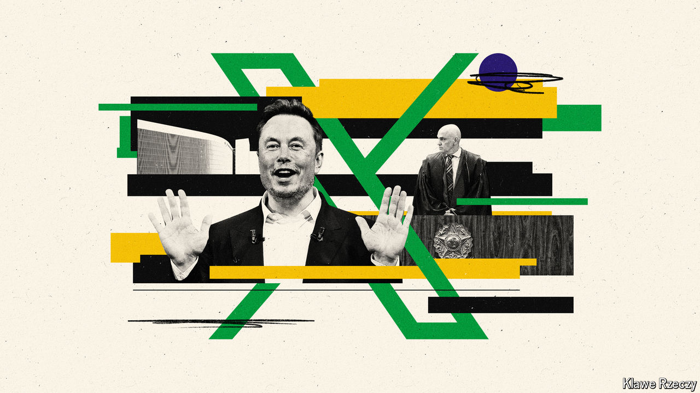

###### Musk v Moraes

# Elon Musk is feuding with Brazil’s powerful Supreme Court 

##### The court has become the de facto regulator of social media in the country 

 

> Apr 14th 2024 

Over the past two weeks , a serial entrepreneur, has been on a very public tirade against Alexandre de Moraes, one of the Brazilian Supreme Court’s 11 judges. The dispute is about X, a social-media company that Mr Musk owns. On April 6th X announced that a Brazilian court had ordered it to block an undisclosed set of “popular” accounts or face hefty fines. Instead, Mr Musk said he would lift restrictions on previously suspended Brazilian accounts, and threatened to close down X in Brazil. Mr Moraes then opened an inquiry into Mr Musk for obstruction of justice. That prompted Mr Musk to rail that censorship in  is worse than in “any country in the world in which this platform operates”, and to call Mr Moraes a “dictator” who should be impeached and put “on trial for his crimes”

So far, so hyperbolic; on April 15th it emerged that X had sent a letter to Brazil’s Supreme Court, assuring the court that X would comply with its orders. But the row is revealing on two issues. One is the power of Brazil’s Supreme Court, which enjoys outsize authority over the lives of Brazilians. The other is the debate over how to regulate social media without hurting freedom of speech. Brazilians adore social media. According to GWI, a market-research firm in London, they spend an average of three hours and 49 minutes a day swiping and scrolling, more than people anywhere else (see chart). They also send the most messages on WhatsApp, a messaging platform, and rely heavily on social media for news. This makes Brazil fertile ground for the spread of misinformation and efforts to regulate it. 

