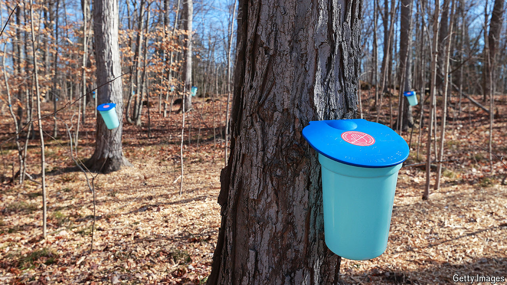

###### The sticky stuff

# The world’s insatiable appetite for Canada’s maple syrup 

##### Production is booming, but climate change is making output more erratic 

 

> Apr 18th 2024 

Hammer a tube called a spile into the bark of a maple tree and its translucent yellow sap will start flowing out; the tree has been tapped (pictured). This gloop drips from some 55m Canadian maple trees today, raw material for the tangy golden syrup which is one of the country’s proudest exports. 

Poring over the numbers reveals that maple-syrup production reached new heights in 2022. Some 79m litres were produced, 54% more than in 2021. Production has grown seven-fold in the past 50 years. But a warming climate is making output erratic. Ice storms helped to reduce syrup flow by 40% in 2023 compared with 2022. Industry representatives expect a return to growth this year.

