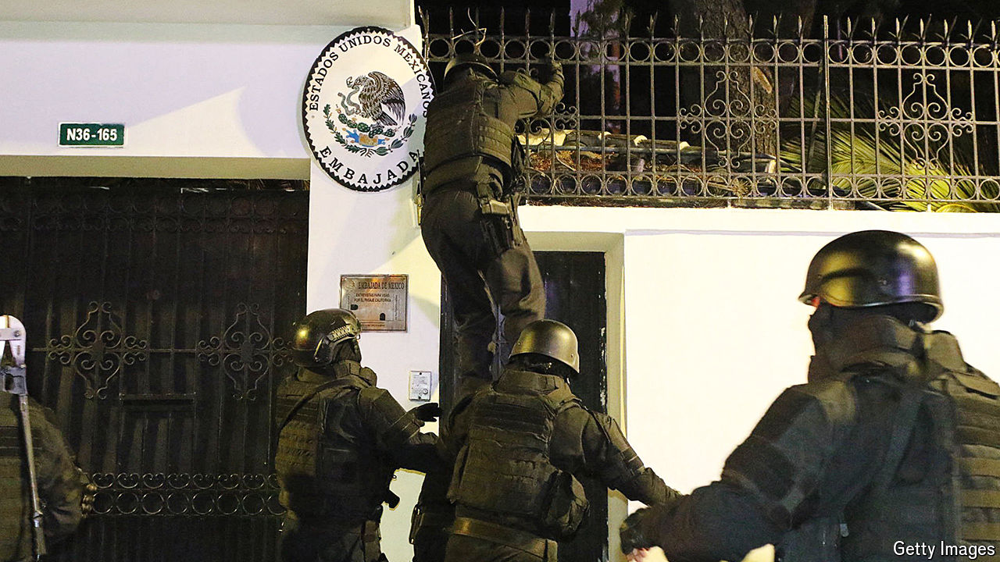

###### The Glas affair

# Why Ecuador risked global condemnation to storm Mexico’s embassy 

##### Jorge Glas, who had claimed asylum from Mexico, is accused of abetting drug networks 

 

> Apr 18th 2024 

On April 5th Ecuadorian police scaled the walls of the Mexican embassy (pictured) in Quito, Ecuador’s capital. They stormed the building and seized Jorge Glas, Ecuador’s former vice-president. He had been granted asylum by Mexico just hours earlier. (Andrés Manuel López Obrador, Mexico’s president, is sympathetic to Mr Glas’s party.) For domestic police to raid an embassy is extremely unusual. It has outraged diplomats and been condemned around the world. Mexico immediately brought the case to the International Court of Justice in The Hague. 

At first glance the assault seems foolish. Why would Daniel Noboa, Ecuador’s president, jeopardise his country’s reputation when it needs international support in its battle against drug gangs, which have threatened parts of the state itself? 

