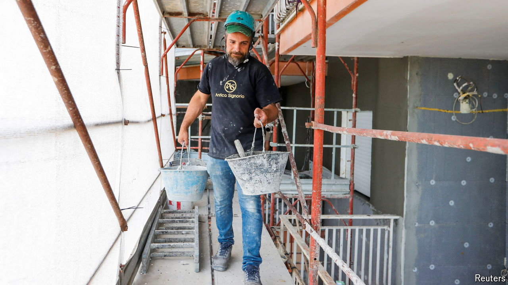

###### The Economist explains

# How a home-improvement subsidy is wrecking Italy’s public finances 

##### Government largesse is costing taxpayers 

 

> Apr 17th 2024 

JUST THINKING about it “gives me a stomach ache”, said Italy’s finance minister, Giancarlo Giorgetti. He was referring to a home-improvements subsidy that has turned into the fiscal equivalent of King Kong: a monster running amok, wreaking havoc on the country’s . On April 9th Mr Giorgetti revealed that claims of the subsidy, known as the “superbonus”, made in the four years that the scheme has been running, together with claims of another that offsets the cost of renovating façades, would eventually drain the treasury of €219bn ($233bn). That is almost 10% of Italy’s GDP last year. How on earth did things get to this point?

Giuseppe Conte’s second government, a left-populist coalition that ran Italy from 2019 to 2021, introduced the superbonus in 2020 at the height of the covid-19 pandemic. The idea was to stimulate the stricken economy with a measure that was also environmentally beneficial. The government offered to pay homeowners 110% of the price of . Its other initiative covered 90% of the cost of doing up the front of a building. The cash was not to be reimbursed directly, but in the form of tax credits that could be sold on. The two measures have certainly helped to reinvigorate the economy. The turnover of Italy’s construction sector grew by 31% in the four years to the end of 2023; in other big European economies it has been flat at best. That has helped Italy recover more quickly from the pandemic than either France or Germany have managed. But success has come at a huge price.

There are at least four reasons why things have gone badly wrong. The first is simply that the superbonus has proved wildly popular. That should not have been a surprise: what is not to like about being repaid more than you have spent? Or not spent: since the tax credits are tradeable, many homeowners simply passed them on to their builders without having to part with a euro. A second reason is outright fraud. Last August , Italy’s prime minister, said that contracts falsified to claim the subsidies constituted the biggest-ever rip-off of the Italian state. That was when they amounted to a mere €12bn; since then, the figure has risen to €16bn. A third problem is overpricing. Because the superbonus refund is greater than the outlay, actual or theoretical, it is in the interests of both the builder and the homeowner to inflate the cost of the work. A fourth reason is that until recently Italy’s politicians did nothing to stop the merry-go-round. The superbonus had cross-party support when it was introduced. Neither of the two governments that followed Mr Conte’s has wanted to anger the public by halting a popular programme.

Ms Meloni’s government has nevertheless curbed its scope. But the cost of the superbonus alone has already left a €122bn hole in the public accounts. That goes some way towards explaining why Italy’s budget deficit soared last year from an original estimate of 5.3% of GDP to 7.2%. The future cost of the subsidies will make getting the deficit back down to 3%, as demanded by the European Commission, a formidable task—all the more so since Italy’s post-pandemic growth surge is tailing off. An austere budget in the autumn looks likely. ■

