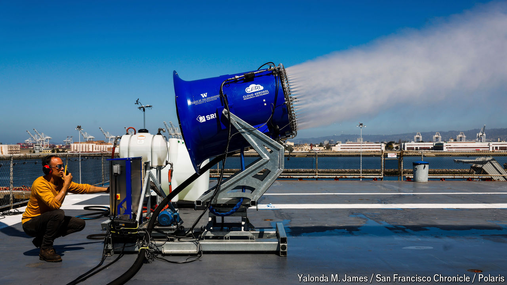

###### The Economist explains

# What is geoengineering? 

##### Deliberately cooling the climate is an unsettling idea 

 

> Apr 16th 2024 

ON APRIL 2ND a contraption resembling a snow machine on the deck of the , a defunct aircraft-carrier moored in San Francisco Bay, began producing a mist of salty aerosol particles. The scientific collaboration behind the project, the Marine Cloud Brightening (MCB) programme, led by the University of Washington, is investigating whether such aerosols might help to slow climate change through a form of “geoengineering”. What does this term mean—and why is it so controversial?

In 2009 Britain’s Royal Society, a scientific academy, defined geoengineering as “the deliberate large-scale manipulation of the planetary environment to counteract anthropogenic climate change”. It split approaches into two categories: those that make it easier for the Earth to lose heat, and those that reduce the amount of heat it gains. Carbon-dioxide removal (CDR) helps in the first way by lowering the level of greenhouse gas in the atmosphere, making it easier for heat to escape. Reducing the amount of energy the Earth absorbs from the Sun, known as , helps in the second way. The MCB experiment seeks to do this by increasing the number of “cloud condensation nuclei” in low marine clouds: that would raise the number of droplets that such clouds are made of while decreasing their size, so that they reflect more sunlight into space. 

The technologies used for CDR and suggested for solar geoengineering are completely different. But there are similarities in their potential ramifications. In the absence of either, the degree of warming the Earth will experience will be set by the total cumulative emissions of long-lived greenhouse gases. If CDR were used to mop up some of those gases, or if solar geoengineering reduced the amount of sunshine getting in in the first place, that strict dependency would no longer hold. 

This introduces a risk often termed “moral hazard”. For as long as total emissions are the only thing that matters, the policy prescription is clear: emit less, come what may. If there are ways around total cumulative emissions, the need is not all-consuming. Some argue that this could reduce the urgency with which countries and businesses pursue emission cuts. 

There are other concerns about solar geoengineering. The most-studied technique requires the creation of a layer of fine particles in the stratosphere, similar to the cooling layers created by large volcanic explosions. That could have implications for the recovery of the ozone layer. It would have repercussions for weather patterns in the lower atmosphere, too, leading to changes in rainfall. The effects would depend on the details of the strategy implemented and would not be uniform; different approaches would bring benefits to some regions and could do harm to others. But unlike emissions reduction, which has to be undertaken by most big emitters to work, solar geoengineering can be done unilaterally. This sounds like a recipe for conflict.

As a result, solar geoengineering remains a fringe issue. By contrast, in the 15 years since the Royal Society’s report, CDR has . The idea of “net-zero” emissions, now central to lots of government and corporate climate policies, relies on it. CDR is considered palatable because, by removing greenhouse gases from the atmosphere, it reduces greenhouse warming in a permanent way. Solar geoengineering, by contrast, would allow for the continued accumulation of greenhouse gases, merely masking their warming effects for as long as the geoengineering continues. That would be a problem if solar geoengineering efforts were suddenly to be stopped for some reason; the masked warming effects of the accumulated greenhouse gases would quickly kick back in. This risk, among others, and the sense that accepting all solar geoengineering’s geophysical and geopolitical risks still only gets the world a temporary patch leads some proponents of CDR to resent the two approaches being lumped together. 

Given the controversy around solar geoengineering, why would anyone want to research it? Because unlike CDR it could work quickly: a stratospheric solar-geoengineering programme might start to cool the Earth within a year. None of the researchers investigating its potential thinks that it should displace emissions reduction. But they do think that its potential merits study nonetheless. ■

