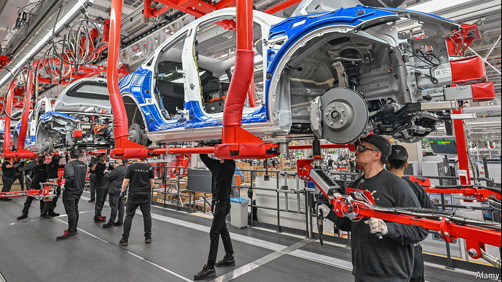
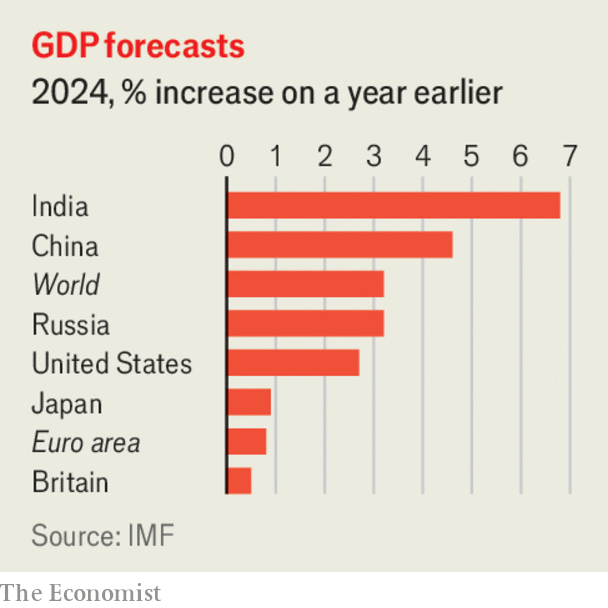

###### The world this week

# Business 

#####  

 

> Apr 18th 2024 

As it adjusts to slower demand for its electric vehicles,  is reportedly set to shed 10% of its global workforce, or around 14,000 jobs. Adding to the woes of Elon Musk’s firm, two senior executives said they were leaving. Tesla’s deliveries fell in the first quarter of this year. As other carmakers, especially in China, step up their EV ambitions, Tesla is facing intense competition in markets that it used to have to itself a few years ago. Its share price is down by 37% this year. The company wants shareholders to reaffirm Mr Musk’s pay at its annual general meeting in June, after a court in Delaware struck it down in January. 

 


The latest estimates from the IMF suggest that global GDP is on track to grow by 3.2% this year. The fund said the  “remains remarkably resilient” and that there would be “less economic scarring” than it had thought from the pandemic. The biggest upgrades to its forecasts for the largest economies it tracks were for America, where the IMF now thinks GDP will expand by 2.7%, and Russia, projected to grow by 3.2%. 

 grew by a better-than-expected 5.3% in the first quarter of 2024, year on year, helped by a 6.1% rise in industrial production. Much of the growth came in January and February. In March retail sales struggled, and the output of cement plummeted, highlighting the problems besetting the country’s property market. 

Markets were rattled by figures that showed growing rapidly in America, more evidence that the economy remains red-hot. Investors pushed back their bets on an interest-rate cut from the Federal Reserve. They were also perturbed by comments from Jerome Powell, the Fed’s chairman, about inflation taking “longer than expected” to fall to the central bank’s 2% target. 

The numbers game

Britain’s annual rate slowed to 3.2% in March, from 3.4% in February. Inflation is now lower in Britain than in America, where it is 3.5%, but higher than the euro area, where it stands at 2.4%. Still, the figures caused traders to think that the Bank of England might not reduce interest rates until September or November. 

 released a set of quarterly earnings that at last delighted investors. Net profit surged by 28% in the first quarter, year on year, to $4.1bn, helped by a 32% jump in revenue from investment banking and a 10% rise in revenue from trading. The results take some of the pressure off David Solomon, the bank’s chief executive, who faces a shareholder proposal at the impending annual general meeting to vote against his pay award. 

 announced a $1.5bn strategic investment in, a firm developing artificial-intelligence technology in Abu Dhabi, which is backed by the emirate’s government. The deal has the blessing of the Biden administration, which persuaded G42 to divest from China and focus on America. 

A little of the shine came off , Europe’s most valuable tech company, when it reported a big drop in quarterly sales. The value of the company’s order book for the lithography machines it supplies, which are an essential component in chip manufacturing, plunged to €3.6bn ($3.8bn) in the first quarter, from €9.2bn in the final quarter of 2023. ASML expects the second half of the year to be stronger “in line with the industry’s continued recovery from the downturn” in the chip cycle. 

 saw its weakest quarter for sales growth since the post-pandemic boom three years ago. The luxury-goods company recorded a big drop in revenue from champagne and watches and jewellery in the first three months of 2024, though sales in Japan grew by double digits, helped by the weak yen and an influx of Chinese shoppers. Meanwhile Bernard Arnault, LVMH’s boss, shored up his succession plan by asking shareholders to approve the addition of two of his sons to the board; they join two other siblings. 

 , one of Europe’s biggest private-equity firms, announced its intention to list shares on the Euronext exchange in Amsterdam. CVC had planned an IPO in 2022, which was upended by Russia’s invasion of Ukraine. It also considered a float last year, but postponed it in November amid market uncertainties. 

Running ahead

Following its first annual loss in three decades,  raised its profit guidance for the year on the back of strong sales in the first quarter. Adidas may face a new reputational problem, however, with the revelation that Rishi Sunak, Britain’s prime minister, has a penchant for its popular Samba trainers. Mr Sunak, whom one newspaper has described as a “geeky tech bro”, recently made a humorous “fulsome” apology for reducing the hip appeal of the shoes. I’ve worn them for “many, many years”, he said. 

