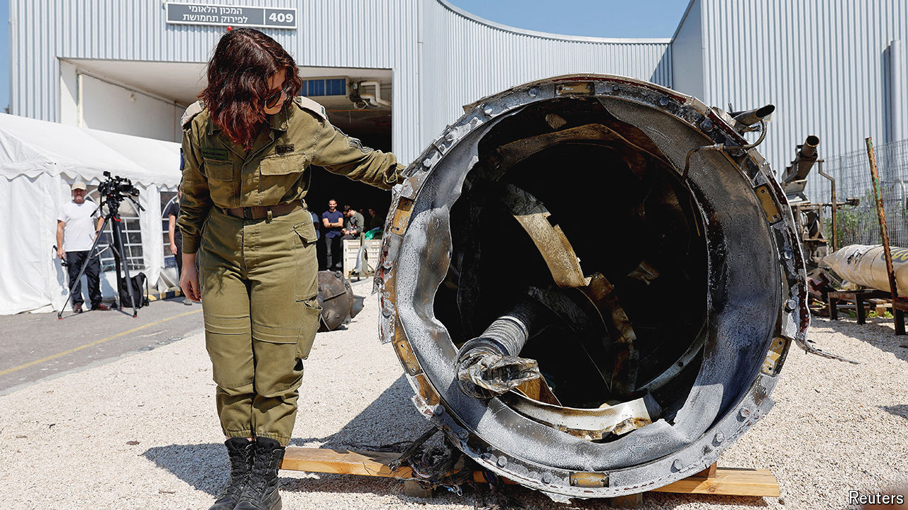
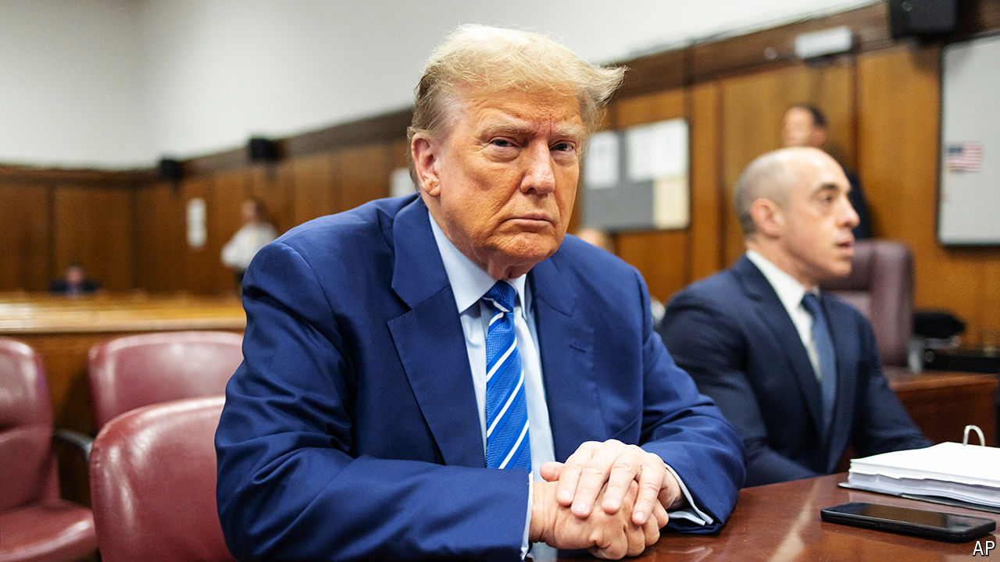

###### The world this week

# Politics 

#####  

 

> Apr 18th 2024 

 launched an  on in retaliation for a strike at the beginning of April that killed two generals at its embassy compound in Damascus, Syria’s capital. Almost all of the more than 300 drones and missiles launched by Iran were successfully intercepted. America, Britain, France, Jordan and other Arab states contributed to Israel’s defence. Binyamin Netanyahu, Israel’s prime minister, said his country was determined to defend itself. Joe Biden, America’s president, urged him to show restraint to avoid regional escalation.

Local officials said that four Palestinians were killed by Israeli settlers in the . Their deaths took place amid violence that erupted after the killing of a 14-year-old Israeli boy in what the Israeli army said was a terrorist attack.

Gulf states were battered by storms that caused floods leading to the deaths of 20 people. The  saw its heaviest rainfall since records began 75 years ago. Dubai airport, the world’s second-busiest, told passengers to stay away. 

Donors pledged around $2.1bn to humanitarian relief in , which is facing the world’s largest humanitarian crisis because of a year-old civil war. Experts warn that the country is entering the grip of famine, which could lead to 500,000 deaths.

 failed to reach a deal on debt forgiveness with its creditors, which holds up its efforts to emerge from default and an economic crisis. Without a sufficiently large write-off of debt it will be unable to access a $3bn bail-out from the IMF.

 inflation rate climbed to 33.2%, a 28-year high, following a collapse in the value of its currency, the naira. Although the central bank has increased interest rates, prices have continued to rise because of economic reforms, including the removal of a fuel subsidy.

Stable government

The prime minister of , Lee Hsien Loong, announced that he would step down on May 15th, after 20 years in office. In a long-planned succession Mr Lee is handing the reins to , his deputy, who is also the finance minister. Mr Wong will be only the fourth prime minister in the city-state. Mr Lee’s father, Lee Kuan Yew, held the job from 1959 to 1990.

Two violent incidents shocked . A man stabbed five women and a man to death, before he was shot dead by a policewoman. The perpetrator had mental-health issues. And in what police described as a terrorist attack, a 16-year-old boy stabbed and injured a bishop at an Assyrian Orthodox church during a mass that was being streamed live. A mob confronted police outside the church, where the boy was being held for his own safety.

Labor government announced plans to increase defence spending by A$50bn ($32bn) over the next decade. That would raise defence spending from 2% of GDP to 2.4%. Australia, America and Britain have created the AUKUS security pact to counter Chinese ambitions in Asia Pacific. 

The government of  named the members of a transitional council that will rule the country for two years when Ariel Henry formally steps down as prime minister. Mr Henry is resigning in the hope of quelling an  by gangs that in effect control the country. The trouble hasn’t abated and the main airport and shipping ports remains closed. It has not been announced when the council will start work. 

America is to reimpose oil sanctions on  for failing to keep to the spirit of an agreement to allow a free and fair presidential election. The Venezuelan authorities have since barred the opposition’s most popular candidate. American firms have until the end of May to wind down their business in the country’s energy sector, although some existing licences to sell Venezuelan oil, such as the one granted to Chevron, will still be valid. 

The Democratic-controlled Senate in America voted swiftly to toss out the  of Alejandro Mayorkas, the homeland security secretary, dismissing the trial and rejecting claims by Republicans that Mr Mayorkas had wilfully ignored border-security law. 

 


The first-ever criminal trial of an American president, former or sitting, got under way in New York.  faces charges of illegally concealing hush-money payments to a porn star, which he denies. Dozens of potential jurors were dismissed during jury selection because they could not promise to be impartial. The trial could last six to eight weeks.

Mike Johnson, the speaker of America’s House of Representatives, pushed forward with a complex package of bills that would provide , Israel and other allies. The Senate had passed a single bill, but it ran into opposition in the House, not least from supporters of Mr Trump, who gripe about giving more funding to Ukraine. 

Meanwhile, president, Volodymyr Zelensky, said his army had been unable to thwart a Russian attack that destroyed a power plant, because “We ran out of missiles.” Separately, a Russian missile attack on Chernihiv, in northern Ukraine, killed 18 people.

In  police arrested two German-Russian men for allegedly spying for Russia. One of the men is suspected of planning to sabotage an American facility in Bavaria that trains Ukrainian troops. He is also thought to have fought for pro-Russian forces in the Ukrainian region of Donetsk from 2014 to 2016. 

Mass demonstrations took place in Tbilisi, the capital of , against a proposed bill that would require NGOs and media companies that receive more than 20% of their funding from abroad to register in effect as foreign agents. The protesters call the legislation “the Russian law”, because of its similarity to rules in Russia. 

Cancelled 

The prime minister of Belgium, Alexander De Croo, sharply criticised the decision by a district mayor in Brussels, Emir Kir, to order police to shut down a conference being held by , an emerging political alliance in Europe. The event’s speakers included Nigel Farage, who championed Brexit in Britain, and Viktor Orban, the populist prime minister of Hungary. Mr Kir, a Socialist, said he wanted to shut the conference because protesters were targeting the venue (the courts disagreed and the conference resumed). Mr De Croo, a liberal, said that “Banning political meetings is unconstitutional. Full stop.” 

An envoy for business in the EU who was controversially hand-picked for the role by Ursula von der Leyen, the president of the , quit just hours before he was supposed to start the job. Markus Pieper, who comes from the same party in Germany as Mrs von der Leyen, had scored lower on a test for the position than other candidates. 

 plan to ban anybody born after 2008 from ever buying cigarettes passed its first big hurdle. Rishi Sunak, the prime minister, easily won a vote in the House of Commons by 383 to 67. A significant number of those who voted against the bill came from his own Conservative Party; no opposition Labour MPs voted against it. The bill now moves to its next stages. If implemented, the ban would be among the strictest in the world. New Zealand scrapped a similar plan earlier this year.

