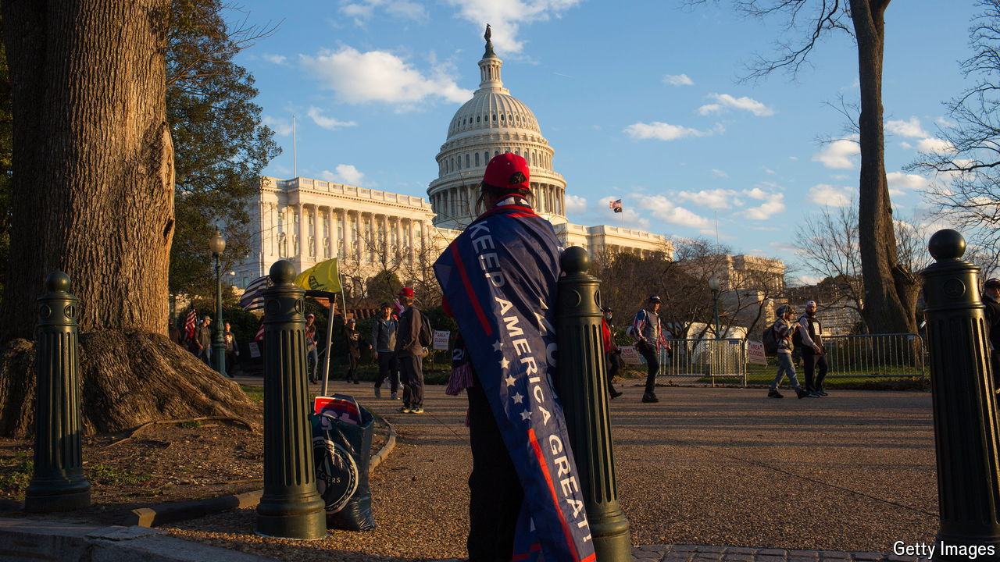
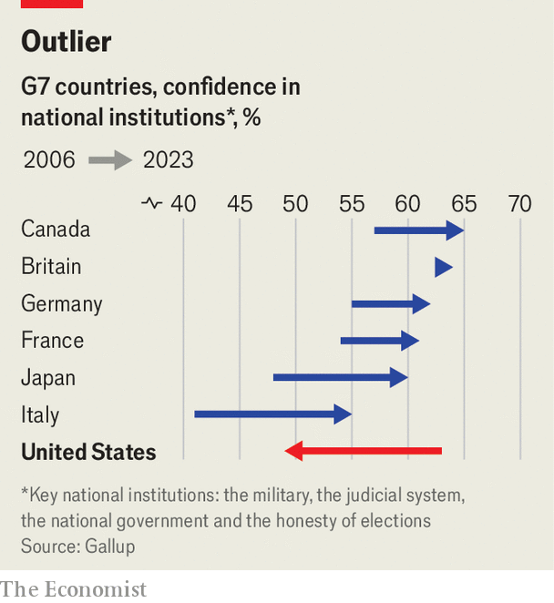

###### Busted trust

# America’s trust in its institutions has collapsed 

##### What are the consequences? 

 

> Apr 17th 2024 

AS FAR AS stereotypes go, brash national self-confidence has long been a defining feature of how Americans are viewed abroad. In 2006, when Gallup first started asking Americans about their trust in key institutions, the country ranked at the top of the G7 league table, tied with Britain. In 2023, for the first time, America came last.

New data from Gallup, a pollster, show that American trust in several national institutions is on the decline. That may not be surprising, given the fraught state of the country’s politics, but the cumulative fall over the years is startling (see chart). Twenty years ago Americans had the highest confidence in their national government of people in any G7 country. Today they have the lowest. Americans are tied with Italians in having the lowest trust in their judicial system, and come last in faith in honest elections. Even the army is suffering from a dip. Although still high at 81%, American trust in its armed forces is now lower than at any point since 2006, and—gasp—lower than in France.

 


The reasons behind this crisis of confidence in the self-declared greatest country on Earth are varied. The roots of a (healthy) scepticism of government can be traced back to the Vietnam war and the Watergate scandal of the early 1970s. The gradual dying-out of the second world war generation, which had significantly higher institutional trust than later generations, also plays a role. However, more recent developments help explain the sharp decline of the past years. 

Donald Trump’s “constant barrage” of unfounded accusations about the 2020 presidential election clearly plays a big role in Americans’ low trust in the , says Henry Brady of the University of California, Berkeley. This no doubt also contributes to growing distrust of the judiciary—just last week Mr Trump called the criminal “hush money” trial against him “a communist show trial”. But few things seem to have done more to directly erode trust in the judiciary than the Supreme Court’s decision in 2022 to overturn . Before this ruling removing a constitutional right to abortion in America, Democrats and Republicans trusted the court in roughly equal measure; afterwards, confidence among Democrats dropped through the floor.

The divergence with Britain is especially striking. Whereas British confidence in the country’s judiciary and electoral system is higher than at any point in the history of the survey, America has moved in the opposite direction. Some 70% of Britons now say that they have confidence in the honesty of elections, compared with only 44% of Americans. 

“Like America, the UK has seen a pretty steady decline in confidence in national government,” observes Benedict Vigers, from Gallup, “but this more core belief in the foundation of the democratic system and in fair elections is still pretty strong.” The same cannot now be said about America. Even within the broader OECD club of mostly rich democracies, only Hungary, Turkey and Colombia have less trust in honest elections.

Yet more than the loss of trust overall, what really worries Mr Brady is the increased polarisation of trust in America. Having some institutions that Democrats trust more (journalism, higher education, science) and others that Republicans trust more (religion, the armed forces and the police) is a matter of concern, particularly for the institutions themselves. The problem is even starker when the workforces of such institutions become increasingly homogenous, something that has happened in predominantly progressive higher education as well as in the predominantly conservative military services.

Strong and credible institutions count among the best guarantors of a country’s long-term stability. People who broadly trust authority are more likely to comply with government directives, such as filing their tax returns. During the pandemic, people who had high trust in government were more likely to get vaccinated and comply with public-health guidance on lockdowns or social-distancing rules, according to a meta-analysis by Daniel Devine of the University of Southampton and colleagues. Blind trust in authority is dangerous, and a degree of scepticism can be healthy. But America’s slide towards becoming an ever more distrusting place has perils of its own. ■


